Week 4: Geostatistics I
================

    ## Loading required package: spacetime

Data
====

The `meuse` data set contains the measurements of the concentration of heavy metals around the banks of the Maas river in the area west of the town Stein in the Netherlands. These heavy metals were accumulated over the years because of river pollution. The data sets has many variables but here we will use the coordinates and the concentration of zinc at each data point. You can see the maps of the study area.

``` r
data(meuse)
coordinates(meuse)=~x+y
proj4string(meuse) = CRS('+init=epsg:28992')

plotGoogleMaps(meuse, filename = 'meuse.html')
```

    ## [1] "using original PolyCol"
    ## [1] "using original PolyCol"

    ## $starthtm
    ## [1] "<!DOCTYPE html> \n <html> \n <head> \n <meta name=\"viewport\" content=\"initial-scale=1.0, user-scalable=no\" />\n <meta charset=\"utf-8\"> \n <style type=\"text/css\">  \n html { height: 100% ; font-size: small} \n body { height: 100%; margin: 0px; padding: 0px }\n #map_canvas {min-height: 100%;height:auto; } \n #cBoxes {position:absolute;right:5px; top:50px; background:white}\n</style> \n\n <script type=\"text/javascript\" src=\"https://maps.google.com/maps/api/js?sensor=false&v=3.18\"> </script>  \n\n <script language=\"javascript\"> \n  \n USGSOverlay.prototype = new google.maps.OverlayView(); \nfunction USGSOverlay(bounds, image, map) {\n      this.bounds_ = bounds;\n      this.image_ = image;\n      this.map_ = map;\n      this.div_ = null;\n      this.setMap(map); }\nUSGSOverlay.prototype.onAdd = function() {\n      var div = document.createElement(\"DIV\");\n      div.style.border = \"none\";\n      div.style.borderWidth = \"0px\";\n      div.style.position = \"absolute\";\n      var img = document.createElement(\"img\");\n      img.src = this.image_;\n      img.style.width = \"100%\";\n      img.style.height = \"100%\";\n      div.appendChild(img);\n      this.div_ = div;\n      this.div_.style.opacity = 0.7;\n      var panes = this.getPanes();\n      panes.overlayImage.appendChild(this.div_);}\nUSGSOverlay.prototype.draw = function() {\n        var overlayProjection = this.getProjection();\n        var sw = overlayProjection.fromLatLngToDivPixel(this.bounds_.getSouthWest());\n        var ne = overlayProjection.fromLatLngToDivPixel(this.bounds_.getNorthEast());\n        var div = this.div_;\n        div.style.left = sw.x + \"px\";\n        div.style.top = ne.y + \"px\";\n        div.style.width = (ne.x - sw.x) + \"px\";\n        div.style.height = (sw.y - ne.y) + \"px\";} \nUSGSOverlay.prototype.onRemove = function() { \n this.div_.parentNode.removeChild(this.div_);} \nUSGSOverlay.prototype.hide = function() { if (this.div_) { this.div_.style.visibility = \"hidden\";} } \nUSGSOverlay.prototype.show = function() {if (this.div_) {  this.div_.style.visibility = \"visible\";}} \n       USGSOverlay.prototype.toggle = function() { \n if (this.div_) { \n  if (this.div_.style.visibility == \"hidden\") {  \n   this.show(); \n  } else { \n  this.hide(); } } } \n USGSOverlay.prototype.toggleDOM = function() {\n          if (this.getMap()) {\n            this.setMap(null);\n          } else {\n            this.setMap(this.map_);}}\n function setOpacR(Raster,textname) { \n  opac=0.01*parseInt(document.getElementById(textname).value) \n    Raster.div_.style.opacity= opac } \n"
    ## 
    ## $var
    ## [1] " var marker \n var  map  \n var  markersmeuse2927 =[] ; var  marker = new google.maps.Marker({ \n position: new google.maps.LatLng(50.9915621567178,5.75853624135808),\n map:map,\n title:\"cadmium : 11.7 \\rcopper : 85 \\rlead : 299 \\rzinc : 1022 \\relev : 7.909 \\rdist : 0.00135803 \\rom : 13.6 \\rffreq : 1 \\rsoil : 1 \\rlime : 1 \\rlanduse : Ah \\rdist.m : 50 \\r\",\n clickable: true,\n draggable: false,\n flat: true,\n visible: true,\n icon: new google.maps.MarkerImage(\"http://chart.apis.google.com/chart?chst=d_map_spin&chld=0.6|0|B94828|10|b|11.7\"), \n  zIndex: null }); \nmarkersmeuse2927.push(marker); \n\nvar  marker = new google.maps.Marker({ \n position: new google.maps.LatLng(50.9910879029232,5.75786301788305),\n map:map,\n title:\"cadmium : 8.6 \\rcopper : 81 \\rlead : 277 \\rzinc : 1141 \\relev : 6.983 \\rdist : 0.0122243 \\rom : 14 \\rffreq : 1 \\rsoil : 1 \\rlime : 1 \\rlanduse : Ah \\rdist.m : 30 \\r\",\n clickable: true,\n draggable: false,\n flat: true,\n visible: true,\n icon: new google.maps.MarkerImage(\"http://chart.apis.google.com/chart?chst=d_map_spin&chld=0.6|0|B94828|10|b|8.6\"), \n  zIndex: null }); \nmarkersmeuse2927.push(marker); \n\nvar  marker = new google.maps.Marker({ \n position: new google.maps.LatLng(50.9908927433765,5.75985541751295),\n map:map,\n title:\"cadmium : 6.5 \\rcopper : 68 \\rlead : 199 \\rzinc : 640 \\relev : 7.8 \\rdist : 0.103029 \\rom : 13 \\rffreq : 1 \\rsoil : 1 \\rlime : 1 \\rlanduse : Ah \\rdist.m : 150 \\r\",\n clickable: true,\n draggable: false,\n flat: true,\n visible: true,\n icon: new google.maps.MarkerImage(\"http://chart.apis.google.com/chart?chst=d_map_spin&chld=0.6|0|CD6325|10|b|6.5\"), \n  zIndex: null }); \nmarkersmeuse2927.push(marker); \n\nvar  marker = new google.maps.Marker({ \n position: new google.maps.LatLng(50.9904102356328,5.76174576970541),\n map:map,\n title:\"cadmium : 2.6 \\rcopper : 81 \\rlead : 116 \\rzinc : 257 \\relev : 7.655 \\rdist : 0.190094 \\rom : 8 \\rffreq : 1 \\rsoil : 2 \\rlime : 0 \\rlanduse : Ga \\rdist.m : 270 \\r\",\n clickable: true,\n draggable: false,\n flat: true,\n visible: true,\n icon: new google.maps.MarkerImage(\"http://chart.apis.google.com/chart?chst=d_map_spin&chld=0.6|0|F1B100|10|b|2.6\"), \n  zIndex: null }); \nmarkersmeuse2927.push(marker); \n\nvar  marker = new google.maps.Marker({ \n position: new google.maps.LatLng(50.9890255709571,5.76186270738117),\n map:map,\n title:\"cadmium : 2.8 \\rcopper : 48 \\rlead : 117 \\rzinc : 269 \\relev : 7.48 \\rdist : 0.27709 \\rom : 8.7 \\rffreq : 1 \\rsoil : 2 \\rlime : 0 \\rlanduse : Ah \\rdist.m : 380 \\r\",\n clickable: true,\n draggable: false,\n flat: true,\n visible: true,\n icon: new google.maps.MarkerImage(\"http://chart.apis.google.com/chart?chst=d_map_spin&chld=0.6|0|F5970F|10|b|2.8\"), \n  zIndex: null }); \nmarkersmeuse2927.push(marker); \n\nvar  marker = new google.maps.Marker({ \n position: new google.maps.LatLng(50.9883925366489,5.76303964098292),\n map:map,\n title:\"cadmium : 3 \\rcopper : 61 \\rlead : 137 \\rzinc : 281 \\relev : 7.791 \\rdist : 0.364067 \\rom : 7.8 \\rffreq : 1 \\rsoil : 2 \\rlime : 0 \\rlanduse : Ga \\rdist.m : 470 \\r\",\n clickable: true,\n draggable: false,\n flat: true,\n visible: true,\n icon: new google.maps.MarkerImage(\"http://chart.apis.google.com/chart?chst=d_map_spin&chld=0.6|0|F5970F|10|b|3\"), \n  zIndex: null }); \nmarkersmeuse2927.push(marker); \n\nvar  marker = new google.maps.Marker({ \n position: new google.maps.LatLng(50.9893916407069,5.75984329282049),\n map:map,\n title:\"cadmium : 3.2 \\rcopper : 31 \\rlead : 132 \\rzinc : 346 \\relev : 8.217 \\rdist : 0.190094 \\rom : 9.2 \\rffreq : 1 \\rsoil : 2 \\rlime : 0 \\rlanduse : Ah \\rdist.m : 240 \\r\",\n clickable: true,\n draggable: false,\n flat: true,\n visible: true,\n icon: new google.maps.MarkerImage(\"http://chart.apis.google.com/chart?chst=d_map_spin&chld=0.6|0|E17D1E|10|b|3.2\"), \n  zIndex: null }); \nmarkersmeuse2927.push(marker); \n\nvar  marker = new google.maps.Marker({ \n position: new google.maps.LatLng(50.9893350268931,5.75787741953428),\n map:map,\n title:\"cadmium : 2.8 \\rcopper : 29 \\rlead : 150 \\rzinc : 406 \\relev : 8.49 \\rdist : 0.0921516 \\rom : 9.5 \\rffreq : 1 \\rsoil : 1 \\rlime : 0 \\rlanduse : Ab \\rdist.m : 120 \\r\",\n clickable: true,\n draggable: false,\n flat: true,\n visible: true,\n icon: new google.maps.MarkerImage(\"http://chart.apis.google.com/chart?chst=d_map_spin&chld=0.6|0|F5970F|10|b|2.8\"), \n  zIndex: null }); \nmarkersmeuse2927.push(marker); \n\nvar  marker = new google.maps.Marker({ \n position: new google.maps.LatLng(50.9881470213434,5.75833785372193),\n map:map,\n title:\"cadmium : 2.4 \\rcopper : 37 \\rlead : 133 \\rzinc : 347 \\relev : 8.668 \\rdist : 0.184614 \\rom : 10.6 \\rffreq : 1 \\rsoil : 1 \\rlime : 0 \\rlanduse : Ab \\rdist.m : 240 \\r\",\n clickable: true,\n draggable: false,\n flat: true,\n visible: true,\n icon: new google.maps.MarkerImage(\"http://chart.apis.google.com/chart?chst=d_map_spin&chld=0.6|0|F1B100|10|b|2.4\"), \n  zIndex: null }); \nmarkersmeuse2927.push(marker); \n\nvar  marker = new google.maps.Marker({ \n position: new google.maps.LatLng(50.9875728618997,5.76078279077936),\n map:map,\n title:\"cadmium : 1.6 \\rcopper : 24 \\rlead : 80 \\rzinc : 183 \\relev : 9.049 \\rdist : 0.309702 \\rom : 6.3 \\rffreq : 1 \\rsoil : 2 \\rlime : 0 \\rlanduse : W \\rdist.m : 420 \\r\",\n clickable: true,\n draggable: false,\n flat: true,\n visible: true,\n icon: new google.maps.MarkerImage(\"http://chart.apis.google.com/chart?chst=d_map_spin&chld=0.6|0|D3C800|10|b|1.6\"), \n  zIndex: null }); \nmarkersmeuse2927.push(marker); \n\nvar  marker = new google.maps.Marker({ \n position: new google.maps.LatLng(50.9870983459807,5.76019504905426),\n map:map,\n title:\"cadmium : 1.4 \\rcopper : 25 \\rlead : 86 \\rzinc : 189 \\relev : 9.015 \\rdist : 0.315116 \\rom : 6.4 \\rffreq : 1 \\rsoil : 2 \\rlime : 0 \\rlanduse : Fh \\rdist.m : 400 \\r\",\n clickable: true,\n draggable: false,\n flat: true,\n visible: true,\n icon: new google.maps.MarkerImage(\"http://chart.apis.google.com/chart?chst=d_map_spin&chld=0.6|0|B0DB00|10|b|1.4\"), \n  zIndex: null }); \nmarkersmeuse2927.push(marker); \n\nvar  marker = new google.maps.Marker({ \n position: new google.maps.LatLng(50.9863505704254,5.75792464948194),\n map:map,\n title:\"cadmium : 1.8 \\rcopper : 25 \\rlead : 97 \\rzinc : 251 \\relev : 9.073 \\rdist : 0.228123 \\rom : 9 \\rffreq : 1 \\rsoil : 1 \\rlime : 0 \\rlanduse : Ag \\rdist.m : 300 \\r\",\n clickable: true,\n draggable: false,\n flat: true,\n visible: true,\n icon: new google.maps.MarkerImage(\"http://chart.apis.google.com/chart?chst=d_map_spin&chld=0.6|0|D3C800|10|b|1.8\"), \n  zIndex: null }); \nmarkersmeuse2927.push(marker); \n\nvar  marker = new google.maps.Marker({ \n position: new google.maps.LatLng(50.9891262526795,5.75569670406275),\n map:map,\n title:\"cadmium : 11.2 \\rcopper : 93 \\rlead : 285 \\rzinc : 1096 \\relev : 7.32 \\rdist : 0 \\rom : 15.4 \\rffreq : 1 \\rsoil : 1 \\rlime : 1 \\rlanduse : W \\rdist.m : 20 \\r\",\n clickable: true,\n draggable: false,\n flat: true,\n visible: true,\n icon: new google.maps.MarkerImage(\"http://chart.apis.google.com/chart?chst=d_map_spin&chld=0.6|0|B94828|10|b|11.2\"), \n  zIndex: null }); \nmarkersmeuse2927.push(marker); \n\nvar  marker = new google.maps.Marker({ \n position: new google.maps.LatLng(50.9883399284191,5.75704339827961),\n map:map,\n title:\"cadmium : 2.5 \\rcopper : 31 \\rlead : 183 \\rzinc : 504 \\relev : 8.815 \\rdist : 0.113932 \\rom : 8.4 \\rffreq : 1 \\rsoil : 1 \\rlime : 0 \\rlanduse : Ah \\rdist.m : 130 \\r\",\n clickable: true,\n draggable: false,\n flat: true,\n visible: true,\n icon: new google.maps.MarkerImage(\"http://chart.apis.google.com/chart?chst=d_map_spin&chld=0.6|0|F1B100|10|b|2.5\"), \n  zIndex: null }); \nmarkersmeuse2927.push(marker); \n\nvar  marker = new google.maps.Marker({ \n position: new google.maps.LatLng(50.9875200505676,5.75763497281676),\n map:map,\n title:\"cadmium : 2 \\rcopper : 27 \\rlead : 130 \\rzinc : 326 \\relev : 8.937 \\rdist : 0.168336 \\rom : 9.1 \\rffreq : 1 \\rsoil : 1 \\rlime : 0 \\rlanduse : Ah \\rdist.m : 220 \\r\",\n clickable: true,\n draggable: false,\n flat: true,\n visible: true,\n icon: new google.maps.MarkerImage(\"http://chart.apis.google.com/chart?chst=d_map_spin&chld=0.6|0|D3C800|10|b|2\"), \n  zIndex: null }); \nmarkersmeuse2927.push(marker); \n\nvar  marker = new google.maps.Marker({ \n position: new google.maps.LatLng(50.9882923009323,5.75506340331458),\n map:map,\n title:\"cadmium : 9.5 \\rcopper : 86 \\rlead : 240 \\rzinc : 1032 \\relev : 7.702 \\rdist : 0 \\rom : 16.2 \\rffreq : 1 \\rsoil : 1 \\rlime : 1 \\rlanduse : W \\rdist.m : 10 \\r\",\n clickable: true,\n draggable: false,\n flat: true,\n visible: true,\n icon: new google.maps.MarkerImage(\"http://chart.apis.google.com/chart?chst=d_map_spin&chld=0.6|0|B94828|10|b|9.5\"), \n  zIndex: null }); \nmarkersmeuse2927.push(marker); \n\nvar  marker = new google.maps.Marker({ \n position: new google.maps.LatLng(50.9870189402934,5.75409907538524),\n map:map,\n title:\"cadmium : 7 \\rcopper : 74 \\rlead : 133 \\rzinc : 606 \\relev : 7.16 \\rdist : 0.0122243 \\rom : 16 \\rffreq : 1 \\rsoil : 1 \\rlime : 1 \\rlanduse : W \\rdist.m : 10 \\r\",\n clickable: true,\n draggable: false,\n flat: true,\n visible: true,\n icon: new google.maps.MarkerImage(\"http://chart.apis.google.com/chart?chst=d_map_spin&chld=0.6|0|CD6325|10|b|7\"), \n  zIndex: null }); \nmarkersmeuse2927.push(marker); \n\nvar  marker = new google.maps.Marker({ \n position: new google.maps.LatLng(50.9858355480134,5.7531070321817),\n map:map,\n title:\"cadmium : 7.1 \\rcopper : 69 \\rlead : 148 \\rzinc : 711 \\relev : 7.1 \\rdist : 0.0122243 \\rom : 16 \\rffreq : 1 \\rsoil : 1 \\rlime : 1 \\rlanduse : W \\rdist.m : 10 \\r\",\n clickable: true,\n draggable: false,\n flat: true,\n visible: true,\n icon: new google.maps.MarkerImage(\"http://chart.apis.google.com/chart?chst=d_map_spin&chld=0.6|0|CD6325|10|b|7.1\"), \n  zIndex: null }); \nmarkersmeuse2927.push(marker); \n\nvar  marker = new google.maps.Marker({ \n position: new google.maps.LatLng(50.9847150677111,5.75211553749502),\n map:map,\n title:\"cadmium : 8.7 \\rcopper : 69 \\rlead : 207 \\rzinc : 735 \\relev : 7.02 \\rdist : 0 \\rom : 13.7 \\rffreq : 1 \\rsoil : 1 \\rlime : 1 \\rlanduse : W \\rdist.m : 10 \\r\",\n clickable: true,\n draggable: false,\n flat: true,\n visible: true,\n icon: new google.maps.MarkerImage(\"http://chart.apis.google.com/chart?chst=d_map_spin&chld=0.6|0|B94828|10|b|8.7\"), \n  zIndex: null }); \nmarkersmeuse2927.push(marker); \n\nvar  marker = new google.maps.Marker({ \n position: new google.maps.LatLng(50.9834597939485,5.7511087876558),\n map:map,\n title:\"cadmium : 12.9 \\rcopper : 95 \\rlead : 284 \\rzinc : 1052 \\relev : 6.86 \\rdist : 0 \\rom : 14.8 \\rffreq : 1 \\rsoil : 1 \\rlime : 1 \\rlanduse : NA \\rdist.m : 10 \\r\",\n clickable: true,\n draggable: false,\n flat: true,\n visible: true,\n icon: new google.maps.MarkerImage(\"http://chart.apis.google.com/chart?chst=d_map_spin&chld=0.6|0|B94828|10|b|12.9\"), \n  zIndex: null }); \nmarkersmeuse2927.push(marker); \n\nvar  marker = new google.maps.Marker({ \n position: new google.maps.LatLng(50.9834648830742,5.75234773643936),\n map:map,\n title:\"cadmium : 5.5 \\rcopper : 53 \\rlead : 194 \\rzinc : 673 \\relev : 8.908 \\rdist : 0.0703468 \\rom : 10.2 \\rffreq : 1 \\rsoil : 1 \\rlime : 1 \\rlanduse : Am \\rdist.m : 80 \\r\",\n clickable: true,\n draggable: false,\n flat: true,\n visible: true,\n icon: new google.maps.MarkerImage(\"http://chart.apis.google.com/chart?chst=d_map_spin&chld=0.6|0|E17D1E|10|b|5.5\"), \n  zIndex: null }); \nmarkersmeuse2927.push(marker); \n\nvar  marker = new google.maps.Marker({ \n position: new google.maps.LatLng(50.9835429938165,5.7532312564973),\n map:map,\n title:\"cadmium : 2.8 \\rcopper : 35 \\rlead : 123 \\rzinc : 402 \\relev : 8.99 \\rdist : 0.0975136 \\rom : 7.2 \\rffreq : 1 \\rsoil : 1 \\rlime : 1 \\rlanduse : Am \\rdist.m : 140 \\r\",\n clickable: true,\n draggable: false,\n flat: true,\n visible: true,\n icon: new google.maps.MarkerImage(\"http://chart.apis.google.com/chart?chst=d_map_spin&chld=0.6|0|F5970F|10|b|2.8\"), \n  zIndex: null }); \nmarkersmeuse2927.push(marker); \n\nvar  marker = new google.maps.Marker({ \n position: new google.maps.LatLng(50.9830665956949,5.75322747760397),\n map:map,\n title:\"cadmium : 2.9 \\rcopper : 35 \\rlead : 110 \\rzinc : 343 \\relev : 8.83 \\rdist : 0.113932 \\rom : 7.2 \\rffreq : 1 \\rsoil : 1 \\rlime : 1 \\rlanduse : Ag \\rdist.m : 160 \\r\",\n clickable: true,\n draggable: false,\n flat: true,\n visible: true,\n icon: new google.maps.MarkerImage(\"http://chart.apis.google.com/chart?chst=d_map_spin&chld=0.6|0|F5970F|10|b|2.9\"), \n  zIndex: null }); \nmarkersmeuse2927.push(marker); \n\nvar  marker = new google.maps.Marker({ \n position: new google.maps.LatLng(50.9853922461842,5.75964010225301),\n map:map,\n title:\"cadmium : 1.7 \\rcopper : 24 \\rlead : 85 \\rzinc : 218 \\relev : 9.02 \\rdist : 0.342321 \\rom : 7 \\rffreq : 1 \\rsoil : 2 \\rlime : 0 \\rlanduse : Ah \\rdist.m : 440 \\r\",\n clickable: true,\n draggable: false,\n flat: true,\n visible: true,\n icon: new google.maps.MarkerImage(\"http://chart.apis.google.com/chart?chst=d_map_spin&chld=0.6|0|D3C800|10|b|1.7\"), \n  zIndex: null }); \nmarkersmeuse2927.push(marker); \n\nvar  marker = new google.maps.Marker({ \n position: new google.maps.LatLng(50.9844756797724,5.75954726041956),\n map:map,\n title:\"cadmium : 1.4 \\rcopper : 26 \\rlead : 75 \\rzinc : 200 \\relev : 8.976 \\rdist : 0.385804 \\rom : 6.9 \\rffreq : 1 \\rsoil : 2 \\rlime : 0 \\rlanduse : W \\rdist.m : 490 \\r\",\n clickable: true,\n draggable: false,\n flat: true,\n visible: true,\n icon: new google.maps.MarkerImage(\"http://chart.apis.google.com/chart?chst=d_map_spin&chld=0.6|0|B0DB00|10|b|1.4\"), \n  zIndex: null }); \nmarkersmeuse2927.push(marker); \n\nvar  marker = new google.maps.Marker({ \n position: new google.maps.LatLng(50.9840702750243,5.75982879953081),\n map:map,\n title:\"cadmium : 1.5 \\rcopper : 22 \\rlead : 76 \\rzinc : 194 \\relev : 8.973 \\rdist : 0.429289 \\rom : 6.3 \\rffreq : 1 \\rsoil : 2 \\rlime : 0 \\rlanduse : W \\rdist.m : 530 \\r\",\n clickable: true,\n draggable: false,\n flat: true,\n visible: true,\n icon: new google.maps.MarkerImage(\"http://chart.apis.google.com/chart?chst=d_map_spin&chld=0.6|0|B0DB00|10|b|1.5\"), \n  zIndex: null }); \nmarkersmeuse2927.push(marker); \n\nvar  marker = new google.maps.Marker({ \n position: new google.maps.LatLng(50.9840685492958,5.75756454288456),\n map:map,\n title:\"cadmium : 1.3 \\rcopper : 27 \\rlead : 73 \\rzinc : 207 \\relev : 8.507 \\rdist : 0.315116 \\rom : 5.6 \\rffreq : 1 \\rsoil : 2 \\rlime : 0 \\rlanduse : Ab \\rdist.m : 400 \\r\",\n clickable: true,\n draggable: false,\n flat: true,\n visible: true,\n icon: new google.maps.MarkerImage(\"http://chart.apis.google.com/chart?chst=d_map_spin&chld=0.6|0|B0DB00|10|b|1.3\"), \n  zIndex: null }); \nmarkersmeuse2927.push(marker); \n\nvar  marker = new google.maps.Marker({ \n position: new google.maps.LatLng(50.9832611644443,5.75705965324643),\n map:map,\n title:\"cadmium : 1.3 \\rcopper : 24 \\rlead : 67 \\rzinc : 180 \\relev : 8.743 \\rdist : 0.320574 \\rom : 4.4 \\rffreq : 1 \\rsoil : 2 \\rlime : 0 \\rlanduse : Ag \\rdist.m : 400 \\r\",\n clickable: true,\n draggable: false,\n flat: true,\n visible: true,\n icon: new google.maps.MarkerImage(\"http://chart.apis.google.com/chart?chst=d_map_spin&chld=0.6|0|B0DB00|10|b|1.3\"), \n  zIndex: null }); \nmarkersmeuse2927.push(marker); \n\nvar  marker = new google.maps.Marker({ \n position: new google.maps.LatLng(50.9838570041339,5.75625272322607),\n map:map,\n title:\"cadmium : 1.8 \\rcopper : 22 \\rlead : 87 \\rzinc : 240 \\relev : 8.973 \\rdist : 0.249863 \\rom : 5.3 \\rffreq : 1 \\rsoil : 2 \\rlime : 0 \\rlanduse : Ah \\rdist.m : 330 \\r\",\n clickable: true,\n draggable: false,\n flat: true,\n visible: true,\n icon: new google.maps.MarkerImage(\"http://chart.apis.google.com/chart?chst=d_map_spin&chld=0.6|0|D3C800|10|b|1.8\"), \n  zIndex: null }); \nmarkersmeuse2927.push(marker); \n\nvar  marker = new google.maps.Marker({ \n position: new google.maps.LatLng(50.9855718596777,5.76247550814582),\n map:map,\n title:\"cadmium : 1.5 \\rcopper : 21 \\rlead : 65 \\rzinc : 180 \\relev : 9.043 \\rdist : 0.489064 \\rom : 4.8 \\rffreq : 1 \\rsoil : 2 \\rlime : 0 \\rlanduse : Ag \\rdist.m : 630 \\r\",\n clickable: true,\n draggable: false,\n flat: true,\n visible: true,\n icon: new google.maps.MarkerImage(\"http://chart.apis.google.com/chart?chst=d_map_spin&chld=0.6|0|B0DB00|10|b|1.5\"), \n  zIndex: null }); \nmarkersmeuse2927.push(marker); \n\nvar  marker = new google.maps.Marker({ \n position: new google.maps.LatLng(50.9822021949462,5.75932955670694),\n map:map,\n title:\"cadmium : 1.3 \\rcopper : 29 \\rlead : 78 \\rzinc : 208 \\relev : 8.688 \\rdist : 0.472778 \\rom : 2.6 \\rffreq : 1 \\rsoil : 2 \\rlime : 0 \\rlanduse : B \\rdist.m : 570 \\r\",\n clickable: true,\n draggable: false,\n flat: true,\n visible: true,\n icon: new google.maps.MarkerImage(\"http://chart.apis.google.com/chart?chst=d_map_spin&chld=0.6|0|B0DB00|10|b|1.3\"), \n  zIndex: null }); \nmarkersmeuse2927.push(marker); \n\nvar  marker = new google.maps.Marker({ \n position: new google.maps.LatLng(50.9814857258188,5.75569264984007),\n map:map,\n title:\"cadmium : 1.3 \\rcopper : 21 \\rlead : 64 \\rzinc : 198 \\relev : 8.727 \\rdist : 0.287957 \\rom : 1 \\rffreq : 1 \\rsoil : 2 \\rlime : 0 \\rlanduse : Ag \\rdist.m : 390 \\r\",\n clickable: true,\n draggable: false,\n flat: true,\n visible: true,\n icon: new google.maps.MarkerImage(\"http://chart.apis.google.com/chart?chst=d_map_spin&chld=0.6|0|B0DB00|10|b|1.3\"), \n  zIndex: null }); \nmarkersmeuse2927.push(marker); \n\nvar  marker = new google.maps.Marker({ \n position: new google.maps.LatLng(50.9811373867951,5.75499212724445),\n map:map,\n title:\"cadmium : 2.1 \\rcopper : 27 \\rlead : 77 \\rzinc : 250 \\relev : 8.328 \\rdist : 0.271622 \\rom : 2.4 \\rffreq : 1 \\rsoil : 2 \\rlime : 0 \\rlanduse : Ah \\rdist.m : 360 \\r\",\n clickable: true,\n draggable: false,\n flat: true,\n visible: true,\n icon: new google.maps.MarkerImage(\"http://chart.apis.google.com/chart?chst=d_map_spin&chld=0.6|0|D3C800|10|b|2.1\"), \n  zIndex: null }); \nmarkersmeuse2927.push(marker); \n\nvar  marker = new google.maps.Marker({ \n position: new google.maps.LatLng(50.980673299633,5.75676836243297),\n map:map,\n title:\"cadmium : 1.2 \\rcopper : 26 \\rlead : 80 \\rzinc : 192 \\relev : 7.971 \\rdist : 0.385807 \\rom : 1.9 \\rffreq : 1 \\rsoil : 2 \\rlime : 0 \\rlanduse : B \\rdist.m : 500 \\r\",\n clickable: true,\n draggable: false,\n flat: true,\n visible: true,\n icon: new google.maps.MarkerImage(\"http://chart.apis.google.com/chart?chst=d_map_spin&chld=0.6|0|7FEE00|10|b|1.2\"), \n  zIndex: null }); \nmarkersmeuse2927.push(marker); \n\nvar  marker = new google.maps.Marker({ \n position: new google.maps.LatLng(50.9799451288486,5.7567910096397),\n map:map,\n title:\"cadmium : 1.6 \\rcopper : 27 \\rlead : 82 \\rzinc : 213 \\relev : 7.809 \\rdist : 0.418417 \\rom : 3.1 \\rffreq : 1 \\rsoil : 2 \\rlime : 0 \\rlanduse : B \\rdist.m : 550 \\r\",\n clickable: true,\n draggable: false,\n flat: true,\n visible: true,\n icon: new google.maps.MarkerImage(\"http://chart.apis.google.com/chart?chst=d_map_spin&chld=0.6|0|D3C800|10|b|1.6\"), \n  zIndex: null }); \nmarkersmeuse2927.push(marker); \n\nvar  marker = new google.maps.Marker({ \n position: new google.maps.LatLng(50.9800641186472,5.75328909906964),\n map:map,\n title:\"cadmium : 3 \\rcopper : 32 \\rlead : 97 \\rzinc : 321 \\relev : 6.986 \\rdist : 0.244474 \\rom : 1.6 \\rffreq : 1 \\rsoil : 2 \\rlime : 0 \\rlanduse : Ab \\rdist.m : 340 \\r\",\n clickable: true,\n draggable: false,\n flat: true,\n visible: true,\n icon: new google.maps.MarkerImage(\"http://chart.apis.google.com/chart?chst=d_map_spin&chld=0.6|0|F5970F|10|b|3\"), \n  zIndex: null }); \nmarkersmeuse2927.push(marker); \n\nvar  marker = new google.maps.Marker({ \n position: new google.maps.LatLng(50.9811013184432,5.75218663828695),\n map:map,\n title:\"cadmium : 5.8 \\rcopper : 50 \\rlead : 166 \\rzinc : 569 \\relev : 7.756 \\rdist : 0.135709 \\rom : 3.5 \\rffreq : 1 \\rsoil : 2 \\rlime : 0 \\rlanduse : Ab \\rdist.m : 210 \\r\",\n clickable: true,\n draggable: false,\n flat: true,\n visible: true,\n icon: new google.maps.MarkerImage(\"http://chart.apis.google.com/chart?chst=d_map_spin&chld=0.6|0|CD6325|10|b|5.8\"), \n  zIndex: null }); \nmarkersmeuse2927.push(marker); \n\nvar  marker = new google.maps.Marker({ \n position: new google.maps.LatLng(50.9819418309139,5.75074082050022),\n map:map,\n title:\"cadmium : 7.9 \\rcopper : 67 \\rlead : 217 \\rzinc : 833 \\relev : 7.784 \\rdist : 0.0484965 \\rom : 8.1 \\rffreq : 1 \\rsoil : 1 \\rlime : 1 \\rlanduse : Am \\rdist.m : 60 \\r\",\n clickable: true,\n draggable: false,\n flat: true,\n visible: true,\n icon: new google.maps.MarkerImage(\"http://chart.apis.google.com/chart?chst=d_map_spin&chld=0.6|0|CD6325|10|b|7.9\"), \n  zIndex: null }); \nmarkersmeuse2927.push(marker); \n\nvar  marker = new google.maps.Marker({ \n position: new google.maps.LatLng(50.9823036988139,5.75000319287152),\n map:map,\n title:\"cadmium : 8.1 \\rcopper : 77 \\rlead : 219 \\rzinc : 906 \\relev : 7 \\rdist : 0 \\rom : 7.9 \\rffreq : 1 \\rsoil : 1 \\rlime : 1 \\rlanduse : W \\rdist.m : 10 \\r\",\n clickable: true,\n draggable: false,\n flat: true,\n visible: true,\n icon: new google.maps.MarkerImage(\"http://chart.apis.google.com/chart?chst=d_map_spin&chld=0.6|0|CD6325|10|b|8.1\"), \n  zIndex: null }); \nmarkersmeuse2927.push(marker); \n\nvar  marker = new google.maps.Marker({ \n position: new google.maps.LatLng(50.9813910868018,5.74864324761722),\n map:map,\n title:\"cadmium : 14.1 \\rcopper : 108 \\rlead : 405 \\rzinc : 1454 \\relev : 6.92 \\rdist : 0.00135803 \\rom : 9.5 \\rffreq : 1 \\rsoil : 1 \\rlime : 1 \\rlanduse : W \\rdist.m : 20 \\r\",\n clickable: true,\n draggable: false,\n flat: true,\n visible: true,\n icon: new google.maps.MarkerImage(\"http://chart.apis.google.com/chart?chst=d_map_spin&chld=0.6|0|B94828|10|b|14.1\"), \n  zIndex: null }); \nmarkersmeuse2927.push(marker); \n\nvar  marker = new google.maps.Marker({ \n position: new google.maps.LatLng(50.9800738005995,5.75021349066651),\n map:map,\n title:\"cadmium : 2.4 \\rcopper : 32 \\rlead : 102 \\rzinc : 298 \\relev : 7.516 \\rdist : 0.135709 \\rom : 1.4 \\rffreq : 1 \\rsoil : 2 \\rlime : 0 \\rlanduse : Am \\rdist.m : 170 \\r\",\n clickable: true,\n draggable: false,\n flat: true,\n visible: true,\n icon: new google.maps.MarkerImage(\"http://chart.apis.google.com/chart?chst=d_map_spin&chld=0.6|0|F1B100|10|b|2.4\"), \n  zIndex: null }); \nmarkersmeuse2927.push(marker); \n\nvar  marker = new google.maps.Marker({ \n position: new google.maps.LatLng(50.9788393617366,5.75115778709919),\n map:map,\n title:\"cadmium : 1.2 \\rcopper : 21 \\rlead : 48 \\rzinc : 167 \\relev : 8.18 \\rdist : 0.26622 \\rom : NA \\rffreq : 1 \\rsoil : 2 \\rlime : 0 \\rlanduse : Ga \\rdist.m : 320 \\r\",\n clickable: true,\n draggable: false,\n flat: true,\n visible: true,\n icon: new google.maps.MarkerImage(\"http://chart.apis.google.com/chart?chst=d_map_spin&chld=0.6|0|7FEE00|10|b|1.2\"), \n  zIndex: null }); \nmarkersmeuse2927.push(marker); \n\nvar  marker = new google.maps.Marker({ \n position: new google.maps.LatLng(50.9786824780721,5.74959027599575),\n map:map,\n title:\"cadmium : 1.7 \\rcopper : 22 \\rlead : 65 \\rzinc : 176 \\relev : 8.694 \\rdist : 0.211843 \\rom : NA \\rffreq : 1 \\rsoil : 2 \\rlime : 0 \\rlanduse : W \\rdist.m : 260 \\r\",\n clickable: true,\n draggable: false,\n flat: true,\n visible: true,\n icon: new google.maps.MarkerImage(\"http://chart.apis.google.com/chart?chst=d_map_spin&chld=0.6|0|D3C800|10|b|1.7\"), \n  zIndex: null }); \nmarkersmeuse2927.push(marker); \n\nvar  marker = new google.maps.Marker({ \n position: new google.maps.LatLng(50.9773899383192,5.74899635022841),\n map:map,\n title:\"cadmium : 1.3 \\rcopper : 21 \\rlead : 62 \\rzinc : 258 \\relev : 9.28 \\rdist : 0.320572 \\rom : 2 \\rffreq : 1 \\rsoil : 2 \\rlime : 0 \\rlanduse : Ah \\rdist.m : 360 \\r\",\n clickable: true,\n draggable: false,\n flat: true,\n visible: true,\n icon: new google.maps.MarkerImage(\"http://chart.apis.google.com/chart?chst=d_map_spin&chld=0.6|0|B0DB00|10|b|1.3\"), \n  zIndex: null }); \nmarkersmeuse2927.push(marker); \n\nvar  marker = new google.maps.Marker({ \n position: new google.maps.LatLng(50.979801339863,5.74823209898502),\n map:map,\n title:\"cadmium : 4.2 \\rcopper : 51 \\rlead : 281 \\rzinc : 746 \\relev : 7.94 \\rdist : 0.081222 \\rom : 5.1 \\rffreq : 1 \\rsoil : 2 \\rlime : 0 \\rlanduse : Ah \\rdist.m : 100 \\r\",\n clickable: true,\n draggable: false,\n flat: true,\n visible: true,\n icon: new google.maps.MarkerImage(\"http://chart.apis.google.com/chart?chst=d_map_spin&chld=0.6|0|E17D1E|10|b|4.2\"), \n  zIndex: null }); \nmarkersmeuse2927.push(marker); \n\nvar  marker = new google.maps.Marker({ \n position: new google.maps.LatLng(50.9785277449808,5.74732509108447),\n map:map,\n title:\"cadmium : 4.3 \\rcopper : 50 \\rlead : 294 \\rzinc : 746 \\relev : 6.36 \\rdist : 0.190086 \\rom : 5.3 \\rffreq : 1 \\rsoil : 2 \\rlime : 0 \\rlanduse : Am \\rdist.m : 200 \\r\",\n clickable: true,\n draggable: false,\n flat: true,\n visible: true,\n icon: new google.maps.MarkerImage(\"http://chart.apis.google.com/chart?chst=d_map_spin&chld=0.6|0|E17D1E|10|b|4.3\"), \n  zIndex: null }); \nmarkersmeuse2927.push(marker); \n\nvar  marker = new google.maps.Marker({ \n position: new google.maps.LatLng(50.9772427667127,5.74718691872388),\n map:map,\n title:\"cadmium : 3.1 \\rcopper : 38 \\rlead : 211 \\rzinc : 464 \\relev : 7.78 \\rdist : 0.287941 \\rom : 4.5 \\rffreq : 1 \\rsoil : 2 \\rlime : 0 \\rlanduse : Ah \\rdist.m : 320 \\r\",\n clickable: true,\n draggable: false,\n flat: true,\n visible: true,\n icon: new google.maps.MarkerImage(\"http://chart.apis.google.com/chart?chst=d_map_spin&chld=0.6|0|F5970F|10|b|3.1\"), \n  zIndex: null }); \nmarkersmeuse2927.push(marker); \n\nvar  marker = new google.maps.Marker({ \n position: new google.maps.LatLng(50.9758675477884,5.74716195442974),\n map:map,\n title:\"cadmium : 1.7 \\rcopper : 26 \\rlead : 135 \\rzinc : 365 \\relev : 8.18 \\rdist : 0.423826 \\rom : 4.9 \\rffreq : 1 \\rsoil : 2 \\rlime : 0 \\rlanduse : Ah \\rdist.m : 480 \\r\",\n clickable: true,\n draggable: false,\n flat: true,\n visible: true,\n icon: new google.maps.MarkerImage(\"http://chart.apis.google.com/chart?chst=d_map_spin&chld=0.6|0|D3C800|10|b|1.7\"), \n  zIndex: null }); \nmarkersmeuse2927.push(marker); \n\nvar  marker = new google.maps.Marker({ \n position: new google.maps.LatLng(50.9744838269228,5.74698031230129),\n map:map,\n title:\"cadmium : 1.7 \\rcopper : 24 \\rlead : 112 \\rzinc : 282 \\relev : 9.42 \\rdist : 0.554289 \\rom : 4.5 \\rffreq : 1 \\rsoil : 2 \\rlime : 0 \\rlanduse : Bw \\rdist.m : 660 \\r\",\n clickable: true,\n draggable: false,\n flat: true,\n visible: true,\n icon: new google.maps.MarkerImage(\"http://chart.apis.google.com/chart?chst=d_map_spin&chld=0.6|0|D3C800|10|b|1.7\"), \n  zIndex: null }); \nmarkersmeuse2927.push(marker); \n\nvar  marker = new google.maps.Marker({ \n position: new google.maps.LatLng(50.9734442799648,5.74596136562816),\n map:map,\n title:\"cadmium : 2.1 \\rcopper : 32 \\rlead : 162 \\rzinc : 375 \\relev : 8.867 \\rdist : 0.603225 \\rom : 5.5 \\rffreq : 1 \\rsoil : 2 \\rlime : 0 \\rlanduse : Bw \\rdist.m : 690 \\r\",\n clickable: true,\n draggable: false,\n flat: true,\n visible: true,\n icon: new google.maps.MarkerImage(\"http://chart.apis.google.com/chart?chst=d_map_spin&chld=0.6|0|D3C800|10|b|2.1\"), \n  zIndex: null }); \nmarkersmeuse2927.push(marker); \n\nvar  marker = new google.maps.Marker({ \n position: new google.maps.LatLng(50.9730965420996,5.74504748664984),\n map:map,\n title:\"cadmium : 1.7 \\rcopper : 24 \\rlead : 94 \\rzinc : 222 \\relev : 8.292 \\rdist : 0.614071 \\rom : 3.4 \\rffreq : 1 \\rsoil : 2 \\rlime : 0 \\rlanduse : Ab \\rdist.m : 710 \\r\",\n clickable: true,\n draggable: false,\n flat: true,\n visible: true,\n icon: new google.maps.MarkerImage(\"http://chart.apis.google.com/chart?chst=d_map_spin&chld=0.6|0|D3C800|10|b|1.7\"), \n  zIndex: null }); \nmarkersmeuse2927.push(marker); \n\nvar  marker = new google.maps.Marker({ \n position: new google.maps.LatLng(50.9802739755958,5.7465555541636),\n map:map,\n title:\"cadmium : 8.2 \\rcopper : 47 \\rlead : 191 \\rzinc : 812 \\relev : 8.06 \\rdist : 0.00135803 \\rom : 11.1 \\rffreq : 1 \\rsoil : 1 \\rlime : 1 \\rlanduse : Ah \\rdist.m : 10 \\r\",\n clickable: true,\n draggable: false,\n flat: true,\n visible: true,\n icon: new google.maps.MarkerImage(\"http://chart.apis.google.com/chart?chst=d_map_spin&chld=0.6|0|CD6325|10|b|8.2\"), \n  zIndex: null }); \nmarkersmeuse2927.push(marker); \n\nvar  marker = new google.maps.Marker({ \n position: new google.maps.LatLng(50.9797944935968,5.7446437686074),\n map:map,\n title:\"cadmium : 17 \\rcopper : 128 \\rlead : 405 \\rzinc : 1548 \\relev : 7.98 \\rdist : 0 \\rom : 12.3 \\rffreq : 1 \\rsoil : 1 \\rlime : 1 \\rlanduse : W \\rdist.m : 10 \\r\",\n clickable: true,\n draggable: false,\n flat: true,\n visible: true,\n icon: new google.maps.MarkerImage(\"http://chart.apis.google.com/chart?chst=d_map_spin&chld=0.6|0|B94828|10|b|17\"), \n  zIndex: null }); \nmarkersmeuse2927.push(marker); \n\nvar  marker = new google.maps.Marker({ \n position: new google.maps.LatLng(50.9794226689628,5.74278980863467),\n map:map,\n title:\"cadmium : 12 \\rcopper : 117 \\rlead : 654 \\rzinc : 1839 \\relev : 7.9 \\rdist : 0.0054321 \\rom : 16.5 \\rffreq : 1 \\rsoil : 1 \\rlime : 1 \\rlanduse : W \\rdist.m : 10 \\r\",\n clickable: true,\n draggable: false,\n flat: true,\n visible: true,\n icon: new google.maps.MarkerImage(\"http://chart.apis.google.com/chart?chst=d_map_spin&chld=0.6|0|B94828|10|b|12\"), \n  zIndex: null }); \nmarkersmeuse2927.push(marker); \n\nvar  marker = new google.maps.Marker({ \n position: new google.maps.LatLng(50.9790875083989,5.74069409719209),\n map:map,\n title:\"cadmium : 9.4 \\rcopper : 104 \\rlead : 482 \\rzinc : 1528 \\relev : 7.74 \\rdist : 0.0054321 \\rom : 13.9 \\rffreq : 1 \\rsoil : 1 \\rlime : 1 \\rlanduse : W \\rdist.m : 10 \\r\",\n clickable: true,\n draggable: false,\n flat: true,\n visible: true,\n icon: new google.maps.MarkerImage(\"http://chart.apis.google.com/chart?chst=d_map_spin&chld=0.6|0|B94828|10|b|9.4\"), \n  zIndex: null }); \nmarkersmeuse2927.push(marker); \n\nvar  marker = new google.maps.Marker({ \n position: new google.maps.LatLng(50.9785901683949,5.73871109204067),\n map:map,\n title:\"cadmium : 8.2 \\rcopper : 76 \\rlead : 276 \\rzinc : 933 \\relev : 7.552 \\rdist : 0.0054321 \\rom : 8.1 \\rffreq : 1 \\rsoil : 1 \\rlime : 1 \\rlanduse : W \\rdist.m : 20 \\r\",\n clickable: true,\n draggable: false,\n flat: true,\n visible: true,\n icon: new google.maps.MarkerImage(\"http://chart.apis.google.com/chart?chst=d_map_spin&chld=0.6|0|CD6325|10|b|8.2\"), \n  zIndex: null }); \nmarkersmeuse2927.push(marker); \n\nvar  marker = new google.maps.Marker({ \n position: new google.maps.LatLng(50.9774530501812,5.74019747024153),\n map:map,\n title:\"cadmium : 2.6 \\rcopper : 36 \\rlead : 180 \\rzinc : 432 \\relev : 7.76 \\rdist : 0.146578 \\rom : 3.1 \\rffreq : 1 \\rsoil : 1 \\rlime : 0 \\rlanduse : Fw \\rdist.m : 200 \\r\",\n clickable: true,\n draggable: false,\n flat: true,\n visible: true,\n icon: new google.maps.MarkerImage(\"http://chart.apis.google.com/chart?chst=d_map_spin&chld=0.6|0|F1B100|10|b|2.6\"), \n  zIndex: null }); \nmarkersmeuse2927.push(marker); \n\nvar  marker = new google.maps.Marker({ \n position: new google.maps.LatLng(50.978149380156,5.74176905142937),\n map:map,\n title:\"cadmium : 3.5 \\rcopper : 34 \\rlead : 207 \\rzinc : 550 \\relev : 6.74 \\rdist : 0.135684 \\rom : 5.8 \\rffreq : 1 \\rsoil : 1 \\rlime : 0 \\rlanduse : Fw \\rdist.m : 140 \\r\",\n clickable: true,\n draggable: false,\n flat: true,\n visible: true,\n icon: new google.maps.MarkerImage(\"http://chart.apis.google.com/chart?chst=d_map_spin&chld=0.6|0|E17D1E|10|b|3.5\"), \n  zIndex: null }); \nmarkersmeuse2927.push(marker); \n\nvar  marker = new google.maps.Marker({ \n position: new google.maps.LatLng(50.9790395787989,5.74459520467365),\n map:map,\n title:\"cadmium : 10.9 \\rcopper : 90 \\rlead : 541 \\rzinc : 1571 \\relev : 6.68 \\rdist : 0.0703333 \\rom : 10.2 \\rffreq : 1 \\rsoil : 1 \\rlime : 1 \\rlanduse : Fw \\rdist.m : 70 \\r\",\n clickable: true,\n draggable: false,\n flat: true,\n visible: true,\n icon: new google.maps.MarkerImage(\"http://chart.apis.google.com/chart?chst=d_map_spin&chld=0.6|0|B94828|10|b|10.9\"), \n  zIndex: null }); \nmarkersmeuse2927.push(marker); \n\nvar  marker = new google.maps.Marker({ \n position: new google.maps.LatLng(50.9776769067862,5.73752233772848),\n map:map,\n title:\"cadmium : 7.3 \\rcopper : 80 \\rlead : 310 \\rzinc : 1190 \\relev : 7.4 \\rdist : 0.0484831 \\rom : 12 \\rffreq : 1 \\rsoil : 1 \\rlime : 1 \\rlanduse : W \\rdist.m : 20 \\r\",\n clickable: true,\n draggable: false,\n flat: true,\n visible: true,\n icon: new google.maps.MarkerImage(\"http://chart.apis.google.com/chart?chst=d_map_spin&chld=0.6|0|CD6325|10|b|7.3\"), \n  zIndex: null }); \nmarkersmeuse2927.push(marker); \n\nvar  marker = new google.maps.Marker({ \n position: new google.maps.LatLng(50.9765746564882,5.73640339186063),\n map:map,\n title:\"cadmium : 9.4 \\rcopper : 78 \\rlead : 210 \\rzinc : 907 \\relev : 7.44 \\rdist : 0.0054321 \\rom : 14.1 \\rffreq : 1 \\rsoil : 1 \\rlime : 1 \\rlanduse : W \\rdist.m : 10 \\r\",\n clickable: true,\n draggable: false,\n flat: true,\n visible: true,\n icon: new google.maps.MarkerImage(\"http://chart.apis.google.com/chart?chst=d_map_spin&chld=0.6|0|B94828|10|b|9.4\"), \n  zIndex: null }); \nmarkersmeuse2927.push(marker); \n\nvar  marker = new google.maps.Marker({ \n position: new google.maps.LatLng(50.9750838696178,5.73595074279196),\n map:map,\n title:\"cadmium : 8.3 \\rcopper : 77 \\rlead : 158 \\rzinc : 761 \\relev : 7.36 \\rdist : 0.0054321 \\rom : 14.5 \\rffreq : 1 \\rsoil : 1 \\rlime : 1 \\rlanduse : Fw \\rdist.m : 10 \\r\",\n clickable: true,\n draggable: false,\n flat: true,\n visible: true,\n icon: new google.maps.MarkerImage(\"http://chart.apis.google.com/chart?chst=d_map_spin&chld=0.6|0|B94828|10|b|8.3\"), \n  zIndex: null }); \nmarkersmeuse2927.push(marker); \n\nvar  marker = new google.maps.Marker({ \n position: new google.maps.LatLng(50.9738526808613,5.73585601588772),\n map:map,\n title:\"cadmium : 7 \\rcopper : 65 \\rlead : 141 \\rzinc : 659 \\relev : 7.2 \\rdist : 0.0316663 \\rom : 14.8 \\rffreq : 1 \\rsoil : 1 \\rlime : 1 \\rlanduse : W \\rdist.m : 20 \\r\",\n clickable: true,\n draggable: false,\n flat: true,\n visible: true,\n icon: new google.maps.MarkerImage(\"http://chart.apis.google.com/chart?chst=d_map_spin&chld=0.6|0|CD6325|10|b|7\"), \n  zIndex: null }); \nmarkersmeuse2927.push(marker); \n\nvar  marker = new google.maps.Marker({ \n position: new google.maps.LatLng(50.9726064676528,5.7347788297209),\n map:map,\n title:\"cadmium : 6.8 \\rcopper : 66 \\rlead : 144 \\rzinc : 643 \\relev : 7.22 \\rdist : 0.0122243 \\rom : 13.3 \\rffreq : 1 \\rsoil : 1 \\rlime : 1 \\rlanduse : Ah \\rdist.m : 10 \\r\",\n clickable: true,\n draggable: false,\n flat: true,\n visible: true,\n icon: new google.maps.MarkerImage(\"http://chart.apis.google.com/chart?chst=d_map_spin&chld=0.6|0|CD6325|10|b|6.8\"), \n  zIndex: null }); \nmarkersmeuse2927.push(marker); \n\nvar  marker = new google.maps.Marker({ \n position: new google.maps.LatLng(50.9714593326225,5.73363126249382),\n map:map,\n title:\"cadmium : 7.4 \\rcopper : 72 \\rlead : 181 \\rzinc : 801 \\relev : 7.36 \\rdist : 0.0122243 \\rom : 15.2 \\rffreq : 1 \\rsoil : 1 \\rlime : 1 \\rlanduse : W \\rdist.m : 20 \\r\",\n clickable: true,\n draggable: false,\n flat: true,\n visible: true,\n icon: new google.maps.MarkerImage(\"http://chart.apis.google.com/chart?chst=d_map_spin&chld=0.6|0|CD6325|10|b|7.4\"), \n  zIndex: null }); \nmarkersmeuse2927.push(marker); \n\nvar  marker = new google.maps.Marker({ \n position: new google.maps.LatLng(50.9705458488692,5.73249973647215),\n map:map,\n title:\"cadmium : 6.6 \\rcopper : 75 \\rlead : 173 \\rzinc : 784 \\relev : 5.18 \\rdist : 0.0373395 \\rom : 11.4 \\rffreq : 1 \\rsoil : 1 \\rlime : 1 \\rlanduse : W \\rdist.m : 20 \\r\",\n clickable: true,\n draggable: false,\n flat: true,\n visible: true,\n icon: new google.maps.MarkerImage(\"http://chart.apis.google.com/chart?chst=d_map_spin&chld=0.6|0|CD6325|10|b|6.6\"), \n  zIndex: null }); \nmarkersmeuse2927.push(marker); \n\nvar  marker = new google.maps.Marker({ \n position: new google.maps.LatLng(50.9692872572816,5.73555105032773),\n map:map,\n title:\"cadmium : 7.8 \\rcopper : 75 \\rlead : 399 \\rzinc : 1060 \\relev : 5.8 \\rdist : 0.211846 \\rom : 9 \\rffreq : 1 \\rsoil : 1 \\rlime : 0 \\rlanduse : Ah \\rdist.m : 270 \\r\",\n clickable: true,\n draggable: false,\n flat: true,\n visible: true,\n icon: new google.maps.MarkerImage(\"http://chart.apis.google.com/chart?chst=d_map_spin&chld=0.6|0|CD6325|10|b|7.8\"), \n  zIndex: null }); \nmarkersmeuse2927.push(marker); \n\nvar  marker = new google.maps.Marker({ \n position: new google.maps.LatLng(50.9675518843431,5.73869821703239),\n map:map,\n title:\"cadmium : 0.7 \\rcopper : 22 \\rlead : 45 \\rzinc : 119 \\relev : 7.64 \\rdist : 0.451037 \\rom : 3.6 \\rffreq : 1 \\rsoil : 1 \\rlime : 1 \\rlanduse : Fw \\rdist.m : 560 \\r\",\n clickable: true,\n draggable: false,\n flat: true,\n visible: true,\n icon: new google.maps.MarkerImage(\"http://chart.apis.google.com/chart?chst=d_map_spin&chld=0.6|0|7FEE00|10|b|0.7\"), \n  zIndex: null }); \nmarkersmeuse2927.push(marker); \n\nvar  marker = new google.maps.Marker({ \n position: new google.maps.LatLng(50.9663584452737,5.74096673794625),\n map:map,\n title:\"cadmium : 3.4 \\rcopper : 55 \\rlead : 325 \\rzinc : 778 \\relev : 6.32 \\rdist : 0.575877 \\rom : 6.9 \\rffreq : 1 \\rsoil : 1 \\rlime : 0 \\rlanduse : Bw \\rdist.m : 750 \\r\",\n clickable: true,\n draggable: false,\n flat: true,\n visible: true,\n icon: new google.maps.MarkerImage(\"http://chart.apis.google.com/chart?chst=d_map_spin&chld=0.6|0|E17D1E|10|b|3.4\"), \n  zIndex: null }); \nmarkersmeuse2927.push(marker); \n\nvar  marker = new google.maps.Marker({ \n position: new google.maps.LatLng(50.9677732235548,5.73084191744462),\n map:map,\n title:\"cadmium : 3.9 \\rcopper : 47 \\rlead : 268 \\rzinc : 703 \\relev : 5.76 \\rdist : 0.0756869 \\rom : 7 \\rffreq : 1 \\rsoil : 1 \\rlime : 1 \\rlanduse : Ab \\rdist.m : 80 \\r\",\n clickable: true,\n draggable: false,\n flat: true,\n visible: true,\n icon: new google.maps.MarkerImage(\"http://chart.apis.google.com/chart?chst=d_map_spin&chld=0.6|0|E17D1E|10|b|3.9\"), \n  zIndex: null }); \nmarkersmeuse2927.push(marker); \n\nvar  marker = new google.maps.Marker({ \n position: new google.maps.LatLng(50.9669827283149,5.73066521033129),\n map:map,\n title:\"cadmium : 3.5 \\rcopper : 46 \\rlead : 252 \\rzinc : 676 \\relev : 6.48 \\rdist : 0.12481 \\rom : 6.2 \\rffreq : 1 \\rsoil : 1 \\rlime : 1 \\rlanduse : Ab \\rdist.m : 130 \\r\",\n clickable: true,\n draggable: false,\n flat: true,\n visible: true,\n icon: new google.maps.MarkerImage(\"http://chart.apis.google.com/chart?chst=d_map_spin&chld=0.6|0|E17D1E|10|b|3.5\"), \n  zIndex: null }); \nmarkersmeuse2927.push(marker); \n\nvar  marker = new google.maps.Marker({ \n position: new google.maps.LatLng(50.966958419262,5.729768210244),\n map:map,\n title:\"cadmium : 4.7 \\rcopper : 55 \\rlead : 315 \\rzinc : 793 \\relev : 6.48 \\rdist : 0.103024 \\rom : 6.5 \\rffreq : 1 \\rsoil : 1 \\rlime : 0 \\rlanduse : W \\rdist.m : 110 \\r\",\n clickable: true,\n draggable: false,\n flat: true,\n visible: true,\n icon: new google.maps.MarkerImage(\"http://chart.apis.google.com/chart?chst=d_map_spin&chld=0.6|0|E17D1E|10|b|4.7\"), \n  zIndex: null }); \nmarkersmeuse2927.push(marker); \n\nvar  marker = new google.maps.Marker({ \n position: new google.maps.LatLng(50.9657294125332,5.72893346951614),\n map:map,\n title:\"cadmium : 3.9 \\rcopper : 49 \\rlead : 260 \\rzinc : 685 \\relev : 6.32 \\rdist : 0.157469 \\rom : 5.7 \\rffreq : 1 \\rsoil : 1 \\rlime : 0 \\rlanduse : W \\rdist.m : 200 \\r\",\n clickable: true,\n draggable: false,\n flat: true,\n visible: true,\n icon: new google.maps.MarkerImage(\"http://chart.apis.google.com/chart?chst=d_map_spin&chld=0.6|0|E17D1E|10|b|3.9\"), \n  zIndex: null }); \nmarkersmeuse2927.push(marker); \n\nvar  marker = new google.maps.Marker({ \n position: new google.maps.LatLng(50.9660037241418,5.73040169796583),\n map:map,\n title:\"cadmium : 3.1 \\rcopper : 39 \\rlead : 237 \\rzinc : 593 \\relev : 6.32 \\rdist : 0.200976 \\rom : 7 \\rffreq : 1 \\rsoil : 1 \\rlime : 1 \\rlanduse : Ah \\rdist.m : 260 \\r\",\n clickable: true,\n draggable: false,\n flat: true,\n visible: true,\n icon: new google.maps.MarkerImage(\"http://chart.apis.google.com/chart?chst=d_map_spin&chld=0.6|0|F5970F|10|b|3.1\"), \n  zIndex: null }); \nmarkersmeuse2927.push(marker); \n\nvar  marker = new google.maps.Marker({ \n position: new google.maps.LatLng(50.9649912913701,5.72928387135357),\n map:map,\n title:\"cadmium : 2.9 \\rcopper : 45 \\rlead : 228 \\rzinc : 549 \\relev : 6.16 \\rdist : 0.200976 \\rom : 7.3 \\rffreq : 1 \\rsoil : 1 \\rlime : 0 \\rlanduse : W \\rdist.m : 270 \\r\",\n clickable: true,\n draggable: false,\n flat: true,\n visible: true,\n icon: new google.maps.MarkerImage(\"http://chart.apis.google.com/chart?chst=d_map_spin&chld=0.6|0|F5970F|10|b|2.9\"), \n  zIndex: null }); \nmarkersmeuse2927.push(marker); \n\nvar  marker = new google.maps.Marker({ \n position: new google.maps.LatLng(50.9649077402814,5.7301800316633),\n map:map,\n title:\"cadmium : 3.9 \\rcopper : 48 \\rlead : 241 \\rzinc : 680 \\relev : 6.56 \\rdist : 0.26622 \\rom : 8.2 \\rffreq : 1 \\rsoil : 1 \\rlime : 0 \\rlanduse : W \\rdist.m : 320 \\r\",\n clickable: true,\n draggable: false,\n flat: true,\n visible: true,\n icon: new google.maps.MarkerImage(\"http://chart.apis.google.com/chart?chst=d_map_spin&chld=0.6|0|E17D1E|10|b|3.9\"), \n  zIndex: null }); \nmarkersmeuse2927.push(marker); \n\nvar  marker = new google.maps.Marker({ \n position: new google.maps.LatLng(50.9637767280288,5.72964496250136),\n map:map,\n title:\"cadmium : 2.7 \\rcopper : 36 \\rlead : 201 \\rzinc : 539 \\relev : 6.9 \\rdist : 0.298835 \\rom : 4.3 \\rffreq : 1 \\rsoil : 1 \\rlime : 0 \\rlanduse : Ah \\rdist.m : 360 \\r\",\n clickable: true,\n draggable: false,\n flat: true,\n visible: true,\n icon: new google.maps.MarkerImage(\"http://chart.apis.google.com/chart?chst=d_map_spin&chld=0.6|0|F5970F|10|b|2.7\"), \n  zIndex: null }); \nmarkersmeuse2927.push(marker); \n\nvar  marker = new google.maps.Marker({ \n position: new google.maps.LatLng(50.9651893471422,5.72612524013299),\n map:map,\n title:\"cadmium : 2.5 \\rcopper : 36 \\rlead : 204 \\rzinc : 560 \\relev : 7.54 \\rdist : 0.0812247 \\rom : 4.4 \\rffreq : 1 \\rsoil : 1 \\rlime : 1 \\rlanduse : Am \\rdist.m : 80 \\r\",\n clickable: true,\n draggable: false,\n flat: true,\n visible: true,\n icon: new google.maps.MarkerImage(\"http://chart.apis.google.com/chart?chst=d_map_spin&chld=0.6|0|F1B100|10|b|2.5\"), \n  zIndex: null }); \nmarkersmeuse2927.push(marker); \n\nvar  marker = new google.maps.Marker({ \n position: new google.maps.LatLng(50.9662008065653,5.7275846347628),\n map:map,\n title:\"cadmium : 5.6 \\rcopper : 68 \\rlead : 429 \\rzinc : 1136 \\relev : 6.42 \\rdist : 0.070355 \\rom : 8.2 \\rffreq : 1 \\rsoil : 1 \\rlime : 1 \\rlanduse : W \\rdist.m : 100 \\r\",\n clickable: true,\n draggable: false,\n flat: true,\n visible: true,\n icon: new google.maps.MarkerImage(\"http://chart.apis.google.com/chart?chst=d_map_spin&chld=0.6|0|E17D1E|10|b|5.6\"), \n  zIndex: null }); \nmarkersmeuse2927.push(marker); \n\nvar  marker = new google.maps.Marker({ \n position: new google.maps.LatLng(50.9675012707552,5.72857646558625),\n map:map,\n title:\"cadmium : 9.4 \\rcopper : 88 \\rlead : 462 \\rzinc : 1383 \\relev : 6.28 \\rdist : 0.0122243 \\rom : 8.5 \\rffreq : 1 \\rsoil : 1 \\rlime : 1 \\rlanduse : W \\rdist.m : 70 \\r\",\n clickable: true,\n draggable: false,\n flat: true,\n visible: true,\n icon: new google.maps.MarkerImage(\"http://chart.apis.google.com/chart?chst=d_map_spin&chld=0.6|0|B94828|10|b|9.4\"), \n  zIndex: null }); \nmarkersmeuse2927.push(marker); \n\nvar  marker = new google.maps.Marker({ \n position: new google.maps.LatLng(50.9682253570603,5.72993420369967),\n map:map,\n title:\"cadmium : 10.8 \\rcopper : 85 \\rlead : 333 \\rzinc : 1161 \\relev : 6.34 \\rdist : 0 \\rom : 9.6 \\rffreq : 1 \\rsoil : 1 \\rlime : 1 \\rlanduse : W \\rdist.m : 20 \\r\",\n clickable: true,\n draggable: false,\n flat: true,\n visible: true,\n icon: new google.maps.MarkerImage(\"http://chart.apis.google.com/chart?chst=d_map_spin&chld=0.6|0|B94828|10|b|10.8\"), \n  zIndex: null }); \nmarkersmeuse2927.push(marker); \n\nvar  marker = new google.maps.Marker({ \n position: new google.maps.LatLng(50.9623184475399,5.7451916904561),\n map:map,\n title:\"cadmium : 18.1 \\rcopper : 76 \\rlead : 464 \\rzinc : 1672 \\relev : 7.307 \\rdist : 0.0537723 \\rom : 17 \\rffreq : 1 \\rsoil : 1 \\rlime : 1 \\rlanduse : W \\rdist.m : 50 \\r\",\n clickable: true,\n draggable: false,\n flat: true,\n visible: true,\n icon: new google.maps.MarkerImage(\"http://chart.apis.google.com/chart?chst=d_map_spin&chld=0.6|0|B94828|10|b|18.1\"), \n  zIndex: null }); \nmarkersmeuse2927.push(marker); \n\nvar  marker = new google.maps.Marker({ \n position: new google.maps.LatLng(50.9697477244813,5.73186737843374),\n map:map,\n title:\"cadmium : 6.3 \\rcopper : 63 \\rlead : 159 \\rzinc : 765 \\relev : 5.7 \\rdist : 0.0593662 \\rom : 12.8 \\rffreq : 1 \\rsoil : 1 \\rlime : 1 \\rlanduse : W \\rdist.m : 80 \\r\",\n clickable: true,\n draggable: false,\n flat: true,\n visible: true,\n icon: new google.maps.MarkerImage(\"http://chart.apis.google.com/chart?chst=d_map_spin&chld=0.6|0|CD6325|10|b|6.3\"), \n  zIndex: null }); \nmarkersmeuse2927.push(marker); \n\nvar  marker = new google.maps.Marker({ \n position: new google.maps.LatLng(50.987991564653,5.75916262360456),\n map:map,\n title:\"cadmium : 2.1 \\rcopper : 32 \\rlead : 116 \\rzinc : 279 \\relev : 7.72 \\rdist : 0.211843 \\rom : 5.9 \\rffreq : 1 \\rsoil : 2 \\rlime : 0 \\rlanduse : W \\rdist.m : 290 \\r\",\n clickable: true,\n draggable: false,\n flat: true,\n visible: true,\n icon: new google.maps.MarkerImage(\"http://chart.apis.google.com/chart?chst=d_map_spin&chld=0.6|0|D3C800|10|b|2.1\"), \n  zIndex: null }); \nmarkersmeuse2927.push(marker); \n\nvar  marker = new google.maps.Marker({ \n position: new google.maps.LatLng(50.9708960555301,5.7356201370016),\n map:map,\n title:\"cadmium : 1.8 \\rcopper : 25 \\rlead : 81 \\rzinc : 241 \\relev : 7.932 \\rdist : 0.12481 \\rom : 2.9 \\rffreq : 2 \\rsoil : 2 \\rlime : 1 \\rlanduse : Ah \\rdist.m : 160 \\r\",\n clickable: true,\n draggable: false,\n flat: true,\n visible: true,\n icon: new google.maps.MarkerImage(\"http://chart.apis.google.com/chart?chst=d_map_spin&chld=0.6|0|D3C800|10|b|1.8\"), \n  zIndex: null }); \nmarkersmeuse2927.push(marker); \n\nvar  marker = new google.maps.Marker({ \n position: new google.maps.LatLng(50.9719620579924,5.73683830913427),\n map:map,\n title:\"cadmium : 2.2 \\rcopper : 27 \\rlead : 131 \\rzinc : 317 \\relev : 7.82 \\rdist : 0.12481 \\rom : 4.5 \\rffreq : 2 \\rsoil : 1 \\rlime : 0 \\rlanduse : W \\rdist.m : 160 \\r\",\n clickable: true,\n draggable: false,\n flat: true,\n visible: true,\n icon: new google.maps.MarkerImage(\"http://chart.apis.google.com/chart?chst=d_map_spin&chld=0.6|0|F1B100|10|b|2.2\"), \n  zIndex: null }); \nmarkersmeuse2927.push(marker); \n\nvar  marker = new google.maps.Marker({ \n position: new google.maps.LatLng(50.9670411266887,5.72915670819275),\n map:map,\n title:\"cadmium : 2.8 \\rcopper : 36 \\rlead : 216 \\rzinc : 545 \\relev : 8.575 \\rdist : 0.0921516 \\rom : 10.7 \\rffreq : 2 \\rsoil : 1 \\rlime : 0 \\rlanduse : W \\rdist.m : 140 \\r\",\n clickable: true,\n draggable: false,\n flat: true,\n visible: true,\n icon: new google.maps.MarkerImage(\"http://chart.apis.google.com/chart?chst=d_map_spin&chld=0.6|0|F5970F|10|b|2.8\"), \n  zIndex: null }); \nmarkersmeuse2927.push(marker); \n\nvar  marker = new google.maps.Marker({ \n position: new google.maps.LatLng(50.9658665087496,5.72816580036895),\n map:map,\n title:\"cadmium : 2.4 \\rcopper : 41 \\rlead : 145 \\rzinc : 505 \\relev : 8.536 \\rdist : 0.113941 \\rom : 9.4 \\rffreq : 2 \\rsoil : 1 \\rlime : 0 \\rlanduse : W \\rdist.m : 150 \\r\",\n clickable: true,\n draggable: false,\n flat: true,\n visible: true,\n icon: new google.maps.MarkerImage(\"http://chart.apis.google.com/chart?chst=d_map_spin&chld=0.6|0|F1B100|10|b|2.4\"), \n  zIndex: null }); \nmarkersmeuse2927.push(marker); \n\nvar  marker = new google.maps.Marker({ \n position: new google.maps.LatLng(50.9638383354393,5.72704054930733),\n map:map,\n title:\"cadmium : 2.6 \\rcopper : 33 \\rlead : 163 \\rzinc : 420 \\relev : 8.504 \\rdist : 0.179216 \\rom : 9 \\rffreq : 2 \\rsoil : 1 \\rlime : 0 \\rlanduse : Ah \\rdist.m : 220 \\r\",\n clickable: true,\n draggable: false,\n flat: true,\n visible: true,\n icon: new google.maps.MarkerImage(\"http://chart.apis.google.com/chart?chst=d_map_spin&chld=0.6|0|F1B100|10|b|2.6\"), \n  zIndex: null }); \nmarkersmeuse2927.push(marker); \n\nvar  marker = new google.maps.Marker({ \n position: new google.maps.LatLng(50.9623402324024,5.72600468879762),\n map:map,\n title:\"cadmium : 1.8 \\rcopper : 27 \\rlead : 129 \\rzinc : 332 \\relev : 8.659 \\rdist : 0.233596 \\rom : 7 \\rffreq : 2 \\rsoil : 1 \\rlime : 0 \\rlanduse : Am \\rdist.m : 280 \\r\",\n clickable: true,\n draggable: false,\n flat: true,\n visible: true,\n icon: new google.maps.MarkerImage(\"http://chart.apis.google.com/chart?chst=d_map_spin&chld=0.6|0|D3C800|10|b|1.8\"), \n  zIndex: null }); \nmarkersmeuse2927.push(marker); \n\nvar  marker = new google.maps.Marker({ \n position: new google.maps.LatLng(50.962735263558,5.72922445414656),\n map:map,\n title:\"cadmium : 2 \\rcopper : 38 \\rlead : 148 \\rzinc : 400 \\relev : 7.633 \\rdist : 0.336861 \\rom : 6.5 \\rffreq : 2 \\rsoil : 1 \\rlime : 1 \\rlanduse : Am \\rdist.m : 450 \\r\",\n clickable: true,\n draggable: false,\n flat: true,\n visible: true,\n icon: new google.maps.MarkerImage(\"http://chart.apis.google.com/chart?chst=d_map_spin&chld=0.6|0|D3C800|10|b|2\"), \n  zIndex: null }); \nmarkersmeuse2927.push(marker); \n\nvar  marker = new google.maps.Marker({ \n position: new google.maps.LatLng(50.9628607996639,5.72319018482882),\n map:map,\n title:\"cadmium : 2.7 \\rcopper : 37 \\rlead : 214 \\rzinc : 553 \\relev : 8.538 \\rdist : 0.070355 \\rom : 9.4 \\rffreq : 2 \\rsoil : 1 \\rlime : 1 \\rlanduse : Am \\rdist.m : 70 \\r\",\n clickable: true,\n draggable: false,\n flat: true,\n visible: true,\n icon: new google.maps.MarkerImage(\"http://chart.apis.google.com/chart?chst=d_map_spin&chld=0.6|0|F5970F|10|b|2.7\"), \n  zIndex: null }); \nmarkersmeuse2927.push(marker); \n\nvar  marker = new google.maps.Marker({ \n position: new google.maps.LatLng(50.9642141143329,5.72456653372424),\n map:map,\n title:\"cadmium : 2.7 \\rcopper : 34 \\rlead : 226 \\rzinc : 577 \\relev : 7.68 \\rdist : 0.0593662 \\rom : 10.2 \\rffreq : 2 \\rsoil : 1 \\rlime : 0 \\rlanduse : Am \\rdist.m : 70 \\r\",\n clickable: true,\n draggable: false,\n flat: true,\n visible: true,\n icon: new google.maps.MarkerImage(\"http://chart.apis.google.com/chart?chst=d_map_spin&chld=0.6|0|F5970F|10|b|2.7\"), \n  zIndex: null }); \nmarkersmeuse2927.push(marker); \n\nvar  marker = new google.maps.Marker({ \n position: new google.maps.LatLng(50.9613739371576,5.7365873263447),\n map:map,\n title:\"cadmium : 0.9 \\rcopper : 19 \\rlead : 54 \\rzinc : 155 \\relev : 7.564 \\rdist : 0.255341 \\rom : 6.4 \\rffreq : 2 \\rsoil : 1 \\rlime : 0 \\rlanduse : W \\rdist.m : 340 \\r\",\n clickable: true,\n draggable: false,\n flat: true,\n visible: true,\n icon: new google.maps.MarkerImage(\"http://chart.apis.google.com/chart?chst=d_map_spin&chld=0.6|0|7FEE00|10|b|0.9\"), \n  zIndex: null }); \nmarkersmeuse2927.push(marker); \n\nvar  marker = new google.maps.Marker({ \n position: new google.maps.LatLng(50.9607911996607,5.73308151808865),\n map:map,\n title:\"cadmium : 0.9 \\rcopper : 22 \\rlead : 70 \\rzinc : 224 \\relev : 7.76 \\rdist : 0.364067 \\rom : 7.6 \\rffreq : 2 \\rsoil : 1 \\rlime : 0 \\rlanduse : W \\rdist.m : 470 \\r\",\n clickable: true,\n draggable: false,\n flat: true,\n visible: true,\n icon: new google.maps.MarkerImage(\"http://chart.apis.google.com/chart?chst=d_map_spin&chld=0.6|0|7FEE00|10|b|0.9\"), \n  zIndex: null }); \nmarkersmeuse2927.push(marker); \n\nvar  marker = new google.maps.Marker({ \n position: new google.maps.LatLng(50.9642743666842,5.73458799038591),\n map:map,\n title:\"cadmium : 0.4 \\rcopper : 26 \\rlead : 73 \\rzinc : 180 \\relev : 7.653 \\rdist : 0.429295 \\rom : 7 \\rffreq : 2 \\rsoil : 1 \\rlime : 0 \\rlanduse : Am \\rdist.m : 630 \\r\",\n clickable: true,\n draggable: false,\n flat: true,\n visible: true,\n icon: new google.maps.MarkerImage(\"http://chart.apis.google.com/chart?chst=d_map_spin&chld=0.6|0|00FF00|10|b|0.4\"), \n  zIndex: null }); \nmarkersmeuse2927.push(marker); \n\nvar  marker = new google.maps.Marker({ \n position: new google.maps.LatLng(50.966060672056,5.73541282402068),\n map:map,\n title:\"cadmium : 0.8 \\rcopper : 25 \\rlead : 87 \\rzinc : 226 \\relev : 7.951 \\rdist : 0.380328 \\rom : 5.6 \\rffreq : 2 \\rsoil : 1 \\rlime : 0 \\rlanduse : Am \\rdist.m : 460 \\r\",\n clickable: true,\n draggable: false,\n flat: true,\n visible: true,\n icon: new google.maps.MarkerImage(\"http://chart.apis.google.com/chart?chst=d_map_spin&chld=0.6|0|7FEE00|10|b|0.8\"), \n  zIndex: null }); \nmarkersmeuse2927.push(marker); \n\nvar  marker = new google.maps.Marker({ \n position: new google.maps.LatLng(50.9663465306797,5.73300925842453),\n map:map,\n title:\"cadmium : 0.4 \\rcopper : 22 \\rlead : 76 \\rzinc : 186 \\relev : 8.176 \\rdist : 0.249874 \\rom : 6.5 \\rffreq : 2 \\rsoil : 1 \\rlime : 0 \\rlanduse : Am \\rdist.m : 320 \\r\",\n clickable: true,\n draggable: false,\n flat: true,\n visible: true,\n icon: new google.maps.MarkerImage(\"http://chart.apis.google.com/chart?chst=d_map_spin&chld=0.6|0|00FF00|10|b|0.4\"), \n  zIndex: null }); \nmarkersmeuse2927.push(marker); \n\nvar  marker = new google.maps.Marker({ \n position: new google.maps.LatLng(50.9655693104709,5.73139490441107),\n map:map,\n title:\"cadmium : 0.4 \\rcopper : 24 \\rlead : 81 \\rzinc : 198 \\relev : 8.468 \\rdist : 0.266212 \\rom : 6.6 \\rffreq : 2 \\rsoil : 1 \\rlime : 0 \\rlanduse : Ah \\rdist.m : 320 \\r\",\n clickable: true,\n draggable: false,\n flat: true,\n visible: true,\n icon: new google.maps.MarkerImage(\"http://chart.apis.google.com/chart?chst=d_map_spin&chld=0.6|0|00FF00|10|b|0.4\"), \n  zIndex: null }); \nmarkersmeuse2927.push(marker); \n\nvar  marker = new google.maps.Marker({ \n position: new google.maps.LatLng(50.9627637478882,5.73174407135168),\n map:map,\n title:\"cadmium : 0.4 \\rcopper : 18 \\rlead : 68 \\rzinc : 187 \\relev : 8.41 \\rdist : 0.451037 \\rom : 5.9 \\rffreq : 2 \\rsoil : 1 \\rlime : 0 \\rlanduse : W \\rdist.m : 540 \\r\",\n clickable: true,\n draggable: false,\n flat: true,\n visible: true,\n icon: new google.maps.MarkerImage(\"http://chart.apis.google.com/chart?chst=d_map_spin&chld=0.6|0|00FF00|10|b|0.4\"), \n  zIndex: null }); \nmarkersmeuse2927.push(marker); \n\nvar  marker = new google.maps.Marker({ \n position: new google.maps.LatLng(50.9632854664232,5.73761241254672),\n map:map,\n title:\"cadmium : 0.8 \\rcopper : 23 \\rlead : 66 \\rzinc : 199 \\relev : 7.61 \\rdist : 0.30971 \\rom : 6.5 \\rffreq : 2 \\rsoil : 1 \\rlime : 0 \\rlanduse : W \\rdist.m : 420 \\r\",\n clickable: true,\n draggable: false,\n flat: true,\n visible: true,\n icon: new google.maps.MarkerImage(\"http://chart.apis.google.com/chart?chst=d_map_spin&chld=0.6|0|7FEE00|10|b|0.8\"), \n  zIndex: null }); \nmarkersmeuse2927.push(marker); \n\nvar  marker = new google.maps.Marker({ \n position: new google.maps.LatLng(50.9640154471245,5.73995238209176),\n map:map,\n title:\"cadmium : 0.4 \\rcopper : 22 \\rlead : 49 \\rzinc : 157 \\relev : 7.792 \\rdist : 0.293359 \\rom : 6.4 \\rffreq : 2 \\rsoil : 1 \\rlime : 0 \\rlanduse : SPO \\rdist.m : 380 \\r\",\n clickable: true,\n draggable: false,\n flat: true,\n visible: true,\n icon: new google.maps.MarkerImage(\"http://chart.apis.google.com/chart?chst=d_map_spin&chld=0.6|0|00FF00|10|b|0.4\"), \n  zIndex: null }); \nmarkersmeuse2927.push(marker); \n\nvar  marker = new google.maps.Marker({ \n position: new google.maps.LatLng(50.9661011814377,5.74278684261421),\n map:map,\n title:\"cadmium : 0.4 \\rcopper : 23 \\rlead : 63 \\rzinc : 203 \\relev : 8.76 \\rdist : 0.532351 \\rom : 7.2 \\rffreq : 2 \\rsoil : 2 \\rlime : 0 \\rlanduse : W \\rdist.m : 500 \\r\",\n clickable: true,\n draggable: false,\n flat: true,\n visible: true,\n icon: new google.maps.MarkerImage(\"http://chart.apis.google.com/chart?chst=d_map_spin&chld=0.6|0|00FF00|10|b|0.4\"), \n  zIndex: null }); \nmarkersmeuse2927.push(marker); \n\nvar  marker = new google.maps.Marker({ \n position: new google.maps.LatLng(50.9698006952178,5.74405388139924),\n map:map,\n title:\"cadmium : 0.4 \\rcopper : 23 \\rlead : 48 \\rzinc : 143 \\relev : 9.879 \\rdist : 0.619513 \\rom : 6.6 \\rffreq : 2 \\rsoil : 3 \\rlime : 0 \\rlanduse : Am \\rdist.m : 760 \\r\",\n clickable: true,\n draggable: false,\n flat: true,\n visible: true,\n icon: new google.maps.MarkerImage(\"http://chart.apis.google.com/chart?chst=d_map_spin&chld=0.6|0|00FF00|10|b|0.4\"), \n  zIndex: null }); \nmarkersmeuse2927.push(marker); \n\nvar  marker = new google.maps.Marker({ \n position: new google.maps.LatLng(50.9716122263729,5.74542036966897),\n map:map,\n title:\"cadmium : 0.2 \\rcopper : 23 \\rlead : 51 \\rzinc : 136 \\relev : 9.097 \\rdist : 0.684725 \\rom : 4.3 \\rffreq : 2 \\rsoil : 2 \\rlime : 0 \\rlanduse : Ah \\rdist.m : 750 \\r\",\n clickable: true,\n draggable: false,\n flat: true,\n visible: true,\n icon: new google.maps.MarkerImage(\"http://chart.apis.google.com/chart?chst=d_map_spin&chld=0.6|0|00FF00|10|b|0.2\"), \n  zIndex: null }); \nmarkersmeuse2927.push(marker); \n\nvar  marker = new google.maps.Marker({ \n position: new google.maps.LatLng(50.9723724483782,5.74954073524401),\n map:map,\n title:\"cadmium : 0.2 \\rcopper : 18 \\rlead : 50 \\rzinc : 117 \\relev : 9.095 \\rdist : 0.809742 \\rom : 5.3 \\rffreq : 2 \\rsoil : 3 \\rlime : 0 \\rlanduse : Fw \\rdist.m : 1000 \\r\",\n clickable: true,\n draggable: false,\n flat: true,\n visible: true,\n icon: new google.maps.MarkerImage(\"http://chart.apis.google.com/chart?chst=d_map_spin&chld=0.6|0|00FF00|10|b|0.2\"), \n  zIndex: null }); \nmarkersmeuse2927.push(marker); \n\nvar  marker = new google.maps.Marker({ \n position: new google.maps.LatLng(50.96954649084,5.74776752106001),\n map:map,\n title:\"cadmium : 0.4 \\rcopper : 20 \\rlead : 39 \\rzinc : 113 \\relev : 9.717 \\rdist : 0.880389 \\rom : 4.1 \\rffreq : 2 \\rsoil : 3 \\rlime : 0 \\rlanduse : Ah \\rdist.m : 860 \\r\",\n clickable: true,\n draggable: false,\n flat: true,\n visible: true,\n icon: new google.maps.MarkerImage(\"http://chart.apis.google.com/chart?chst=d_map_spin&chld=0.6|0|00FF00|10|b|0.4\"), \n  zIndex: null }); \nmarkersmeuse2927.push(marker); \n\nvar  marker = new google.maps.Marker({ \n position: new google.maps.LatLng(50.9677960073605,5.74701360316762),\n map:map,\n title:\"cadmium : 0.2 \\rcopper : 22 \\rlead : 48 \\rzinc : 130 \\relev : 9.924 \\rdist : 0.749591 \\rom : 6.1 \\rffreq : 2 \\rsoil : 3 \\rlime : 0 \\rlanduse : Ah \\rdist.m : 680 \\r\",\n clickable: true,\n draggable: false,\n flat: true,\n visible: true,\n icon: new google.maps.MarkerImage(\"http://chart.apis.google.com/chart?chst=d_map_spin&chld=0.6|0|00FF00|10|b|0.2\"), \n  zIndex: null }); \nmarkersmeuse2927.push(marker); \n\nvar  marker = new google.maps.Marker({ \n position: new google.maps.LatLng(50.9663649670125,5.74469637127722),\n map:map,\n title:\"cadmium : 0.2 \\rcopper : 27 \\rlead : 64 \\rzinc : 192 \\relev : 9.404 \\rdist : 0.575752 \\rom : 7.5 \\rffreq : 2 \\rsoil : 3 \\rlime : 0 \\rlanduse : Fw \\rdist.m : 500 \\r\",\n clickable: true,\n draggable: false,\n flat: true,\n visible: true,\n icon: new google.maps.MarkerImage(\"http://chart.apis.google.com/chart?chst=d_map_spin&chld=0.6|0|00FF00|10|b|0.2\"), \n  zIndex: null }); \nmarkersmeuse2927.push(marker); \n\nvar  marker = new google.maps.Marker({ \n position: new google.maps.LatLng(50.967354923591,5.74138719933494),\n map:map,\n title:\"cadmium : 0.4 \\rcopper : 25 \\rlead : 84 \\rzinc : 240 \\relev : 10.52 \\rdist : 0.581484 \\rom : 8.8 \\rffreq : 2 \\rsoil : 3 \\rlime : 0 \\rlanduse : STA \\rdist.m : 650 \\r\",\n clickable: true,\n draggable: false,\n flat: true,\n visible: true,\n icon: new google.maps.MarkerImage(\"http://chart.apis.google.com/chart?chst=d_map_spin&chld=0.6|0|00FF00|10|b|0.4\"), \n  zIndex: null }); \nmarkersmeuse2927.push(marker); \n\nvar  marker = new google.maps.Marker({ \n position: new google.maps.LatLng(50.9674404709143,5.73986466990306),\n map:map,\n title:\"cadmium : 0.2 \\rcopper : 30 \\rlead : 67 \\rzinc : 221 \\relev : 8.84 \\rdist : 0.49452 \\rom : 5.7 \\rffreq : 2 \\rsoil : 3 \\rlime : 0 \\rlanduse : DEN \\rdist.m : 630 \\r\",\n clickable: true,\n draggable: false,\n flat: true,\n visible: true,\n icon: new google.maps.MarkerImage(\"http://chart.apis.google.com/chart?chst=d_map_spin&chld=0.6|0|00FF00|10|b|0.2\"), \n  zIndex: null }); \nmarkersmeuse2927.push(marker); \n\nvar  marker = new google.maps.Marker({ \n position: new google.maps.LatLng(50.969503933912,5.73821482017712),\n map:map,\n title:\"cadmium : 0.2 \\rcopper : 23 \\rlead : 49 \\rzinc : 140 \\relev : 8.472 \\rdist : 0.32058 \\rom : 6.1 \\rffreq : 2 \\rsoil : 3 \\rlime : 0 \\rlanduse : Fw \\rdist.m : 410 \\r\",\n clickable: true,\n draggable: false,\n flat: true,\n visible: true,\n icon: new google.maps.MarkerImage(\"http://chart.apis.google.com/chart?chst=d_map_spin&chld=0.6|0|00FF00|10|b|0.2\"), \n  zIndex: null }); \nmarkersmeuse2927.push(marker); \n\nvar  marker = new google.maps.Marker({ \n position: new google.maps.LatLng(50.9703546576292,5.73927477378635),\n map:map,\n title:\"cadmium : 0.2 \\rcopper : 24 \\rlead : 48 \\rzinc : 128 \\relev : 9.634 \\rdist : 0.336851 \\rom : 7.1 \\rffreq : 2 \\rsoil : 3 \\rlime : 0 \\rlanduse : Ah \\rdist.m : 390 \\r\",\n clickable: true,\n draggable: false,\n flat: true,\n visible: true,\n icon: new google.maps.MarkerImage(\"http://chart.apis.google.com/chart?chst=d_map_spin&chld=0.6|0|00FF00|10|b|0.2\"), \n  zIndex: null }); \nmarkersmeuse2927.push(marker); \n\nvar  marker = new google.maps.Marker({ \n position: new google.maps.LatLng(50.9721170397225,5.73908890078217),\n map:map,\n title:\"cadmium : 0.2 \\rcopper : 21 \\rlead : 56 \\rzinc : 166 \\relev : 9.206 \\rdist : 0.249852 \\rom : 4.1 \\rffreq : 2 \\rsoil : 2 \\rlime : 0 \\rlanduse : Ah \\rdist.m : 310 \\r\",\n clickable: true,\n draggable: false,\n flat: true,\n visible: true,\n icon: new google.maps.MarkerImage(\"http://chart.apis.google.com/chart?chst=d_map_spin&chld=0.6|0|00FF00|10|b|0.2\"), \n  zIndex: null }); \nmarkersmeuse2927.push(marker); \n\nvar  marker = new google.maps.Marker({ \n position: new google.maps.LatLng(50.9719579158849,5.7352295226803),\n map:map,\n title:\"cadmium : 0.2 \\rcopper : 24 \\rlead : 65 \\rzinc : 191 \\relev : 8.47 \\rdist : 0.0756869 \\rom : 6 \\rffreq : 2 \\rsoil : 1 \\rlime : 0 \\rlanduse : Ah \\rdist.m : 70 \\r\",\n clickable: true,\n draggable: false,\n flat: true,\n visible: true,\n icon: new google.maps.MarkerImage(\"http://chart.apis.google.com/chart?chst=d_map_spin&chld=0.6|0|00FF00|10|b|0.2\"), \n  zIndex: null }); \nmarkersmeuse2927.push(marker); \n\nvar  marker = new google.maps.Marker({ \n position: new google.maps.LatLng(50.9732399507463,5.73634968829575),\n map:map,\n title:\"cadmium : 0.2 \\rcopper : 21 \\rlead : 84 \\rzinc : 232 \\relev : 8.463 \\rdist : 0.0756869 \\rom : 6.6 \\rffreq : 2 \\rsoil : 1 \\rlime : 0 \\rlanduse : W \\rdist.m : 70 \\r\",\n clickable: true,\n draggable: false,\n flat: true,\n visible: true,\n icon: new google.maps.MarkerImage(\"http://chart.apis.google.com/chart?chst=d_map_spin&chld=0.6|0|00FF00|10|b|0.2\"), \n  zIndex: null }); \nmarkersmeuse2927.push(marker); \n\nvar  marker = new google.maps.Marker({ \n position: new google.maps.LatLng(50.9747179147867,5.73806938330502),\n map:map,\n title:\"cadmium : 0.2 \\rcopper : 23 \\rlead : 75 \\rzinc : 203 \\relev : 9.691 \\rdist : 0.162853 \\rom : 6.8 \\rffreq : 2 \\rsoil : 1 \\rlime : 1 \\rlanduse : STA \\rdist.m : 150 \\r\",\n clickable: true,\n draggable: false,\n flat: true,\n visible: true,\n icon: new google.maps.MarkerImage(\"http://chart.apis.google.com/chart?chst=d_map_spin&chld=0.6|0|00FF00|10|b|0.2\"), \n  zIndex: null }); \nmarkersmeuse2927.push(marker); \n\nvar  marker = new google.maps.Marker({ \n position: new google.maps.LatLng(50.9624277925777,5.74761229105811),\n map:map,\n title:\"cadmium : 3.7 \\rcopper : 53 \\rlead : 250 \\rzinc : 722 \\relev : 8.704 \\rdist : 0.0974916 \\rom : 9.1 \\rffreq : 2 \\rsoil : 2 \\rlime : 0 \\rlanduse : Bw \\rdist.m : 80 \\r\",\n clickable: true,\n draggable: false,\n flat: true,\n visible: true,\n icon: new google.maps.MarkerImage(\"http://chart.apis.google.com/chart?chst=d_map_spin&chld=0.6|0|E17D1E|10|b|3.7\"), \n  zIndex: null }); \nmarkersmeuse2927.push(marker); \n\nvar  marker = new google.maps.Marker({ \n position: new google.maps.LatLng(50.9756571186268,5.74545176314163),\n map:map,\n title:\"cadmium : 0.2 \\rcopper : 33 \\rlead : 81 \\rzinc : 210 \\relev : 9.42 \\rdist : 0.440142 \\rom : 5.9 \\rffreq : 2 \\rsoil : 2 \\rlime : 0 \\rlanduse : Ah \\rdist.m : 450 \\r\",\n clickable: true,\n draggable: false,\n flat: true,\n visible: true,\n icon: new google.maps.MarkerImage(\"http://chart.apis.google.com/chart?chst=d_map_spin&chld=0.6|0|00FF00|10|b|0.2\"), \n  zIndex: null }); \nmarkersmeuse2927.push(marker); \n\nvar  marker = new google.maps.Marker({ \n position: new google.maps.LatLng(50.9746112894054,5.74355004555877),\n map:map,\n title:\"cadmium : 0.2 \\rcopper : 22 \\rlead : 72 \\rzinc : 198 \\relev : 9.573 \\rdist : 0.4619 \\rom : 4.9 \\rffreq : 2 \\rsoil : 2 \\rlime : 0 \\rlanduse : Aa \\rdist.m : 530 \\r\",\n clickable: true,\n draggable: false,\n flat: true,\n visible: true,\n icon: new google.maps.MarkerImage(\"http://chart.apis.google.com/chart?chst=d_map_spin&chld=0.6|0|00FF00|10|b|0.2\"), \n  zIndex: null }); \nmarkersmeuse2927.push(marker); \n\nvar  marker = new google.maps.Marker({ \n position: new google.maps.LatLng(50.9764101493103,5.74026068439739),\n map:map,\n title:\"cadmium : 0.2 \\rcopper : 23 \\rlead : 86 \\rzinc : 139 \\relev : 9.555 \\rdist : 0.222701 \\rom : 7.1 \\rffreq : 2 \\rsoil : 1 \\rlime : 0 \\rlanduse : W \\rdist.m : 240 \\r\",\n clickable: true,\n draggable: false,\n flat: true,\n visible: true,\n icon: new google.maps.MarkerImage(\"http://chart.apis.google.com/chart?chst=d_map_spin&chld=0.6|0|00FF00|10|b|0.2\"), \n  zIndex: null }); \nmarkersmeuse2927.push(marker); \n\nvar  marker = new google.maps.Marker({ \n position: new google.maps.LatLng(50.9767404485262,5.73805628282554),\n map:map,\n title:\"cadmium : 0.2 \\rcopper : 25 \\rlead : 94 \\rzinc : 253 \\relev : 8.779 \\rdist : 0.103024 \\rom : 8.1 \\rffreq : 2 \\rsoil : 1 \\rlime : 1 \\rlanduse : Tv \\rdist.m : 70 \\r\",\n clickable: true,\n draggable: false,\n flat: true,\n visible: true,\n icon: new google.maps.MarkerImage(\"http://chart.apis.google.com/chart?chst=d_map_spin&chld=0.6|0|00FF00|10|b|0.2\"), \n  zIndex: null }); \nmarkersmeuse2927.push(marker); \n\nvar  marker = new google.maps.Marker({ \n position: new google.maps.LatLng(50.9784123592549,5.74101641736654),\n map:map,\n title:\"cadmium : 1.2 \\rcopper : 30 \\rlead : 244 \\rzinc : 703 \\relev : 8.54 \\rdist : 0.0921353 \\rom : 8.3 \\rffreq : 2 \\rsoil : 1 \\rlime : 0 \\rlanduse : Fw \\rdist.m : 70 \\r\",\n clickable: true,\n draggable: false,\n flat: true,\n visible: true,\n icon: new google.maps.MarkerImage(\"http://chart.apis.google.com/chart?chst=d_map_spin&chld=0.6|0|7FEE00|10|b|1.2\"), \n  zIndex: null }); \nmarkersmeuse2927.push(marker); \n\nvar  marker = new google.maps.Marker({ \n position: new google.maps.LatLng(50.9797873506923,5.74695046224039),\n map:map,\n title:\"cadmium : 2.4 \\rcopper : 47 \\rlead : 297 \\rzinc : 832 \\relev : 8.809 \\rdist : 0.0484884 \\rom : 10 \\rffreq : 2 \\rsoil : 1 \\rlime : 0 \\rlanduse : Ah \\rdist.m : 60 \\r\",\n clickable: true,\n draggable: false,\n flat: true,\n visible: true,\n icon: new google.maps.MarkerImage(\"http://chart.apis.google.com/chart?chst=d_map_spin&chld=0.6|0|F1B100|10|b|2.4\"), \n  zIndex: null }); \nmarkersmeuse2927.push(marker); \n\nvar  marker = new google.maps.Marker({ \n position: new google.maps.LatLng(50.9780325423074,5.74468707667693),\n map:map,\n title:\"cadmium : 0.2 \\rcopper : 31 \\rlead : 96 \\rzinc : 262 \\relev : 9.523 \\rdist : 0.168331 \\rom : 5.9 \\rffreq : 2 \\rsoil : 1 \\rlime : 0 \\rlanduse : Ah \\rdist.m : 190 \\r\",\n clickable: true,\n draggable: false,\n flat: true,\n visible: true,\n icon: new google.maps.MarkerImage(\"http://chart.apis.google.com/chart?chst=d_map_spin&chld=0.6|0|00FF00|10|b|0.2\"), \n  zIndex: null }); \nmarkersmeuse2927.push(marker); \n\nvar  marker = new google.maps.Marker({ \n position: new google.maps.LatLng(50.9766325764767,5.74973080069763),\n map:map,\n title:\"cadmium : 0.2 \\rcopper : 20 \\rlead : 56 \\rzinc : 142 \\relev : 9.811 \\rdist : 0.38581 \\rom : 5 \\rffreq : 2 \\rsoil : 2 \\rlime : 0 \\rlanduse : Ah \\rdist.m : 450 \\r\",\n clickable: true,\n draggable: false,\n flat: true,\n visible: true,\n icon: new google.maps.MarkerImage(\"http://chart.apis.google.com/chart?chst=d_map_spin&chld=0.6|0|00FF00|10|b|0.2\"), \n  zIndex: null }); \nmarkersmeuse2927.push(marker); \n\nvar  marker = new google.maps.Marker({ \n position: new google.maps.LatLng(50.9755082823092,5.74994977567117),\n map:map,\n title:\"cadmium : 0.2 \\rcopper : 16 \\rlead : 49 \\rzinc : 119 \\relev : 9.604 \\rdist : 0.489064 \\rom : 4.5 \\rffreq : 2 \\rsoil : 2 \\rlime : 0 \\rlanduse : Am \\rdist.m : 550 \\r\",\n clickable: true,\n draggable: false,\n flat: true,\n visible: true,\n icon: new google.maps.MarkerImage(\"http://chart.apis.google.com/chart?chst=d_map_spin&chld=0.6|0|00FF00|10|b|0.2\"), \n  zIndex: null }); \nmarkersmeuse2927.push(marker); \n\nvar  marker = new google.maps.Marker({ \n position: new google.maps.LatLng(50.9744174950464,5.74807608555067),\n map:map,\n title:\"cadmium : 0.2 \\rcopper : 17 \\rlead : 50 \\rzinc : 152 \\relev : 9.732 \\rdist : 0.57602 \\rom : 5.4 \\rffreq : 2 \\rsoil : 2 \\rlime : 0 \\rlanduse : Am \\rdist.m : 650 \\r\",\n clickable: true,\n draggable: false,\n flat: true,\n visible: true,\n icon: new google.maps.MarkerImage(\"http://chart.apis.google.com/chart?chst=d_map_spin&chld=0.6|0|00FF00|10|b|0.2\"), \n  zIndex: null }); \nmarkersmeuse2927.push(marker); \n\nvar  marker = new google.maps.Marker({ \n position: new google.maps.LatLng(50.9871223290827,5.75550980203048),\n map:map,\n title:\"cadmium : 0.4 \\rcopper : 26 \\rlead : 148 \\rzinc : 415 \\relev : 9.518 \\rdist : 0.0812194 \\rom : 2.3 \\rffreq : 2 \\rsoil : 1 \\rlime : 0 \\rlanduse : Am \\rdist.m : 100 \\r\",\n clickable: true,\n draggable: false,\n flat: true,\n visible: true,\n icon: new google.maps.MarkerImage(\"http://chart.apis.google.com/chart?chst=d_map_spin&chld=0.6|0|00FF00|10|b|0.4\"), \n  zIndex: null }); \nmarkersmeuse2927.push(marker); \n\nvar  marker = new google.maps.Marker({ \n position: new google.maps.LatLng(50.9850263000728,5.75318605973489),\n map:map,\n title:\"cadmium : 1.6 \\rcopper : 34 \\rlead : 162 \\rzinc : 474 \\relev : 9.72 \\rdist : 0.0373369 \\rom : 7.5 \\rffreq : 2 \\rsoil : 1 \\rlime : 0 \\rlanduse : W \\rdist.m : 170 \\r\",\n clickable: true,\n draggable: false,\n flat: true,\n visible: true,\n icon: new google.maps.MarkerImage(\"http://chart.apis.google.com/chart?chst=d_map_spin&chld=0.6|0|D3C800|10|b|1.6\"), \n  zIndex: null }); \nmarkersmeuse2927.push(marker); \n\nvar  marker = new google.maps.Marker({ \n position: new google.maps.LatLng(50.969570084074,5.74595972807204),\n map:map,\n title:\"cadmium : 0.8 \\rcopper : 18 \\rlead : 37 \\rzinc : 126 \\relev : 9.036 \\rdist : 0.771698 \\rom : 4.6 \\rffreq : 2 \\rsoil : 3 \\rlime : 1 \\rlanduse : Ah \\rdist.m : 860 \\r\",\n clickable: true,\n draggable: false,\n flat: true,\n visible: true,\n icon: new google.maps.MarkerImage(\"http://chart.apis.google.com/chart?chst=d_map_spin&chld=0.6|0|7FEE00|10|b|0.8\"), \n  zIndex: null }); \nmarkersmeuse2927.push(marker); \n\nvar  marker = new google.maps.Marker({ \n position: new google.maps.LatLng(50.9764296578443,5.74561437945596),\n map:map,\n title:\"cadmium : 1.2 \\rcopper : 23 \\rlead : 80 \\rzinc : 210 \\relev : 9.528 \\rdist : 0.336829 \\rom : 5.8 \\rffreq : 2 \\rsoil : 2 \\rlime : 0 \\rlanduse : W \\rdist.m : 410 \\r\",\n clickable: true,\n draggable: false,\n flat: true,\n visible: true,\n icon: new google.maps.MarkerImage(\"http://chart.apis.google.com/chart?chst=d_map_spin&chld=0.6|0|7FEE00|10|b|1.2\"), \n  zIndex: null }); \nmarkersmeuse2927.push(marker); \n\nvar  marker = new google.maps.Marker({ \n position: new google.maps.LatLng(50.9849443120433,5.75636110509254),\n map:map,\n title:\"cadmium : 0.2 \\rcopper : 20 \\rlead : 80 \\rzinc : 220 \\relev : 9.155 \\rdist : 0.228123 \\rom : 4.4 \\rffreq : 3 \\rsoil : 1 \\rlime : 0 \\rlanduse : Aa \\rdist.m : 290 \\r\",\n clickable: true,\n draggable: false,\n flat: true,\n visible: true,\n icon: new google.maps.MarkerImage(\"http://chart.apis.google.com/chart?chst=d_map_spin&chld=0.6|0|00FF00|10|b|0.2\"), \n  zIndex: null }); \nmarkersmeuse2927.push(marker); \n\nvar  marker = new google.maps.Marker({ \n position: new google.maps.LatLng(50.9743582261177,5.7497841244298),\n map:map,\n title:\"cadmium : 0.2 \\rcopper : 14 \\rlead : 49 \\rzinc : 133 \\relev : 10.08 \\rdist : 0.597761 \\rom : 4.4 \\rffreq : 3 \\rsoil : 2 \\rlime : 0 \\rlanduse : Am \\rdist.m : 680 \\r\",\n clickable: true,\n draggable: false,\n flat: true,\n visible: true,\n icon: new google.maps.MarkerImage(\"http://chart.apis.google.com/chart?chst=d_map_spin&chld=0.6|0|00FF00|10|b|0.2\"), \n  zIndex: null }); \nmarkersmeuse2927.push(marker); \n\nvar  marker = new google.maps.Marker({ \n position: new google.maps.LatLng(50.9710656680312,5.74192818556248),\n map:map,\n title:\"cadmium : 0.8 \\rcopper : 46 \\rlead : 42 \\rzinc : 141 \\relev : 9.97 \\rdist : 0.44558 \\rom : 4.5 \\rffreq : 3 \\rsoil : 2 \\rlime : 0 \\rlanduse : Am \\rdist.m : 540 \\r\",\n clickable: true,\n draggable: false,\n flat: true,\n visible: true,\n icon: new google.maps.MarkerImage(\"http://chart.apis.google.com/chart?chst=d_map_spin&chld=0.6|0|7FEE00|10|b|0.8\"), \n  zIndex: null }); \nmarkersmeuse2927.push(marker); \n\nvar  marker = new google.maps.Marker({ \n position: new google.maps.LatLng(50.9703237452531,5.74057003852211),\n map:map,\n title:\"cadmium : 1 \\rcopper : 29 \\rlead : 48 \\rzinc : 158 \\relev : 10.136 \\rdist : 0.396675 \\rom : 5.2 \\rffreq : 3 \\rsoil : 2 \\rlime : 0 \\rlanduse : Am \\rdist.m : 480 \\r\",\n clickable: true,\n draggable: false,\n flat: true,\n visible: true,\n icon: new google.maps.MarkerImage(\"http://chart.apis.google.com/chart?chst=d_map_spin&chld=0.6|0|7FEE00|10|b|1\"), \n  zIndex: null }); \nmarkersmeuse2927.push(marker); \n\nvar  marker = new google.maps.Marker({ \n position: new google.maps.LatLng(50.9687613411206,5.74296392685375),\n map:map,\n title:\"cadmium : 0.8 \\rcopper : 19 \\rlead : 41 \\rzinc : 129 \\relev : 10.32 \\rdist : 0.581478 \\rom : 4.6 \\rffreq : 3 \\rsoil : 3 \\rlime : 0 \\rlanduse : W \\rdist.m : 720 \\r\",\n clickable: true,\n draggable: false,\n flat: true,\n visible: true,\n icon: new google.maps.MarkerImage(\"http://chart.apis.google.com/chart?chst=d_map_spin&chld=0.6|0|7FEE00|10|b|0.8\"), \n  zIndex: null }); \nmarkersmeuse2927.push(marker); \n\nvar  marker = new google.maps.Marker({ \n position: new google.maps.LatLng(50.964385343225,5.7305320116308),\n map:map,\n title:\"cadmium : 1.2 \\rcopper : 31 \\rlead : 73 \\rzinc : 206 \\relev : 9.041 \\rdist : 0.287966 \\rom : 6.9 \\rffreq : 3 \\rsoil : 1 \\rlime : 0 \\rlanduse : W \\rdist.m : 380 \\r\",\n clickable: true,\n draggable: false,\n flat: true,\n visible: true,\n icon: new google.maps.MarkerImage(\"http://chart.apis.google.com/chart?chst=d_map_spin&chld=0.6|0|7FEE00|10|b|1.2\"), \n  zIndex: null }); \nmarkersmeuse2927.push(marker); \n\nvar  marker = new google.maps.Marker({ \n position: new google.maps.LatLng(50.964236159703,5.72930674496926),\n map:map,\n title:\"cadmium : 2 \\rcopper : 27 \\rlead : 146 \\rzinc : 451 \\relev : 7.86 \\rdist : 0.233596 \\rom : 7 \\rffreq : 3 \\rsoil : 1 \\rlime : 0 \\rlanduse : W \\rdist.m : 310 \\r\",\n clickable: true,\n draggable: false,\n flat: true,\n visible: true,\n icon: new google.maps.MarkerImage(\"http://chart.apis.google.com/chart?chst=d_map_spin&chld=0.6|0|D3C800|10|b|2\"), \n  zIndex: null }); \nmarkersmeuse2927.push(marker); \n\nvar  marker = new google.maps.Marker({ \n position: new google.maps.LatLng(50.9630834637602,5.73002413935026),\n map:map,\n title:\"cadmium : 1.5 \\rcopper : 29 \\rlead : 95 \\rzinc : 296 \\relev : 8.741 \\rdist : 0.364067 \\rom : 5.4 \\rffreq : 3 \\rsoil : 1 \\rlime : 0 \\rlanduse : Ah \\rdist.m : 430 \\r\",\n clickable: true,\n draggable: false,\n flat: true,\n visible: true,\n icon: new google.maps.MarkerImage(\"http://chart.apis.google.com/chart?chst=d_map_spin&chld=0.6|0|B0DB00|10|b|1.5\"), \n  zIndex: null }); \nmarkersmeuse2927.push(marker); \n\nvar  marker = new google.maps.Marker({ \n position: new google.maps.LatLng(50.9595984683956,5.7321474412756),\n map:map,\n title:\"cadmium : 1.1 \\rcopper : 22 \\rlead : 72 \\rzinc : 189 \\relev : 7.822 \\rdist : 0.331454 \\rom : 6.2 \\rffreq : 3 \\rsoil : 1 \\rlime : 0 \\rlanduse : Ah \\rdist.m : 370 \\r\",\n clickable: true,\n draggable: false,\n flat: true,\n visible: true,\n icon: new google.maps.MarkerImage(\"http://chart.apis.google.com/chart?chst=d_map_spin&chld=0.6|0|7FEE00|10|b|1.1\"), \n  zIndex: null }); \nmarkersmeuse2927.push(marker); \n\nvar  marker = new google.maps.Marker({ \n position: new google.maps.LatLng(50.9598228012411,5.73528038358116),\n map:map,\n title:\"cadmium : 0.8 \\rcopper : 20 \\rlead : 51 \\rzinc : 154 \\relev : 7.78 \\rdist : 0.211846 \\rom : 5 \\rffreq : 3 \\rsoil : 1 \\rlime : 0 \\rlanduse : Fw \\rdist.m : 290 \\r\",\n clickable: true,\n draggable: false,\n flat: true,\n visible: true,\n icon: new google.maps.MarkerImage(\"http://chart.apis.google.com/chart?chst=d_map_spin&chld=0.6|0|7FEE00|10|b|0.8\"), \n  zIndex: null }); \nmarkersmeuse2927.push(marker); \n\nvar  marker = new google.maps.Marker({ \n position: new google.maps.LatLng(50.9586322684186,5.73660927956852),\n map:map,\n title:\"cadmium : 0.8 \\rcopper : 20 \\rlead : 54 \\rzinc : 169 \\relev : 8.121 \\rdist : 0.103029 \\rom : 5.1 \\rffreq : 3 \\rsoil : 1 \\rlime : 0 \\rlanduse : W \\rdist.m : 150 \\r\",\n clickable: true,\n draggable: false,\n flat: true,\n visible: true,\n icon: new google.maps.MarkerImage(\"http://chart.apis.google.com/chart?chst=d_map_spin&chld=0.6|0|7FEE00|10|b|0.8\"), \n  zIndex: null }); \nmarkersmeuse2927.push(marker); \n\nvar  marker = new google.maps.Marker({ \n position: new google.maps.LatLng(50.9574412779348,5.73510587658979),\n map:map,\n title:\"cadmium : 2.1 \\rcopper : 29 \\rlead : 136 \\rzinc : 403 \\relev : 8.231 \\rdist : 0.070355 \\rom : 8.1 \\rffreq : 3 \\rsoil : 1 \\rlime : 0 \\rlanduse : Bw \\rdist.m : 70 \\r\",\n clickable: true,\n draggable: false,\n flat: true,\n visible: true,\n icon: new google.maps.MarkerImage(\"http://chart.apis.google.com/chart?chst=d_map_spin&chld=0.6|0|D3C800|10|b|2.1\"), \n  zIndex: null }); \nmarkersmeuse2927.push(marker); \n\nvar  marker = new google.maps.Marker({ \n position: new google.maps.LatLng(50.958012172479,5.73357307086976),\n map:map,\n title:\"cadmium : 2.5 \\rcopper : 38 \\rlead : 170 \\rzinc : 471 \\relev : 8.351 \\rdist : 0.146576 \\rom : 8 \\rffreq : 3 \\rsoil : 1 \\rlime : 0 \\rlanduse : Bw \\rdist.m : 220 \\r\",\n clickable: true,\n draggable: false,\n flat: true,\n visible: true,\n icon: new google.maps.MarkerImage(\"http://chart.apis.google.com/chart?chst=d_map_spin&chld=0.6|0|F1B100|10|b|2.5\"), \n  zIndex: null }); \nmarkersmeuse2927.push(marker); \n\nvar  marker = new google.maps.Marker({ \n position: new google.maps.LatLng(50.9566138520321,5.73225323471614),\n map:map,\n title:\"cadmium : 3.8 \\rcopper : 39 \\rlead : 179 \\rzinc : 612 \\relev : 7.3 \\rdist : 0.0537723 \\rom : 8.8 \\rffreq : 3 \\rsoil : 1 \\rlime : 0 \\rlanduse : W \\rdist.m : 80 \\r\",\n clickable: true,\n draggable: false,\n flat: true,\n visible: true,\n icon: new google.maps.MarkerImage(\"http://chart.apis.google.com/chart?chst=d_map_spin&chld=0.6|0|E17D1E|10|b|3.8\"), \n  zIndex: null }); \nmarkersmeuse2927.push(marker); \n\nvar  marker = new google.maps.Marker({ \n position: new google.maps.LatLng(50.9567939688649,5.72910928777653),\n map:map,\n title:\"cadmium : 3.2 \\rcopper : 35 \\rlead : 200 \\rzinc : 601 \\relev : 7.536 \\rdist : 0.119286 \\rom : 9.3 \\rffreq : 3 \\rsoil : 1 \\rlime : 0 \\rlanduse : W \\rdist.m : 120 \\r\",\n clickable: true,\n draggable: false,\n flat: true,\n visible: true,\n icon: new google.maps.MarkerImage(\"http://chart.apis.google.com/chart?chst=d_map_spin&chld=0.6|0|E17D1E|10|b|3.2\"), \n  zIndex: null }); \nmarkersmeuse2927.push(marker); \n\nvar  marker = new google.maps.Marker({ \n position: new google.maps.LatLng(50.9576039145765,5.72572798754482),\n map:map,\n title:\"cadmium : 3.1 \\rcopper : 42 \\rlead : 258 \\rzinc : 783 \\relev : 7.706 \\rdist : 0.0921435 \\rom : 8.4 \\rffreq : 3 \\rsoil : 1 \\rlime : 0 \\rlanduse : Ah \\rdist.m : 120 \\r\",\n clickable: true,\n draggable: false,\n flat: true,\n visible: true,\n icon: new google.maps.MarkerImage(\"http://chart.apis.google.com/chart?chst=d_map_spin&chld=0.6|0|F5970F|10|b|3.1\"), \n  zIndex: null }); \nmarkersmeuse2927.push(marker); \n\nvar  marker = new google.maps.Marker({ \n position: new google.maps.LatLng(50.9582005118259,5.73069951288422),\n map:map,\n title:\"cadmium : 1.5 \\rcopper : 24 \\rlead : 93 \\rzinc : 258 \\relev : 8.07 \\rdist : 0.249863 \\rom : 7.7 \\rffreq : 3 \\rsoil : 1 \\rlime : 0 \\rlanduse : Am \\rdist.m : 260 \\r\",\n clickable: true,\n draggable: false,\n flat: true,\n visible: true,\n icon: new google.maps.MarkerImage(\"http://chart.apis.google.com/chart?chst=d_map_spin&chld=0.6|0|B0DB00|10|b|1.5\"), \n  zIndex: null }); \nmarkersmeuse2927.push(marker); \n\nvar  marker = new google.maps.Marker({ \n position: new google.maps.LatLng(50.9599307592545,5.72921791320759),\n map:map,\n title:\"cadmium : 1.2 \\rcopper : 20 \\rlead : 68 \\rzinc : 214 \\relev : 8.226 \\rdist : 0.37494 \\rom : 5.7 \\rffreq : 3 \\rsoil : 1 \\rlime : 0 \\rlanduse : Ah \\rdist.m : 440 \\r\",\n clickable: true,\n draggable: false,\n flat: true,\n visible: true,\n icon: new google.maps.MarkerImage(\"http://chart.apis.google.com/chart?chst=d_map_spin&chld=0.6|0|7FEE00|10|b|1.2\"), \n  zIndex: null }); \nmarkersmeuse2927.push(marker); \n\nvar  marker = new google.maps.Marker({ \n position: new google.maps.LatLng(50.9608231289454,5.73141645690526),\n map:map,\n title:\"cadmium : 0.8 \\rcopper : 20 \\rlead : 49 \\rzinc : 166 \\relev : 8.128 \\rdist : 0.423837 \\rom : 4.7 \\rffreq : 3 \\rsoil : 1 \\rlime : 0 \\rlanduse : Am \\rdist.m : 540 \\r\",\n clickable: true,\n draggable: false,\n flat: true,\n visible: true,\n icon: new google.maps.MarkerImage(\"http://chart.apis.google.com/chart?chst=d_map_spin&chld=0.6|0|7FEE00|10|b|0.8\"), \n  zIndex: null }); \nmarkersmeuse2927.push(marker); \n\nvar  marker = new google.maps.Marker({ \n position: new google.maps.LatLng(50.9618160626213,5.73001472884631),\n map:map,\n title:\"cadmium : 3.1 \\rcopper : 39 \\rlead : 173 \\rzinc : 496 \\relev : 8.577 \\rdist : 0.423837 \\rom : 9.1 \\rffreq : 3 \\rsoil : 1 \\rlime : 0 \\rlanduse : Ah \\rdist.m : 520 \\r\",\n clickable: true,\n draggable: false,\n flat: true,\n visible: true,\n icon: new google.maps.MarkerImage(\"http://chart.apis.google.com/chart?chst=d_map_spin&chld=0.6|0|F5970F|10|b|3.1\"), \n  zIndex: null }); \nmarkersmeuse2927.push(marker); \n\nvar  marker = new google.maps.Marker({ \n position: new google.maps.LatLng(50.9619956595548,5.72702698628839),\n map:map,\n title:\"cadmium : 2.1 \\rcopper : 31 \\rlead : 119 \\rzinc : 342 \\relev : 8.429 \\rdist : 0.27709 \\rom : 6.5 \\rffreq : 3 \\rsoil : 1 \\rlime : 0 \\rlanduse : Ah \\rdist.m : 350 \\r\",\n clickable: true,\n draggable: false,\n flat: true,\n visible: true,\n icon: new google.maps.MarkerImage(\"http://chart.apis.google.com/chart?chst=d_map_spin&chld=0.6|0|D3C800|10|b|2.1\"), \n  zIndex: null }); \nmarkersmeuse2927.push(marker); \n\nvar  marker = new google.maps.Marker({ \n position: new google.maps.LatLng(50.9625998680199,5.73544365845197),\n map:map,\n title:\"cadmium : 0.8 \\rcopper : 21 \\rlead : 51 \\rzinc : 162 \\relev : 9.406 \\rdist : 0.358606 \\rom : 5.7 \\rffreq : 3 \\rsoil : 1 \\rlime : 0 \\rlanduse : W \\rdist.m : 460 \\r\",\n clickable: true,\n draggable: false,\n flat: true,\n visible: true,\n icon: new google.maps.MarkerImage(\"http://chart.apis.google.com/chart?chst=d_map_spin&chld=0.6|0|7FEE00|10|b|0.8\"), \n  zIndex: null }); \nmarkersmeuse2927.push(marker); \n\nvar  marker = new google.maps.Marker({ \n position: new google.maps.LatLng(50.9608321506575,5.75195524139862),\n map:map,\n title:\"cadmium : 2.7 \\rcopper : 27 \\rlead : 124 \\rzinc : 375 \\relev : 8.261 \\rdist : 0.0122243 \\rom : 5.5 \\rffreq : 3 \\rsoil : 3 \\rlime : 0 \\rlanduse : W \\rdist.m : 40 \\r\",\n clickable: true,\n draggable: false,\n flat: true,\n visible: true,\n icon: new google.maps.MarkerImage(\"http://chart.apis.google.com/chart?chst=d_map_spin&chld=0.6|0|F5970F|10|b|2.7\"), \n  zIndex: null }); \nmarkersmeuse2927.push(marker); \n"
    ## 
    ## $functions
    ## [1] "function showR(R,boxname, map) {\n  R.setMap(map);\n  document.getElementById(boxname).checked = true; }\n\nfunction hideR(R,boxname) {\nR.setMap(null);\ndocument.getElementById(boxname).checked = false; }\n\nfunction showO(MLPArray,boxname, map ) { \nfor (var i = 0; i < MLPArray.length; i++) { \nMLPArray[i].setMap(map); } \ndocument.getElementById(boxname).checked = true; }\n\nfunction hideO(MLPArray,boxname) { \nfor (var i = 0; i < MLPArray.length; i++) { \nMLPArray[i].setMap(null);} \ndocument.getElementById(boxname).checked = false; } \n\nfunction boxclick(box,MLPArray,boxname, map) { \nif (box.checked) { showO(MLPArray,boxname, map); \n}else {  hideO(MLPArray,boxname);} }\n\nfunction setOpac(MLPArray,textname){\nopacity=0.01*parseInt(document.getElementById(textname).value) \nfor(var i = 0; i < MLPArray.length; i++) {\nMLPArray[i].setOptions({strokeOpacity: opacity, fillOpacity: opacity}); }}\n\nfunction setOpacL(MLPArray,textname) {\nopacity=0.01*parseInt(document.getElementById(textname).value) \nfor (var i = 0; i < MLPArray.length; i++) {\nMLPArray[i].setOptions({strokeOpacity: opacity});}}\n\nfunction setLineWeight(MLPArray,textnameW){\nweight=parseInt(document.getElementById(textnameW).value)\nfor (var i = 0; i < MLPArray.length; i++){\nMLPArray[i].setOptions({strokeWeight: weight}); } }\n\nfunction legendDisplay(box,divLegendImage){\nelement = document.getElementById(divLegendImage).style;\nif (box.checked){ element.display=\"block\";} else {  element.display=\"none\";}}\n\nfunction boxclickR(box,R,boxname, map) {\nif (box.checked){\nshowR(R,boxname,map); } else { hideR(R,boxname);} }\n\nfunction legendDisplay(box,divLegendImage){\nelement = document.getElementById(divLegendImage).style; \nif (box.checked){ element.display=\"block\";} else {  element.display=\"none\";}}  \n function initialize() { \n var latlng = new google.maps.LatLng( 50.9740880043749 , 5.74311491290587 ) ; \n \n var myOptions = { zoom: 15 , \n center: latlng , \n mapTypeId: google.maps.MapTypeId.HYBRID  ,\n disableDefaultUI: false  ,\n disableDoubleClickZoom: false  ,\n  draggable: true  ,\n  keyboardShortcuts:  true  ,\n mapTypeControlOptions: {style: google.maps.MapTypeControlStyle.DEFAULT}  ,\n  navigationControl: true  ,\n navigationControlOptions: {style: google.maps.NavigationControlStyle.DEFAULT}  ,\n noClear: false  ,\n scaleControl: true  ,\n scaleControlOptions: {style: google.maps.ScaleControlStyle.STANDARD}  ,\n  scrollwheel: true  ,\n streetViewControl: false } ; \n \n map= new google.maps.Map(document.getElementById(\"map_canvas\"),myOptions); \n map.fitBounds(new google.maps.LatLngBounds(\n new google.maps.LatLng(50.9566138520321,5.72319018482882),\n new google.maps.LatLng( 50.9915621567178,5.76303964098292)));   var infowindow = new google.maps.InfoWindow({ content: \"\", disableAutoPan:false, maxWidth :330, pixelOffset :null  }); \n google.maps.event.addListener(markersmeuse2927[0] ,\"click\",function(event){ \n\n infowindow.setContent(\"cadmium : 11.7 <br>copper : 85 <br>lead : 299 <br>zinc : 1022 <br>elev : 7.909 <br>dist : 0.00135803 <br>om : 13.6 <br>ffreq : 1 <br>soil : 1 <br>lime : 1 <br>landuse : Ah <br>dist.m : 50 <br>\"); \n\n infowindow.setPosition(event.latLng);\ninfowindow.open(map,markersmeuse2927[0] )});   \n\n  var infowindow = new google.maps.InfoWindow({ content: \"\", disableAutoPan:false, maxWidth :330, pixelOffset :null  }); \n google.maps.event.addListener(markersmeuse2927[1] ,\"click\",function(event){ \n\n infowindow.setContent(\"cadmium : 8.6 <br>copper : 81 <br>lead : 277 <br>zinc : 1141 <br>elev : 6.983 <br>dist : 0.0122243 <br>om : 14 <br>ffreq : 1 <br>soil : 1 <br>lime : 1 <br>landuse : Ah <br>dist.m : 30 <br>\"); \n\n infowindow.setPosition(event.latLng);\ninfowindow.open(map,markersmeuse2927[1] )});   \n\n  var infowindow = new google.maps.InfoWindow({ content: \"\", disableAutoPan:false, maxWidth :330, pixelOffset :null  }); \n google.maps.event.addListener(markersmeuse2927[2] ,\"click\",function(event){ \n\n infowindow.setContent(\"cadmium : 6.5 <br>copper : 68 <br>lead : 199 <br>zinc : 640 <br>elev : 7.8 <br>dist : 0.103029 <br>om : 13 <br>ffreq : 1 <br>soil : 1 <br>lime : 1 <br>landuse : Ah <br>dist.m : 150 <br>\"); \n\n infowindow.setPosition(event.latLng);\ninfowindow.open(map,markersmeuse2927[2] )});   \n\n  var infowindow = new google.maps.InfoWindow({ content: \"\", disableAutoPan:false, maxWidth :330, pixelOffset :null  }); \n google.maps.event.addListener(markersmeuse2927[3] ,\"click\",function(event){ \n\n infowindow.setContent(\"cadmium : 2.6 <br>copper : 81 <br>lead : 116 <br>zinc : 257 <br>elev : 7.655 <br>dist : 0.190094 <br>om : 8 <br>ffreq : 1 <br>soil : 2 <br>lime : 0 <br>landuse : Ga <br>dist.m : 270 <br>\"); \n\n infowindow.setPosition(event.latLng);\ninfowindow.open(map,markersmeuse2927[3] )});   \n\n  var infowindow = new google.maps.InfoWindow({ content: \"\", disableAutoPan:false, maxWidth :330, pixelOffset :null  }); \n google.maps.event.addListener(markersmeuse2927[4] ,\"click\",function(event){ \n\n infowindow.setContent(\"cadmium : 2.8 <br>copper : 48 <br>lead : 117 <br>zinc : 269 <br>elev : 7.48 <br>dist : 0.27709 <br>om : 8.7 <br>ffreq : 1 <br>soil : 2 <br>lime : 0 <br>landuse : Ah <br>dist.m : 380 <br>\"); \n\n infowindow.setPosition(event.latLng);\ninfowindow.open(map,markersmeuse2927[4] )});   \n\n  var infowindow = new google.maps.InfoWindow({ content: \"\", disableAutoPan:false, maxWidth :330, pixelOffset :null  }); \n google.maps.event.addListener(markersmeuse2927[5] ,\"click\",function(event){ \n\n infowindow.setContent(\"cadmium : 3 <br>copper : 61 <br>lead : 137 <br>zinc : 281 <br>elev : 7.791 <br>dist : 0.364067 <br>om : 7.8 <br>ffreq : 1 <br>soil : 2 <br>lime : 0 <br>landuse : Ga <br>dist.m : 470 <br>\"); \n\n infowindow.setPosition(event.latLng);\ninfowindow.open(map,markersmeuse2927[5] )});   \n\n  var infowindow = new google.maps.InfoWindow({ content: \"\", disableAutoPan:false, maxWidth :330, pixelOffset :null  }); \n google.maps.event.addListener(markersmeuse2927[6] ,\"click\",function(event){ \n\n infowindow.setContent(\"cadmium : 3.2 <br>copper : 31 <br>lead : 132 <br>zinc : 346 <br>elev : 8.217 <br>dist : 0.190094 <br>om : 9.2 <br>ffreq : 1 <br>soil : 2 <br>lime : 0 <br>landuse : Ah <br>dist.m : 240 <br>\"); \n\n infowindow.setPosition(event.latLng);\ninfowindow.open(map,markersmeuse2927[6] )});   \n\n  var infowindow = new google.maps.InfoWindow({ content: \"\", disableAutoPan:false, maxWidth :330, pixelOffset :null  }); \n google.maps.event.addListener(markersmeuse2927[7] ,\"click\",function(event){ \n\n infowindow.setContent(\"cadmium : 2.8 <br>copper : 29 <br>lead : 150 <br>zinc : 406 <br>elev : 8.49 <br>dist : 0.0921516 <br>om : 9.5 <br>ffreq : 1 <br>soil : 1 <br>lime : 0 <br>landuse : Ab <br>dist.m : 120 <br>\"); \n\n infowindow.setPosition(event.latLng);\ninfowindow.open(map,markersmeuse2927[7] )});   \n\n  var infowindow = new google.maps.InfoWindow({ content: \"\", disableAutoPan:false, maxWidth :330, pixelOffset :null  }); \n google.maps.event.addListener(markersmeuse2927[8] ,\"click\",function(event){ \n\n infowindow.setContent(\"cadmium : 2.4 <br>copper : 37 <br>lead : 133 <br>zinc : 347 <br>elev : 8.668 <br>dist : 0.184614 <br>om : 10.6 <br>ffreq : 1 <br>soil : 1 <br>lime : 0 <br>landuse : Ab <br>dist.m : 240 <br>\"); \n\n infowindow.setPosition(event.latLng);\ninfowindow.open(map,markersmeuse2927[8] )});   \n\n  var infowindow = new google.maps.InfoWindow({ content: \"\", disableAutoPan:false, maxWidth :330, pixelOffset :null  }); \n google.maps.event.addListener(markersmeuse2927[9] ,\"click\",function(event){ \n\n infowindow.setContent(\"cadmium : 1.6 <br>copper : 24 <br>lead : 80 <br>zinc : 183 <br>elev : 9.049 <br>dist : 0.309702 <br>om : 6.3 <br>ffreq : 1 <br>soil : 2 <br>lime : 0 <br>landuse : W <br>dist.m : 420 <br>\"); \n\n infowindow.setPosition(event.latLng);\ninfowindow.open(map,markersmeuse2927[9] )});   \n\n  var infowindow = new google.maps.InfoWindow({ content: \"\", disableAutoPan:false, maxWidth :330, pixelOffset :null  }); \n google.maps.event.addListener(markersmeuse2927[10] ,\"click\",function(event){ \n\n infowindow.setContent(\"cadmium : 1.4 <br>copper : 25 <br>lead : 86 <br>zinc : 189 <br>elev : 9.015 <br>dist : 0.315116 <br>om : 6.4 <br>ffreq : 1 <br>soil : 2 <br>lime : 0 <br>landuse : Fh <br>dist.m : 400 <br>\"); \n\n infowindow.setPosition(event.latLng);\ninfowindow.open(map,markersmeuse2927[10] )});   \n\n  var infowindow = new google.maps.InfoWindow({ content: \"\", disableAutoPan:false, maxWidth :330, pixelOffset :null  }); \n google.maps.event.addListener(markersmeuse2927[11] ,\"click\",function(event){ \n\n infowindow.setContent(\"cadmium : 1.8 <br>copper : 25 <br>lead : 97 <br>zinc : 251 <br>elev : 9.073 <br>dist : 0.228123 <br>om : 9 <br>ffreq : 1 <br>soil : 1 <br>lime : 0 <br>landuse : Ag <br>dist.m : 300 <br>\"); \n\n infowindow.setPosition(event.latLng);\ninfowindow.open(map,markersmeuse2927[11] )});   \n\n  var infowindow = new google.maps.InfoWindow({ content: \"\", disableAutoPan:false, maxWidth :330, pixelOffset :null  }); \n google.maps.event.addListener(markersmeuse2927[12] ,\"click\",function(event){ \n\n infowindow.setContent(\"cadmium : 11.2 <br>copper : 93 <br>lead : 285 <br>zinc : 1096 <br>elev : 7.32 <br>dist : 0 <br>om : 15.4 <br>ffreq : 1 <br>soil : 1 <br>lime : 1 <br>landuse : W <br>dist.m : 20 <br>\"); \n\n infowindow.setPosition(event.latLng);\ninfowindow.open(map,markersmeuse2927[12] )});   \n\n  var infowindow = new google.maps.InfoWindow({ content: \"\", disableAutoPan:false, maxWidth :330, pixelOffset :null  }); \n google.maps.event.addListener(markersmeuse2927[13] ,\"click\",function(event){ \n\n infowindow.setContent(\"cadmium : 2.5 <br>copper : 31 <br>lead : 183 <br>zinc : 504 <br>elev : 8.815 <br>dist : 0.113932 <br>om : 8.4 <br>ffreq : 1 <br>soil : 1 <br>lime : 0 <br>landuse : Ah <br>dist.m : 130 <br>\"); \n\n infowindow.setPosition(event.latLng);\ninfowindow.open(map,markersmeuse2927[13] )});   \n\n  var infowindow = new google.maps.InfoWindow({ content: \"\", disableAutoPan:false, maxWidth :330, pixelOffset :null  }); \n google.maps.event.addListener(markersmeuse2927[14] ,\"click\",function(event){ \n\n infowindow.setContent(\"cadmium : 2 <br>copper : 27 <br>lead : 130 <br>zinc : 326 <br>elev : 8.937 <br>dist : 0.168336 <br>om : 9.1 <br>ffreq : 1 <br>soil : 1 <br>lime : 0 <br>landuse : Ah <br>dist.m : 220 <br>\"); \n\n infowindow.setPosition(event.latLng);\ninfowindow.open(map,markersmeuse2927[14] )});   \n\n  var infowindow = new google.maps.InfoWindow({ content: \"\", disableAutoPan:false, maxWidth :330, pixelOffset :null  }); \n google.maps.event.addListener(markersmeuse2927[15] ,\"click\",function(event){ \n\n infowindow.setContent(\"cadmium : 9.5 <br>copper : 86 <br>lead : 240 <br>zinc : 1032 <br>elev : 7.702 <br>dist : 0 <br>om : 16.2 <br>ffreq : 1 <br>soil : 1 <br>lime : 1 <br>landuse : W <br>dist.m : 10 <br>\"); \n\n infowindow.setPosition(event.latLng);\ninfowindow.open(map,markersmeuse2927[15] )});   \n\n  var infowindow = new google.maps.InfoWindow({ content: \"\", disableAutoPan:false, maxWidth :330, pixelOffset :null  }); \n google.maps.event.addListener(markersmeuse2927[16] ,\"click\",function(event){ \n\n infowindow.setContent(\"cadmium : 7 <br>copper : 74 <br>lead : 133 <br>zinc : 606 <br>elev : 7.16 <br>dist : 0.0122243 <br>om : 16 <br>ffreq : 1 <br>soil : 1 <br>lime : 1 <br>landuse : W <br>dist.m : 10 <br>\"); \n\n infowindow.setPosition(event.latLng);\ninfowindow.open(map,markersmeuse2927[16] )});   \n\n  var infowindow = new google.maps.InfoWindow({ content: \"\", disableAutoPan:false, maxWidth :330, pixelOffset :null  }); \n google.maps.event.addListener(markersmeuse2927[17] ,\"click\",function(event){ \n\n infowindow.setContent(\"cadmium : 7.1 <br>copper : 69 <br>lead : 148 <br>zinc : 711 <br>elev : 7.1 <br>dist : 0.0122243 <br>om : 16 <br>ffreq : 1 <br>soil : 1 <br>lime : 1 <br>landuse : W <br>dist.m : 10 <br>\"); \n\n infowindow.setPosition(event.latLng);\ninfowindow.open(map,markersmeuse2927[17] )});   \n\n  var infowindow = new google.maps.InfoWindow({ content: \"\", disableAutoPan:false, maxWidth :330, pixelOffset :null  }); \n google.maps.event.addListener(markersmeuse2927[18] ,\"click\",function(event){ \n\n infowindow.setContent(\"cadmium : 8.7 <br>copper : 69 <br>lead : 207 <br>zinc : 735 <br>elev : 7.02 <br>dist : 0 <br>om : 13.7 <br>ffreq : 1 <br>soil : 1 <br>lime : 1 <br>landuse : W <br>dist.m : 10 <br>\"); \n\n infowindow.setPosition(event.latLng);\ninfowindow.open(map,markersmeuse2927[18] )});   \n\n  var infowindow = new google.maps.InfoWindow({ content: \"\", disableAutoPan:false, maxWidth :330, pixelOffset :null  }); \n google.maps.event.addListener(markersmeuse2927[19] ,\"click\",function(event){ \n\n infowindow.setContent(\"cadmium : 12.9 <br>copper : 95 <br>lead : 284 <br>zinc : 1052 <br>elev : 6.86 <br>dist : 0 <br>om : 14.8 <br>ffreq : 1 <br>soil : 1 <br>lime : 1 <br>landuse : NA <br>dist.m : 10 <br>\"); \n\n infowindow.setPosition(event.latLng);\ninfowindow.open(map,markersmeuse2927[19] )});   \n\n  var infowindow = new google.maps.InfoWindow({ content: \"\", disableAutoPan:false, maxWidth :330, pixelOffset :null  }); \n google.maps.event.addListener(markersmeuse2927[20] ,\"click\",function(event){ \n\n infowindow.setContent(\"cadmium : 5.5 <br>copper : 53 <br>lead : 194 <br>zinc : 673 <br>elev : 8.908 <br>dist : 0.0703468 <br>om : 10.2 <br>ffreq : 1 <br>soil : 1 <br>lime : 1 <br>landuse : Am <br>dist.m : 80 <br>\"); \n\n infowindow.setPosition(event.latLng);\ninfowindow.open(map,markersmeuse2927[20] )});   \n\n  var infowindow = new google.maps.InfoWindow({ content: \"\", disableAutoPan:false, maxWidth :330, pixelOffset :null  }); \n google.maps.event.addListener(markersmeuse2927[21] ,\"click\",function(event){ \n\n infowindow.setContent(\"cadmium : 2.8 <br>copper : 35 <br>lead : 123 <br>zinc : 402 <br>elev : 8.99 <br>dist : 0.0975136 <br>om : 7.2 <br>ffreq : 1 <br>soil : 1 <br>lime : 1 <br>landuse : Am <br>dist.m : 140 <br>\"); \n\n infowindow.setPosition(event.latLng);\ninfowindow.open(map,markersmeuse2927[21] )});   \n\n  var infowindow = new google.maps.InfoWindow({ content: \"\", disableAutoPan:false, maxWidth :330, pixelOffset :null  }); \n google.maps.event.addListener(markersmeuse2927[22] ,\"click\",function(event){ \n\n infowindow.setContent(\"cadmium : 2.9 <br>copper : 35 <br>lead : 110 <br>zinc : 343 <br>elev : 8.83 <br>dist : 0.113932 <br>om : 7.2 <br>ffreq : 1 <br>soil : 1 <br>lime : 1 <br>landuse : Ag <br>dist.m : 160 <br>\"); \n\n infowindow.setPosition(event.latLng);\ninfowindow.open(map,markersmeuse2927[22] )});   \n\n  var infowindow = new google.maps.InfoWindow({ content: \"\", disableAutoPan:false, maxWidth :330, pixelOffset :null  }); \n google.maps.event.addListener(markersmeuse2927[23] ,\"click\",function(event){ \n\n infowindow.setContent(\"cadmium : 1.7 <br>copper : 24 <br>lead : 85 <br>zinc : 218 <br>elev : 9.02 <br>dist : 0.342321 <br>om : 7 <br>ffreq : 1 <br>soil : 2 <br>lime : 0 <br>landuse : Ah <br>dist.m : 440 <br>\"); \n\n infowindow.setPosition(event.latLng);\ninfowindow.open(map,markersmeuse2927[23] )});   \n\n  var infowindow = new google.maps.InfoWindow({ content: \"\", disableAutoPan:false, maxWidth :330, pixelOffset :null  }); \n google.maps.event.addListener(markersmeuse2927[24] ,\"click\",function(event){ \n\n infowindow.setContent(\"cadmium : 1.4 <br>copper : 26 <br>lead : 75 <br>zinc : 200 <br>elev : 8.976 <br>dist : 0.385804 <br>om : 6.9 <br>ffreq : 1 <br>soil : 2 <br>lime : 0 <br>landuse : W <br>dist.m : 490 <br>\"); \n\n infowindow.setPosition(event.latLng);\ninfowindow.open(map,markersmeuse2927[24] )});   \n\n  var infowindow = new google.maps.InfoWindow({ content: \"\", disableAutoPan:false, maxWidth :330, pixelOffset :null  }); \n google.maps.event.addListener(markersmeuse2927[25] ,\"click\",function(event){ \n\n infowindow.setContent(\"cadmium : 1.5 <br>copper : 22 <br>lead : 76 <br>zinc : 194 <br>elev : 8.973 <br>dist : 0.429289 <br>om : 6.3 <br>ffreq : 1 <br>soil : 2 <br>lime : 0 <br>landuse : W <br>dist.m : 530 <br>\"); \n\n infowindow.setPosition(event.latLng);\ninfowindow.open(map,markersmeuse2927[25] )});   \n\n  var infowindow = new google.maps.InfoWindow({ content: \"\", disableAutoPan:false, maxWidth :330, pixelOffset :null  }); \n google.maps.event.addListener(markersmeuse2927[26] ,\"click\",function(event){ \n\n infowindow.setContent(\"cadmium : 1.3 <br>copper : 27 <br>lead : 73 <br>zinc : 207 <br>elev : 8.507 <br>dist : 0.315116 <br>om : 5.6 <br>ffreq : 1 <br>soil : 2 <br>lime : 0 <br>landuse : Ab <br>dist.m : 400 <br>\"); \n\n infowindow.setPosition(event.latLng);\ninfowindow.open(map,markersmeuse2927[26] )});   \n\n  var infowindow = new google.maps.InfoWindow({ content: \"\", disableAutoPan:false, maxWidth :330, pixelOffset :null  }); \n google.maps.event.addListener(markersmeuse2927[27] ,\"click\",function(event){ \n\n infowindow.setContent(\"cadmium : 1.3 <br>copper : 24 <br>lead : 67 <br>zinc : 180 <br>elev : 8.743 <br>dist : 0.320574 <br>om : 4.4 <br>ffreq : 1 <br>soil : 2 <br>lime : 0 <br>landuse : Ag <br>dist.m : 400 <br>\"); \n\n infowindow.setPosition(event.latLng);\ninfowindow.open(map,markersmeuse2927[27] )});   \n\n  var infowindow = new google.maps.InfoWindow({ content: \"\", disableAutoPan:false, maxWidth :330, pixelOffset :null  }); \n google.maps.event.addListener(markersmeuse2927[28] ,\"click\",function(event){ \n\n infowindow.setContent(\"cadmium : 1.8 <br>copper : 22 <br>lead : 87 <br>zinc : 240 <br>elev : 8.973 <br>dist : 0.249863 <br>om : 5.3 <br>ffreq : 1 <br>soil : 2 <br>lime : 0 <br>landuse : Ah <br>dist.m : 330 <br>\"); \n\n infowindow.setPosition(event.latLng);\ninfowindow.open(map,markersmeuse2927[28] )});   \n\n  var infowindow = new google.maps.InfoWindow({ content: \"\", disableAutoPan:false, maxWidth :330, pixelOffset :null  }); \n google.maps.event.addListener(markersmeuse2927[29] ,\"click\",function(event){ \n\n infowindow.setContent(\"cadmium : 1.5 <br>copper : 21 <br>lead : 65 <br>zinc : 180 <br>elev : 9.043 <br>dist : 0.489064 <br>om : 4.8 <br>ffreq : 1 <br>soil : 2 <br>lime : 0 <br>landuse : Ag <br>dist.m : 630 <br>\"); \n\n infowindow.setPosition(event.latLng);\ninfowindow.open(map,markersmeuse2927[29] )});   \n\n  var infowindow = new google.maps.InfoWindow({ content: \"\", disableAutoPan:false, maxWidth :330, pixelOffset :null  }); \n google.maps.event.addListener(markersmeuse2927[30] ,\"click\",function(event){ \n\n infowindow.setContent(\"cadmium : 1.3 <br>copper : 29 <br>lead : 78 <br>zinc : 208 <br>elev : 8.688 <br>dist : 0.472778 <br>om : 2.6 <br>ffreq : 1 <br>soil : 2 <br>lime : 0 <br>landuse : B <br>dist.m : 570 <br>\"); \n\n infowindow.setPosition(event.latLng);\ninfowindow.open(map,markersmeuse2927[30] )});   \n\n  var infowindow = new google.maps.InfoWindow({ content: \"\", disableAutoPan:false, maxWidth :330, pixelOffset :null  }); \n google.maps.event.addListener(markersmeuse2927[31] ,\"click\",function(event){ \n\n infowindow.setContent(\"cadmium : 1.3 <br>copper : 21 <br>lead : 64 <br>zinc : 198 <br>elev : 8.727 <br>dist : 0.287957 <br>om : 1 <br>ffreq : 1 <br>soil : 2 <br>lime : 0 <br>landuse : Ag <br>dist.m : 390 <br>\"); \n\n infowindow.setPosition(event.latLng);\ninfowindow.open(map,markersmeuse2927[31] )});   \n\n  var infowindow = new google.maps.InfoWindow({ content: \"\", disableAutoPan:false, maxWidth :330, pixelOffset :null  }); \n google.maps.event.addListener(markersmeuse2927[32] ,\"click\",function(event){ \n\n infowindow.setContent(\"cadmium : 2.1 <br>copper : 27 <br>lead : 77 <br>zinc : 250 <br>elev : 8.328 <br>dist : 0.271622 <br>om : 2.4 <br>ffreq : 1 <br>soil : 2 <br>lime : 0 <br>landuse : Ah <br>dist.m : 360 <br>\"); \n\n infowindow.setPosition(event.latLng);\ninfowindow.open(map,markersmeuse2927[32] )});   \n\n  var infowindow = new google.maps.InfoWindow({ content: \"\", disableAutoPan:false, maxWidth :330, pixelOffset :null  }); \n google.maps.event.addListener(markersmeuse2927[33] ,\"click\",function(event){ \n\n infowindow.setContent(\"cadmium : 1.2 <br>copper : 26 <br>lead : 80 <br>zinc : 192 <br>elev : 7.971 <br>dist : 0.385807 <br>om : 1.9 <br>ffreq : 1 <br>soil : 2 <br>lime : 0 <br>landuse : B <br>dist.m : 500 <br>\"); \n\n infowindow.setPosition(event.latLng);\ninfowindow.open(map,markersmeuse2927[33] )});   \n\n  var infowindow = new google.maps.InfoWindow({ content: \"\", disableAutoPan:false, maxWidth :330, pixelOffset :null  }); \n google.maps.event.addListener(markersmeuse2927[34] ,\"click\",function(event){ \n\n infowindow.setContent(\"cadmium : 1.6 <br>copper : 27 <br>lead : 82 <br>zinc : 213 <br>elev : 7.809 <br>dist : 0.418417 <br>om : 3.1 <br>ffreq : 1 <br>soil : 2 <br>lime : 0 <br>landuse : B <br>dist.m : 550 <br>\"); \n\n infowindow.setPosition(event.latLng);\ninfowindow.open(map,markersmeuse2927[34] )});   \n\n  var infowindow = new google.maps.InfoWindow({ content: \"\", disableAutoPan:false, maxWidth :330, pixelOffset :null  }); \n google.maps.event.addListener(markersmeuse2927[35] ,\"click\",function(event){ \n\n infowindow.setContent(\"cadmium : 3 <br>copper : 32 <br>lead : 97 <br>zinc : 321 <br>elev : 6.986 <br>dist : 0.244474 <br>om : 1.6 <br>ffreq : 1 <br>soil : 2 <br>lime : 0 <br>landuse : Ab <br>dist.m : 340 <br>\"); \n\n infowindow.setPosition(event.latLng);\ninfowindow.open(map,markersmeuse2927[35] )});   \n\n  var infowindow = new google.maps.InfoWindow({ content: \"\", disableAutoPan:false, maxWidth :330, pixelOffset :null  }); \n google.maps.event.addListener(markersmeuse2927[36] ,\"click\",function(event){ \n\n infowindow.setContent(\"cadmium : 5.8 <br>copper : 50 <br>lead : 166 <br>zinc : 569 <br>elev : 7.756 <br>dist : 0.135709 <br>om : 3.5 <br>ffreq : 1 <br>soil : 2 <br>lime : 0 <br>landuse : Ab <br>dist.m : 210 <br>\"); \n\n infowindow.setPosition(event.latLng);\ninfowindow.open(map,markersmeuse2927[36] )});   \n\n  var infowindow = new google.maps.InfoWindow({ content: \"\", disableAutoPan:false, maxWidth :330, pixelOffset :null  }); \n google.maps.event.addListener(markersmeuse2927[37] ,\"click\",function(event){ \n\n infowindow.setContent(\"cadmium : 7.9 <br>copper : 67 <br>lead : 217 <br>zinc : 833 <br>elev : 7.784 <br>dist : 0.0484965 <br>om : 8.1 <br>ffreq : 1 <br>soil : 1 <br>lime : 1 <br>landuse : Am <br>dist.m : 60 <br>\"); \n\n infowindow.setPosition(event.latLng);\ninfowindow.open(map,markersmeuse2927[37] )});   \n\n  var infowindow = new google.maps.InfoWindow({ content: \"\", disableAutoPan:false, maxWidth :330, pixelOffset :null  }); \n google.maps.event.addListener(markersmeuse2927[38] ,\"click\",function(event){ \n\n infowindow.setContent(\"cadmium : 8.1 <br>copper : 77 <br>lead : 219 <br>zinc : 906 <br>elev : 7 <br>dist : 0 <br>om : 7.9 <br>ffreq : 1 <br>soil : 1 <br>lime : 1 <br>landuse : W <br>dist.m : 10 <br>\"); \n\n infowindow.setPosition(event.latLng);\ninfowindow.open(map,markersmeuse2927[38] )});   \n\n  var infowindow = new google.maps.InfoWindow({ content: \"\", disableAutoPan:false, maxWidth :330, pixelOffset :null  }); \n google.maps.event.addListener(markersmeuse2927[39] ,\"click\",function(event){ \n\n infowindow.setContent(\"cadmium : 14.1 <br>copper : 108 <br>lead : 405 <br>zinc : 1454 <br>elev : 6.92 <br>dist : 0.00135803 <br>om : 9.5 <br>ffreq : 1 <br>soil : 1 <br>lime : 1 <br>landuse : W <br>dist.m : 20 <br>\"); \n\n infowindow.setPosition(event.latLng);\ninfowindow.open(map,markersmeuse2927[39] )});   \n\n  var infowindow = new google.maps.InfoWindow({ content: \"\", disableAutoPan:false, maxWidth :330, pixelOffset :null  }); \n google.maps.event.addListener(markersmeuse2927[40] ,\"click\",function(event){ \n\n infowindow.setContent(\"cadmium : 2.4 <br>copper : 32 <br>lead : 102 <br>zinc : 298 <br>elev : 7.516 <br>dist : 0.135709 <br>om : 1.4 <br>ffreq : 1 <br>soil : 2 <br>lime : 0 <br>landuse : Am <br>dist.m : 170 <br>\"); \n\n infowindow.setPosition(event.latLng);\ninfowindow.open(map,markersmeuse2927[40] )});   \n\n  var infowindow = new google.maps.InfoWindow({ content: \"\", disableAutoPan:false, maxWidth :330, pixelOffset :null  }); \n google.maps.event.addListener(markersmeuse2927[41] ,\"click\",function(event){ \n\n infowindow.setContent(\"cadmium : 1.2 <br>copper : 21 <br>lead : 48 <br>zinc : 167 <br>elev : 8.18 <br>dist : 0.26622 <br>om : NA <br>ffreq : 1 <br>soil : 2 <br>lime : 0 <br>landuse : Ga <br>dist.m : 320 <br>\"); \n\n infowindow.setPosition(event.latLng);\ninfowindow.open(map,markersmeuse2927[41] )});   \n\n  var infowindow = new google.maps.InfoWindow({ content: \"\", disableAutoPan:false, maxWidth :330, pixelOffset :null  }); \n google.maps.event.addListener(markersmeuse2927[42] ,\"click\",function(event){ \n\n infowindow.setContent(\"cadmium : 1.7 <br>copper : 22 <br>lead : 65 <br>zinc : 176 <br>elev : 8.694 <br>dist : 0.211843 <br>om : NA <br>ffreq : 1 <br>soil : 2 <br>lime : 0 <br>landuse : W <br>dist.m : 260 <br>\"); \n\n infowindow.setPosition(event.latLng);\ninfowindow.open(map,markersmeuse2927[42] )});   \n\n  var infowindow = new google.maps.InfoWindow({ content: \"\", disableAutoPan:false, maxWidth :330, pixelOffset :null  }); \n google.maps.event.addListener(markersmeuse2927[43] ,\"click\",function(event){ \n\n infowindow.setContent(\"cadmium : 1.3 <br>copper : 21 <br>lead : 62 <br>zinc : 258 <br>elev : 9.28 <br>dist : 0.320572 <br>om : 2 <br>ffreq : 1 <br>soil : 2 <br>lime : 0 <br>landuse : Ah <br>dist.m : 360 <br>\"); \n\n infowindow.setPosition(event.latLng);\ninfowindow.open(map,markersmeuse2927[43] )});   \n\n  var infowindow = new google.maps.InfoWindow({ content: \"\", disableAutoPan:false, maxWidth :330, pixelOffset :null  }); \n google.maps.event.addListener(markersmeuse2927[44] ,\"click\",function(event){ \n\n infowindow.setContent(\"cadmium : 4.2 <br>copper : 51 <br>lead : 281 <br>zinc : 746 <br>elev : 7.94 <br>dist : 0.081222 <br>om : 5.1 <br>ffreq : 1 <br>soil : 2 <br>lime : 0 <br>landuse : Ah <br>dist.m : 100 <br>\"); \n\n infowindow.setPosition(event.latLng);\ninfowindow.open(map,markersmeuse2927[44] )});   \n\n  var infowindow = new google.maps.InfoWindow({ content: \"\", disableAutoPan:false, maxWidth :330, pixelOffset :null  }); \n google.maps.event.addListener(markersmeuse2927[45] ,\"click\",function(event){ \n\n infowindow.setContent(\"cadmium : 4.3 <br>copper : 50 <br>lead : 294 <br>zinc : 746 <br>elev : 6.36 <br>dist : 0.190086 <br>om : 5.3 <br>ffreq : 1 <br>soil : 2 <br>lime : 0 <br>landuse : Am <br>dist.m : 200 <br>\"); \n\n infowindow.setPosition(event.latLng);\ninfowindow.open(map,markersmeuse2927[45] )});   \n\n  var infowindow = new google.maps.InfoWindow({ content: \"\", disableAutoPan:false, maxWidth :330, pixelOffset :null  }); \n google.maps.event.addListener(markersmeuse2927[46] ,\"click\",function(event){ \n\n infowindow.setContent(\"cadmium : 3.1 <br>copper : 38 <br>lead : 211 <br>zinc : 464 <br>elev : 7.78 <br>dist : 0.287941 <br>om : 4.5 <br>ffreq : 1 <br>soil : 2 <br>lime : 0 <br>landuse : Ah <br>dist.m : 320 <br>\"); \n\n infowindow.setPosition(event.latLng);\ninfowindow.open(map,markersmeuse2927[46] )});   \n\n  var infowindow = new google.maps.InfoWindow({ content: \"\", disableAutoPan:false, maxWidth :330, pixelOffset :null  }); \n google.maps.event.addListener(markersmeuse2927[47] ,\"click\",function(event){ \n\n infowindow.setContent(\"cadmium : 1.7 <br>copper : 26 <br>lead : 135 <br>zinc : 365 <br>elev : 8.18 <br>dist : 0.423826 <br>om : 4.9 <br>ffreq : 1 <br>soil : 2 <br>lime : 0 <br>landuse : Ah <br>dist.m : 480 <br>\"); \n\n infowindow.setPosition(event.latLng);\ninfowindow.open(map,markersmeuse2927[47] )});   \n\n  var infowindow = new google.maps.InfoWindow({ content: \"\", disableAutoPan:false, maxWidth :330, pixelOffset :null  }); \n google.maps.event.addListener(markersmeuse2927[48] ,\"click\",function(event){ \n\n infowindow.setContent(\"cadmium : 1.7 <br>copper : 24 <br>lead : 112 <br>zinc : 282 <br>elev : 9.42 <br>dist : 0.554289 <br>om : 4.5 <br>ffreq : 1 <br>soil : 2 <br>lime : 0 <br>landuse : Bw <br>dist.m : 660 <br>\"); \n\n infowindow.setPosition(event.latLng);\ninfowindow.open(map,markersmeuse2927[48] )});   \n\n  var infowindow = new google.maps.InfoWindow({ content: \"\", disableAutoPan:false, maxWidth :330, pixelOffset :null  }); \n google.maps.event.addListener(markersmeuse2927[49] ,\"click\",function(event){ \n\n infowindow.setContent(\"cadmium : 2.1 <br>copper : 32 <br>lead : 162 <br>zinc : 375 <br>elev : 8.867 <br>dist : 0.603225 <br>om : 5.5 <br>ffreq : 1 <br>soil : 2 <br>lime : 0 <br>landuse : Bw <br>dist.m : 690 <br>\"); \n\n infowindow.setPosition(event.latLng);\ninfowindow.open(map,markersmeuse2927[49] )});   \n\n  var infowindow = new google.maps.InfoWindow({ content: \"\", disableAutoPan:false, maxWidth :330, pixelOffset :null  }); \n google.maps.event.addListener(markersmeuse2927[50] ,\"click\",function(event){ \n\n infowindow.setContent(\"cadmium : 1.7 <br>copper : 24 <br>lead : 94 <br>zinc : 222 <br>elev : 8.292 <br>dist : 0.614071 <br>om : 3.4 <br>ffreq : 1 <br>soil : 2 <br>lime : 0 <br>landuse : Ab <br>dist.m : 710 <br>\"); \n\n infowindow.setPosition(event.latLng);\ninfowindow.open(map,markersmeuse2927[50] )});   \n\n  var infowindow = new google.maps.InfoWindow({ content: \"\", disableAutoPan:false, maxWidth :330, pixelOffset :null  }); \n google.maps.event.addListener(markersmeuse2927[51] ,\"click\",function(event){ \n\n infowindow.setContent(\"cadmium : 8.2 <br>copper : 47 <br>lead : 191 <br>zinc : 812 <br>elev : 8.06 <br>dist : 0.00135803 <br>om : 11.1 <br>ffreq : 1 <br>soil : 1 <br>lime : 1 <br>landuse : Ah <br>dist.m : 10 <br>\"); \n\n infowindow.setPosition(event.latLng);\ninfowindow.open(map,markersmeuse2927[51] )});   \n\n  var infowindow = new google.maps.InfoWindow({ content: \"\", disableAutoPan:false, maxWidth :330, pixelOffset :null  }); \n google.maps.event.addListener(markersmeuse2927[52] ,\"click\",function(event){ \n\n infowindow.setContent(\"cadmium : 17 <br>copper : 128 <br>lead : 405 <br>zinc : 1548 <br>elev : 7.98 <br>dist : 0 <br>om : 12.3 <br>ffreq : 1 <br>soil : 1 <br>lime : 1 <br>landuse : W <br>dist.m : 10 <br>\"); \n\n infowindow.setPosition(event.latLng);\ninfowindow.open(map,markersmeuse2927[52] )});   \n\n  var infowindow = new google.maps.InfoWindow({ content: \"\", disableAutoPan:false, maxWidth :330, pixelOffset :null  }); \n google.maps.event.addListener(markersmeuse2927[53] ,\"click\",function(event){ \n\n infowindow.setContent(\"cadmium : 12 <br>copper : 117 <br>lead : 654 <br>zinc : 1839 <br>elev : 7.9 <br>dist : 0.0054321 <br>om : 16.5 <br>ffreq : 1 <br>soil : 1 <br>lime : 1 <br>landuse : W <br>dist.m : 10 <br>\"); \n\n infowindow.setPosition(event.latLng);\ninfowindow.open(map,markersmeuse2927[53] )});   \n\n  var infowindow = new google.maps.InfoWindow({ content: \"\", disableAutoPan:false, maxWidth :330, pixelOffset :null  }); \n google.maps.event.addListener(markersmeuse2927[54] ,\"click\",function(event){ \n\n infowindow.setContent(\"cadmium : 9.4 <br>copper : 104 <br>lead : 482 <br>zinc : 1528 <br>elev : 7.74 <br>dist : 0.0054321 <br>om : 13.9 <br>ffreq : 1 <br>soil : 1 <br>lime : 1 <br>landuse : W <br>dist.m : 10 <br>\"); \n\n infowindow.setPosition(event.latLng);\ninfowindow.open(map,markersmeuse2927[54] )});   \n\n  var infowindow = new google.maps.InfoWindow({ content: \"\", disableAutoPan:false, maxWidth :330, pixelOffset :null  }); \n google.maps.event.addListener(markersmeuse2927[55] ,\"click\",function(event){ \n\n infowindow.setContent(\"cadmium : 8.2 <br>copper : 76 <br>lead : 276 <br>zinc : 933 <br>elev : 7.552 <br>dist : 0.0054321 <br>om : 8.1 <br>ffreq : 1 <br>soil : 1 <br>lime : 1 <br>landuse : W <br>dist.m : 20 <br>\"); \n\n infowindow.setPosition(event.latLng);\ninfowindow.open(map,markersmeuse2927[55] )});   \n\n  var infowindow = new google.maps.InfoWindow({ content: \"\", disableAutoPan:false, maxWidth :330, pixelOffset :null  }); \n google.maps.event.addListener(markersmeuse2927[56] ,\"click\",function(event){ \n\n infowindow.setContent(\"cadmium : 2.6 <br>copper : 36 <br>lead : 180 <br>zinc : 432 <br>elev : 7.76 <br>dist : 0.146578 <br>om : 3.1 <br>ffreq : 1 <br>soil : 1 <br>lime : 0 <br>landuse : Fw <br>dist.m : 200 <br>\"); \n\n infowindow.setPosition(event.latLng);\ninfowindow.open(map,markersmeuse2927[56] )});   \n\n  var infowindow = new google.maps.InfoWindow({ content: \"\", disableAutoPan:false, maxWidth :330, pixelOffset :null  }); \n google.maps.event.addListener(markersmeuse2927[57] ,\"click\",function(event){ \n\n infowindow.setContent(\"cadmium : 3.5 <br>copper : 34 <br>lead : 207 <br>zinc : 550 <br>elev : 6.74 <br>dist : 0.135684 <br>om : 5.8 <br>ffreq : 1 <br>soil : 1 <br>lime : 0 <br>landuse : Fw <br>dist.m : 140 <br>\"); \n\n infowindow.setPosition(event.latLng);\ninfowindow.open(map,markersmeuse2927[57] )});   \n\n  var infowindow = new google.maps.InfoWindow({ content: \"\", disableAutoPan:false, maxWidth :330, pixelOffset :null  }); \n google.maps.event.addListener(markersmeuse2927[58] ,\"click\",function(event){ \n\n infowindow.setContent(\"cadmium : 10.9 <br>copper : 90 <br>lead : 541 <br>zinc : 1571 <br>elev : 6.68 <br>dist : 0.0703333 <br>om : 10.2 <br>ffreq : 1 <br>soil : 1 <br>lime : 1 <br>landuse : Fw <br>dist.m : 70 <br>\"); \n\n infowindow.setPosition(event.latLng);\ninfowindow.open(map,markersmeuse2927[58] )});   \n\n  var infowindow = new google.maps.InfoWindow({ content: \"\", disableAutoPan:false, maxWidth :330, pixelOffset :null  }); \n google.maps.event.addListener(markersmeuse2927[59] ,\"click\",function(event){ \n\n infowindow.setContent(\"cadmium : 7.3 <br>copper : 80 <br>lead : 310 <br>zinc : 1190 <br>elev : 7.4 <br>dist : 0.0484831 <br>om : 12 <br>ffreq : 1 <br>soil : 1 <br>lime : 1 <br>landuse : W <br>dist.m : 20 <br>\"); \n\n infowindow.setPosition(event.latLng);\ninfowindow.open(map,markersmeuse2927[59] )});   \n\n  var infowindow = new google.maps.InfoWindow({ content: \"\", disableAutoPan:false, maxWidth :330, pixelOffset :null  }); \n google.maps.event.addListener(markersmeuse2927[60] ,\"click\",function(event){ \n\n infowindow.setContent(\"cadmium : 9.4 <br>copper : 78 <br>lead : 210 <br>zinc : 907 <br>elev : 7.44 <br>dist : 0.0054321 <br>om : 14.1 <br>ffreq : 1 <br>soil : 1 <br>lime : 1 <br>landuse : W <br>dist.m : 10 <br>\"); \n\n infowindow.setPosition(event.latLng);\ninfowindow.open(map,markersmeuse2927[60] )});   \n\n  var infowindow = new google.maps.InfoWindow({ content: \"\", disableAutoPan:false, maxWidth :330, pixelOffset :null  }); \n google.maps.event.addListener(markersmeuse2927[61] ,\"click\",function(event){ \n\n infowindow.setContent(\"cadmium : 8.3 <br>copper : 77 <br>lead : 158 <br>zinc : 761 <br>elev : 7.36 <br>dist : 0.0054321 <br>om : 14.5 <br>ffreq : 1 <br>soil : 1 <br>lime : 1 <br>landuse : Fw <br>dist.m : 10 <br>\"); \n\n infowindow.setPosition(event.latLng);\ninfowindow.open(map,markersmeuse2927[61] )});   \n\n  var infowindow = new google.maps.InfoWindow({ content: \"\", disableAutoPan:false, maxWidth :330, pixelOffset :null  }); \n google.maps.event.addListener(markersmeuse2927[62] ,\"click\",function(event){ \n\n infowindow.setContent(\"cadmium : 7 <br>copper : 65 <br>lead : 141 <br>zinc : 659 <br>elev : 7.2 <br>dist : 0.0316663 <br>om : 14.8 <br>ffreq : 1 <br>soil : 1 <br>lime : 1 <br>landuse : W <br>dist.m : 20 <br>\"); \n\n infowindow.setPosition(event.latLng);\ninfowindow.open(map,markersmeuse2927[62] )});   \n\n  var infowindow = new google.maps.InfoWindow({ content: \"\", disableAutoPan:false, maxWidth :330, pixelOffset :null  }); \n google.maps.event.addListener(markersmeuse2927[63] ,\"click\",function(event){ \n\n infowindow.setContent(\"cadmium : 6.8 <br>copper : 66 <br>lead : 144 <br>zinc : 643 <br>elev : 7.22 <br>dist : 0.0122243 <br>om : 13.3 <br>ffreq : 1 <br>soil : 1 <br>lime : 1 <br>landuse : Ah <br>dist.m : 10 <br>\"); \n\n infowindow.setPosition(event.latLng);\ninfowindow.open(map,markersmeuse2927[63] )});   \n\n  var infowindow = new google.maps.InfoWindow({ content: \"\", disableAutoPan:false, maxWidth :330, pixelOffset :null  }); \n google.maps.event.addListener(markersmeuse2927[64] ,\"click\",function(event){ \n\n infowindow.setContent(\"cadmium : 7.4 <br>copper : 72 <br>lead : 181 <br>zinc : 801 <br>elev : 7.36 <br>dist : 0.0122243 <br>om : 15.2 <br>ffreq : 1 <br>soil : 1 <br>lime : 1 <br>landuse : W <br>dist.m : 20 <br>\"); \n\n infowindow.setPosition(event.latLng);\ninfowindow.open(map,markersmeuse2927[64] )});   \n\n  var infowindow = new google.maps.InfoWindow({ content: \"\", disableAutoPan:false, maxWidth :330, pixelOffset :null  }); \n google.maps.event.addListener(markersmeuse2927[65] ,\"click\",function(event){ \n\n infowindow.setContent(\"cadmium : 6.6 <br>copper : 75 <br>lead : 173 <br>zinc : 784 <br>elev : 5.18 <br>dist : 0.0373395 <br>om : 11.4 <br>ffreq : 1 <br>soil : 1 <br>lime : 1 <br>landuse : W <br>dist.m : 20 <br>\"); \n\n infowindow.setPosition(event.latLng);\ninfowindow.open(map,markersmeuse2927[65] )});   \n\n  var infowindow = new google.maps.InfoWindow({ content: \"\", disableAutoPan:false, maxWidth :330, pixelOffset :null  }); \n google.maps.event.addListener(markersmeuse2927[66] ,\"click\",function(event){ \n\n infowindow.setContent(\"cadmium : 7.8 <br>copper : 75 <br>lead : 399 <br>zinc : 1060 <br>elev : 5.8 <br>dist : 0.211846 <br>om : 9 <br>ffreq : 1 <br>soil : 1 <br>lime : 0 <br>landuse : Ah <br>dist.m : 270 <br>\"); \n\n infowindow.setPosition(event.latLng);\ninfowindow.open(map,markersmeuse2927[66] )});   \n\n  var infowindow = new google.maps.InfoWindow({ content: \"\", disableAutoPan:false, maxWidth :330, pixelOffset :null  }); \n google.maps.event.addListener(markersmeuse2927[67] ,\"click\",function(event){ \n\n infowindow.setContent(\"cadmium : 0.7 <br>copper : 22 <br>lead : 45 <br>zinc : 119 <br>elev : 7.64 <br>dist : 0.451037 <br>om : 3.6 <br>ffreq : 1 <br>soil : 1 <br>lime : 1 <br>landuse : Fw <br>dist.m : 560 <br>\"); \n\n infowindow.setPosition(event.latLng);\ninfowindow.open(map,markersmeuse2927[67] )});   \n\n  var infowindow = new google.maps.InfoWindow({ content: \"\", disableAutoPan:false, maxWidth :330, pixelOffset :null  }); \n google.maps.event.addListener(markersmeuse2927[68] ,\"click\",function(event){ \n\n infowindow.setContent(\"cadmium : 3.4 <br>copper : 55 <br>lead : 325 <br>zinc : 778 <br>elev : 6.32 <br>dist : 0.575877 <br>om : 6.9 <br>ffreq : 1 <br>soil : 1 <br>lime : 0 <br>landuse : Bw <br>dist.m : 750 <br>\"); \n\n infowindow.setPosition(event.latLng);\ninfowindow.open(map,markersmeuse2927[68] )});   \n\n  var infowindow = new google.maps.InfoWindow({ content: \"\", disableAutoPan:false, maxWidth :330, pixelOffset :null  }); \n google.maps.event.addListener(markersmeuse2927[69] ,\"click\",function(event){ \n\n infowindow.setContent(\"cadmium : 3.9 <br>copper : 47 <br>lead : 268 <br>zinc : 703 <br>elev : 5.76 <br>dist : 0.0756869 <br>om : 7 <br>ffreq : 1 <br>soil : 1 <br>lime : 1 <br>landuse : Ab <br>dist.m : 80 <br>\"); \n\n infowindow.setPosition(event.latLng);\ninfowindow.open(map,markersmeuse2927[69] )});   \n\n  var infowindow = new google.maps.InfoWindow({ content: \"\", disableAutoPan:false, maxWidth :330, pixelOffset :null  }); \n google.maps.event.addListener(markersmeuse2927[70] ,\"click\",function(event){ \n\n infowindow.setContent(\"cadmium : 3.5 <br>copper : 46 <br>lead : 252 <br>zinc : 676 <br>elev : 6.48 <br>dist : 0.12481 <br>om : 6.2 <br>ffreq : 1 <br>soil : 1 <br>lime : 1 <br>landuse : Ab <br>dist.m : 130 <br>\"); \n\n infowindow.setPosition(event.latLng);\ninfowindow.open(map,markersmeuse2927[70] )});   \n\n  var infowindow = new google.maps.InfoWindow({ content: \"\", disableAutoPan:false, maxWidth :330, pixelOffset :null  }); \n google.maps.event.addListener(markersmeuse2927[71] ,\"click\",function(event){ \n\n infowindow.setContent(\"cadmium : 4.7 <br>copper : 55 <br>lead : 315 <br>zinc : 793 <br>elev : 6.48 <br>dist : 0.103024 <br>om : 6.5 <br>ffreq : 1 <br>soil : 1 <br>lime : 0 <br>landuse : W <br>dist.m : 110 <br>\"); \n\n infowindow.setPosition(event.latLng);\ninfowindow.open(map,markersmeuse2927[71] )});   \n\n  var infowindow = new google.maps.InfoWindow({ content: \"\", disableAutoPan:false, maxWidth :330, pixelOffset :null  }); \n google.maps.event.addListener(markersmeuse2927[72] ,\"click\",function(event){ \n\n infowindow.setContent(\"cadmium : 3.9 <br>copper : 49 <br>lead : 260 <br>zinc : 685 <br>elev : 6.32 <br>dist : 0.157469 <br>om : 5.7 <br>ffreq : 1 <br>soil : 1 <br>lime : 0 <br>landuse : W <br>dist.m : 200 <br>\"); \n\n infowindow.setPosition(event.latLng);\ninfowindow.open(map,markersmeuse2927[72] )});   \n\n  var infowindow = new google.maps.InfoWindow({ content: \"\", disableAutoPan:false, maxWidth :330, pixelOffset :null  }); \n google.maps.event.addListener(markersmeuse2927[73] ,\"click\",function(event){ \n\n infowindow.setContent(\"cadmium : 3.1 <br>copper : 39 <br>lead : 237 <br>zinc : 593 <br>elev : 6.32 <br>dist : 0.200976 <br>om : 7 <br>ffreq : 1 <br>soil : 1 <br>lime : 1 <br>landuse : Ah <br>dist.m : 260 <br>\"); \n\n infowindow.setPosition(event.latLng);\ninfowindow.open(map,markersmeuse2927[73] )});   \n\n  var infowindow = new google.maps.InfoWindow({ content: \"\", disableAutoPan:false, maxWidth :330, pixelOffset :null  }); \n google.maps.event.addListener(markersmeuse2927[74] ,\"click\",function(event){ \n\n infowindow.setContent(\"cadmium : 2.9 <br>copper : 45 <br>lead : 228 <br>zinc : 549 <br>elev : 6.16 <br>dist : 0.200976 <br>om : 7.3 <br>ffreq : 1 <br>soil : 1 <br>lime : 0 <br>landuse : W <br>dist.m : 270 <br>\"); \n\n infowindow.setPosition(event.latLng);\ninfowindow.open(map,markersmeuse2927[74] )});   \n\n  var infowindow = new google.maps.InfoWindow({ content: \"\", disableAutoPan:false, maxWidth :330, pixelOffset :null  }); \n google.maps.event.addListener(markersmeuse2927[75] ,\"click\",function(event){ \n\n infowindow.setContent(\"cadmium : 3.9 <br>copper : 48 <br>lead : 241 <br>zinc : 680 <br>elev : 6.56 <br>dist : 0.26622 <br>om : 8.2 <br>ffreq : 1 <br>soil : 1 <br>lime : 0 <br>landuse : W <br>dist.m : 320 <br>\"); \n\n infowindow.setPosition(event.latLng);\ninfowindow.open(map,markersmeuse2927[75] )});   \n\n  var infowindow = new google.maps.InfoWindow({ content: \"\", disableAutoPan:false, maxWidth :330, pixelOffset :null  }); \n google.maps.event.addListener(markersmeuse2927[76] ,\"click\",function(event){ \n\n infowindow.setContent(\"cadmium : 2.7 <br>copper : 36 <br>lead : 201 <br>zinc : 539 <br>elev : 6.9 <br>dist : 0.298835 <br>om : 4.3 <br>ffreq : 1 <br>soil : 1 <br>lime : 0 <br>landuse : Ah <br>dist.m : 360 <br>\"); \n\n infowindow.setPosition(event.latLng);\ninfowindow.open(map,markersmeuse2927[76] )});   \n\n  var infowindow = new google.maps.InfoWindow({ content: \"\", disableAutoPan:false, maxWidth :330, pixelOffset :null  }); \n google.maps.event.addListener(markersmeuse2927[77] ,\"click\",function(event){ \n\n infowindow.setContent(\"cadmium : 2.5 <br>copper : 36 <br>lead : 204 <br>zinc : 560 <br>elev : 7.54 <br>dist : 0.0812247 <br>om : 4.4 <br>ffreq : 1 <br>soil : 1 <br>lime : 1 <br>landuse : Am <br>dist.m : 80 <br>\"); \n\n infowindow.setPosition(event.latLng);\ninfowindow.open(map,markersmeuse2927[77] )});   \n\n  var infowindow = new google.maps.InfoWindow({ content: \"\", disableAutoPan:false, maxWidth :330, pixelOffset :null  }); \n google.maps.event.addListener(markersmeuse2927[78] ,\"click\",function(event){ \n\n infowindow.setContent(\"cadmium : 5.6 <br>copper : 68 <br>lead : 429 <br>zinc : 1136 <br>elev : 6.42 <br>dist : 0.070355 <br>om : 8.2 <br>ffreq : 1 <br>soil : 1 <br>lime : 1 <br>landuse : W <br>dist.m : 100 <br>\"); \n\n infowindow.setPosition(event.latLng);\ninfowindow.open(map,markersmeuse2927[78] )});   \n\n  var infowindow = new google.maps.InfoWindow({ content: \"\", disableAutoPan:false, maxWidth :330, pixelOffset :null  }); \n google.maps.event.addListener(markersmeuse2927[79] ,\"click\",function(event){ \n\n infowindow.setContent(\"cadmium : 9.4 <br>copper : 88 <br>lead : 462 <br>zinc : 1383 <br>elev : 6.28 <br>dist : 0.0122243 <br>om : 8.5 <br>ffreq : 1 <br>soil : 1 <br>lime : 1 <br>landuse : W <br>dist.m : 70 <br>\"); \n\n infowindow.setPosition(event.latLng);\ninfowindow.open(map,markersmeuse2927[79] )});   \n\n  var infowindow = new google.maps.InfoWindow({ content: \"\", disableAutoPan:false, maxWidth :330, pixelOffset :null  }); \n google.maps.event.addListener(markersmeuse2927[80] ,\"click\",function(event){ \n\n infowindow.setContent(\"cadmium : 10.8 <br>copper : 85 <br>lead : 333 <br>zinc : 1161 <br>elev : 6.34 <br>dist : 0 <br>om : 9.6 <br>ffreq : 1 <br>soil : 1 <br>lime : 1 <br>landuse : W <br>dist.m : 20 <br>\"); \n\n infowindow.setPosition(event.latLng);\ninfowindow.open(map,markersmeuse2927[80] )});   \n\n  var infowindow = new google.maps.InfoWindow({ content: \"\", disableAutoPan:false, maxWidth :330, pixelOffset :null  }); \n google.maps.event.addListener(markersmeuse2927[81] ,\"click\",function(event){ \n\n infowindow.setContent(\"cadmium : 18.1 <br>copper : 76 <br>lead : 464 <br>zinc : 1672 <br>elev : 7.307 <br>dist : 0.0537723 <br>om : 17 <br>ffreq : 1 <br>soil : 1 <br>lime : 1 <br>landuse : W <br>dist.m : 50 <br>\"); \n\n infowindow.setPosition(event.latLng);\ninfowindow.open(map,markersmeuse2927[81] )});   \n\n  var infowindow = new google.maps.InfoWindow({ content: \"\", disableAutoPan:false, maxWidth :330, pixelOffset :null  }); \n google.maps.event.addListener(markersmeuse2927[82] ,\"click\",function(event){ \n\n infowindow.setContent(\"cadmium : 6.3 <br>copper : 63 <br>lead : 159 <br>zinc : 765 <br>elev : 5.7 <br>dist : 0.0593662 <br>om : 12.8 <br>ffreq : 1 <br>soil : 1 <br>lime : 1 <br>landuse : W <br>dist.m : 80 <br>\"); \n\n infowindow.setPosition(event.latLng);\ninfowindow.open(map,markersmeuse2927[82] )});   \n\n  var infowindow = new google.maps.InfoWindow({ content: \"\", disableAutoPan:false, maxWidth :330, pixelOffset :null  }); \n google.maps.event.addListener(markersmeuse2927[83] ,\"click\",function(event){ \n\n infowindow.setContent(\"cadmium : 2.1 <br>copper : 32 <br>lead : 116 <br>zinc : 279 <br>elev : 7.72 <br>dist : 0.211843 <br>om : 5.9 <br>ffreq : 1 <br>soil : 2 <br>lime : 0 <br>landuse : W <br>dist.m : 290 <br>\"); \n\n infowindow.setPosition(event.latLng);\ninfowindow.open(map,markersmeuse2927[83] )});   \n\n  var infowindow = new google.maps.InfoWindow({ content: \"\", disableAutoPan:false, maxWidth :330, pixelOffset :null  }); \n google.maps.event.addListener(markersmeuse2927[84] ,\"click\",function(event){ \n\n infowindow.setContent(\"cadmium : 1.8 <br>copper : 25 <br>lead : 81 <br>zinc : 241 <br>elev : 7.932 <br>dist : 0.12481 <br>om : 2.9 <br>ffreq : 2 <br>soil : 2 <br>lime : 1 <br>landuse : Ah <br>dist.m : 160 <br>\"); \n\n infowindow.setPosition(event.latLng);\ninfowindow.open(map,markersmeuse2927[84] )});   \n\n  var infowindow = new google.maps.InfoWindow({ content: \"\", disableAutoPan:false, maxWidth :330, pixelOffset :null  }); \n google.maps.event.addListener(markersmeuse2927[85] ,\"click\",function(event){ \n\n infowindow.setContent(\"cadmium : 2.2 <br>copper : 27 <br>lead : 131 <br>zinc : 317 <br>elev : 7.82 <br>dist : 0.12481 <br>om : 4.5 <br>ffreq : 2 <br>soil : 1 <br>lime : 0 <br>landuse : W <br>dist.m : 160 <br>\"); \n\n infowindow.setPosition(event.latLng);\ninfowindow.open(map,markersmeuse2927[85] )});   \n\n  var infowindow = new google.maps.InfoWindow({ content: \"\", disableAutoPan:false, maxWidth :330, pixelOffset :null  }); \n google.maps.event.addListener(markersmeuse2927[86] ,\"click\",function(event){ \n\n infowindow.setContent(\"cadmium : 2.8 <br>copper : 36 <br>lead : 216 <br>zinc : 545 <br>elev : 8.575 <br>dist : 0.0921516 <br>om : 10.7 <br>ffreq : 2 <br>soil : 1 <br>lime : 0 <br>landuse : W <br>dist.m : 140 <br>\"); \n\n infowindow.setPosition(event.latLng);\ninfowindow.open(map,markersmeuse2927[86] )});   \n\n  var infowindow = new google.maps.InfoWindow({ content: \"\", disableAutoPan:false, maxWidth :330, pixelOffset :null  }); \n google.maps.event.addListener(markersmeuse2927[87] ,\"click\",function(event){ \n\n infowindow.setContent(\"cadmium : 2.4 <br>copper : 41 <br>lead : 145 <br>zinc : 505 <br>elev : 8.536 <br>dist : 0.113941 <br>om : 9.4 <br>ffreq : 2 <br>soil : 1 <br>lime : 0 <br>landuse : W <br>dist.m : 150 <br>\"); \n\n infowindow.setPosition(event.latLng);\ninfowindow.open(map,markersmeuse2927[87] )});   \n\n  var infowindow = new google.maps.InfoWindow({ content: \"\", disableAutoPan:false, maxWidth :330, pixelOffset :null  }); \n google.maps.event.addListener(markersmeuse2927[88] ,\"click\",function(event){ \n\n infowindow.setContent(\"cadmium : 2.6 <br>copper : 33 <br>lead : 163 <br>zinc : 420 <br>elev : 8.504 <br>dist : 0.179216 <br>om : 9 <br>ffreq : 2 <br>soil : 1 <br>lime : 0 <br>landuse : Ah <br>dist.m : 220 <br>\"); \n\n infowindow.setPosition(event.latLng);\ninfowindow.open(map,markersmeuse2927[88] )});   \n\n  var infowindow = new google.maps.InfoWindow({ content: \"\", disableAutoPan:false, maxWidth :330, pixelOffset :null  }); \n google.maps.event.addListener(markersmeuse2927[89] ,\"click\",function(event){ \n\n infowindow.setContent(\"cadmium : 1.8 <br>copper : 27 <br>lead : 129 <br>zinc : 332 <br>elev : 8.659 <br>dist : 0.233596 <br>om : 7 <br>ffreq : 2 <br>soil : 1 <br>lime : 0 <br>landuse : Am <br>dist.m : 280 <br>\"); \n\n infowindow.setPosition(event.latLng);\ninfowindow.open(map,markersmeuse2927[89] )});   \n\n  var infowindow = new google.maps.InfoWindow({ content: \"\", disableAutoPan:false, maxWidth :330, pixelOffset :null  }); \n google.maps.event.addListener(markersmeuse2927[90] ,\"click\",function(event){ \n\n infowindow.setContent(\"cadmium : 2 <br>copper : 38 <br>lead : 148 <br>zinc : 400 <br>elev : 7.633 <br>dist : 0.336861 <br>om : 6.5 <br>ffreq : 2 <br>soil : 1 <br>lime : 1 <br>landuse : Am <br>dist.m : 450 <br>\"); \n\n infowindow.setPosition(event.latLng);\ninfowindow.open(map,markersmeuse2927[90] )});   \n\n  var infowindow = new google.maps.InfoWindow({ content: \"\", disableAutoPan:false, maxWidth :330, pixelOffset :null  }); \n google.maps.event.addListener(markersmeuse2927[91] ,\"click\",function(event){ \n\n infowindow.setContent(\"cadmium : 2.7 <br>copper : 37 <br>lead : 214 <br>zinc : 553 <br>elev : 8.538 <br>dist : 0.070355 <br>om : 9.4 <br>ffreq : 2 <br>soil : 1 <br>lime : 1 <br>landuse : Am <br>dist.m : 70 <br>\"); \n\n infowindow.setPosition(event.latLng);\ninfowindow.open(map,markersmeuse2927[91] )});   \n\n  var infowindow = new google.maps.InfoWindow({ content: \"\", disableAutoPan:false, maxWidth :330, pixelOffset :null  }); \n google.maps.event.addListener(markersmeuse2927[92] ,\"click\",function(event){ \n\n infowindow.setContent(\"cadmium : 2.7 <br>copper : 34 <br>lead : 226 <br>zinc : 577 <br>elev : 7.68 <br>dist : 0.0593662 <br>om : 10.2 <br>ffreq : 2 <br>soil : 1 <br>lime : 0 <br>landuse : Am <br>dist.m : 70 <br>\"); \n\n infowindow.setPosition(event.latLng);\ninfowindow.open(map,markersmeuse2927[92] )});   \n\n  var infowindow = new google.maps.InfoWindow({ content: \"\", disableAutoPan:false, maxWidth :330, pixelOffset :null  }); \n google.maps.event.addListener(markersmeuse2927[93] ,\"click\",function(event){ \n\n infowindow.setContent(\"cadmium : 0.9 <br>copper : 19 <br>lead : 54 <br>zinc : 155 <br>elev : 7.564 <br>dist : 0.255341 <br>om : 6.4 <br>ffreq : 2 <br>soil : 1 <br>lime : 0 <br>landuse : W <br>dist.m : 340 <br>\"); \n\n infowindow.setPosition(event.latLng);\ninfowindow.open(map,markersmeuse2927[93] )});   \n\n  var infowindow = new google.maps.InfoWindow({ content: \"\", disableAutoPan:false, maxWidth :330, pixelOffset :null  }); \n google.maps.event.addListener(markersmeuse2927[94] ,\"click\",function(event){ \n\n infowindow.setContent(\"cadmium : 0.9 <br>copper : 22 <br>lead : 70 <br>zinc : 224 <br>elev : 7.76 <br>dist : 0.364067 <br>om : 7.6 <br>ffreq : 2 <br>soil : 1 <br>lime : 0 <br>landuse : W <br>dist.m : 470 <br>\"); \n\n infowindow.setPosition(event.latLng);\ninfowindow.open(map,markersmeuse2927[94] )});   \n\n  var infowindow = new google.maps.InfoWindow({ content: \"\", disableAutoPan:false, maxWidth :330, pixelOffset :null  }); \n google.maps.event.addListener(markersmeuse2927[95] ,\"click\",function(event){ \n\n infowindow.setContent(\"cadmium : 0.4 <br>copper : 26 <br>lead : 73 <br>zinc : 180 <br>elev : 7.653 <br>dist : 0.429295 <br>om : 7 <br>ffreq : 2 <br>soil : 1 <br>lime : 0 <br>landuse : Am <br>dist.m : 630 <br>\"); \n\n infowindow.setPosition(event.latLng);\ninfowindow.open(map,markersmeuse2927[95] )});   \n\n  var infowindow = new google.maps.InfoWindow({ content: \"\", disableAutoPan:false, maxWidth :330, pixelOffset :null  }); \n google.maps.event.addListener(markersmeuse2927[96] ,\"click\",function(event){ \n\n infowindow.setContent(\"cadmium : 0.8 <br>copper : 25 <br>lead : 87 <br>zinc : 226 <br>elev : 7.951 <br>dist : 0.380328 <br>om : 5.6 <br>ffreq : 2 <br>soil : 1 <br>lime : 0 <br>landuse : Am <br>dist.m : 460 <br>\"); \n\n infowindow.setPosition(event.latLng);\ninfowindow.open(map,markersmeuse2927[96] )});   \n\n  var infowindow = new google.maps.InfoWindow({ content: \"\", disableAutoPan:false, maxWidth :330, pixelOffset :null  }); \n google.maps.event.addListener(markersmeuse2927[97] ,\"click\",function(event){ \n\n infowindow.setContent(\"cadmium : 0.4 <br>copper : 22 <br>lead : 76 <br>zinc : 186 <br>elev : 8.176 <br>dist : 0.249874 <br>om : 6.5 <br>ffreq : 2 <br>soil : 1 <br>lime : 0 <br>landuse : Am <br>dist.m : 320 <br>\"); \n\n infowindow.setPosition(event.latLng);\ninfowindow.open(map,markersmeuse2927[97] )});   \n\n  var infowindow = new google.maps.InfoWindow({ content: \"\", disableAutoPan:false, maxWidth :330, pixelOffset :null  }); \n google.maps.event.addListener(markersmeuse2927[98] ,\"click\",function(event){ \n\n infowindow.setContent(\"cadmium : 0.4 <br>copper : 24 <br>lead : 81 <br>zinc : 198 <br>elev : 8.468 <br>dist : 0.266212 <br>om : 6.6 <br>ffreq : 2 <br>soil : 1 <br>lime : 0 <br>landuse : Ah <br>dist.m : 320 <br>\"); \n\n infowindow.setPosition(event.latLng);\ninfowindow.open(map,markersmeuse2927[98] )});   \n\n  var infowindow = new google.maps.InfoWindow({ content: \"\", disableAutoPan:false, maxWidth :330, pixelOffset :null  }); \n google.maps.event.addListener(markersmeuse2927[99] ,\"click\",function(event){ \n\n infowindow.setContent(\"cadmium : 0.4 <br>copper : 18 <br>lead : 68 <br>zinc : 187 <br>elev : 8.41 <br>dist : 0.451037 <br>om : 5.9 <br>ffreq : 2 <br>soil : 1 <br>lime : 0 <br>landuse : W <br>dist.m : 540 <br>\"); \n\n infowindow.setPosition(event.latLng);\ninfowindow.open(map,markersmeuse2927[99] )});   \n\n  var infowindow = new google.maps.InfoWindow({ content: \"\", disableAutoPan:false, maxWidth :330, pixelOffset :null  }); \n google.maps.event.addListener(markersmeuse2927[100] ,\"click\",function(event){ \n\n infowindow.setContent(\"cadmium : 0.8 <br>copper : 23 <br>lead : 66 <br>zinc : 199 <br>elev : 7.61 <br>dist : 0.30971 <br>om : 6.5 <br>ffreq : 2 <br>soil : 1 <br>lime : 0 <br>landuse : W <br>dist.m : 420 <br>\"); \n\n infowindow.setPosition(event.latLng);\ninfowindow.open(map,markersmeuse2927[100] )});   \n\n  var infowindow = new google.maps.InfoWindow({ content: \"\", disableAutoPan:false, maxWidth :330, pixelOffset :null  }); \n google.maps.event.addListener(markersmeuse2927[101] ,\"click\",function(event){ \n\n infowindow.setContent(\"cadmium : 0.4 <br>copper : 22 <br>lead : 49 <br>zinc : 157 <br>elev : 7.792 <br>dist : 0.293359 <br>om : 6.4 <br>ffreq : 2 <br>soil : 1 <br>lime : 0 <br>landuse : SPO <br>dist.m : 380 <br>\"); \n\n infowindow.setPosition(event.latLng);\ninfowindow.open(map,markersmeuse2927[101] )});   \n\n  var infowindow = new google.maps.InfoWindow({ content: \"\", disableAutoPan:false, maxWidth :330, pixelOffset :null  }); \n google.maps.event.addListener(markersmeuse2927[102] ,\"click\",function(event){ \n\n infowindow.setContent(\"cadmium : 0.4 <br>copper : 23 <br>lead : 63 <br>zinc : 203 <br>elev : 8.76 <br>dist : 0.532351 <br>om : 7.2 <br>ffreq : 2 <br>soil : 2 <br>lime : 0 <br>landuse : W <br>dist.m : 500 <br>\"); \n\n infowindow.setPosition(event.latLng);\ninfowindow.open(map,markersmeuse2927[102] )});   \n\n  var infowindow = new google.maps.InfoWindow({ content: \"\", disableAutoPan:false, maxWidth :330, pixelOffset :null  }); \n google.maps.event.addListener(markersmeuse2927[103] ,\"click\",function(event){ \n\n infowindow.setContent(\"cadmium : 0.4 <br>copper : 23 <br>lead : 48 <br>zinc : 143 <br>elev : 9.879 <br>dist : 0.619513 <br>om : 6.6 <br>ffreq : 2 <br>soil : 3 <br>lime : 0 <br>landuse : Am <br>dist.m : 760 <br>\"); \n\n infowindow.setPosition(event.latLng);\ninfowindow.open(map,markersmeuse2927[103] )});   \n\n  var infowindow = new google.maps.InfoWindow({ content: \"\", disableAutoPan:false, maxWidth :330, pixelOffset :null  }); \n google.maps.event.addListener(markersmeuse2927[104] ,\"click\",function(event){ \n\n infowindow.setContent(\"cadmium : 0.2 <br>copper : 23 <br>lead : 51 <br>zinc : 136 <br>elev : 9.097 <br>dist : 0.684725 <br>om : 4.3 <br>ffreq : 2 <br>soil : 2 <br>lime : 0 <br>landuse : Ah <br>dist.m : 750 <br>\"); \n\n infowindow.setPosition(event.latLng);\ninfowindow.open(map,markersmeuse2927[104] )});   \n\n  var infowindow = new google.maps.InfoWindow({ content: \"\", disableAutoPan:false, maxWidth :330, pixelOffset :null  }); \n google.maps.event.addListener(markersmeuse2927[105] ,\"click\",function(event){ \n\n infowindow.setContent(\"cadmium : 0.2 <br>copper : 18 <br>lead : 50 <br>zinc : 117 <br>elev : 9.095 <br>dist : 0.809742 <br>om : 5.3 <br>ffreq : 2 <br>soil : 3 <br>lime : 0 <br>landuse : Fw <br>dist.m : 1000 <br>\"); \n\n infowindow.setPosition(event.latLng);\ninfowindow.open(map,markersmeuse2927[105] )});   \n\n  var infowindow = new google.maps.InfoWindow({ content: \"\", disableAutoPan:false, maxWidth :330, pixelOffset :null  }); \n google.maps.event.addListener(markersmeuse2927[106] ,\"click\",function(event){ \n\n infowindow.setContent(\"cadmium : 0.4 <br>copper : 20 <br>lead : 39 <br>zinc : 113 <br>elev : 9.717 <br>dist : 0.880389 <br>om : 4.1 <br>ffreq : 2 <br>soil : 3 <br>lime : 0 <br>landuse : Ah <br>dist.m : 860 <br>\"); \n\n infowindow.setPosition(event.latLng);\ninfowindow.open(map,markersmeuse2927[106] )});   \n\n  var infowindow = new google.maps.InfoWindow({ content: \"\", disableAutoPan:false, maxWidth :330, pixelOffset :null  }); \n google.maps.event.addListener(markersmeuse2927[107] ,\"click\",function(event){ \n\n infowindow.setContent(\"cadmium : 0.2 <br>copper : 22 <br>lead : 48 <br>zinc : 130 <br>elev : 9.924 <br>dist : 0.749591 <br>om : 6.1 <br>ffreq : 2 <br>soil : 3 <br>lime : 0 <br>landuse : Ah <br>dist.m : 680 <br>\"); \n\n infowindow.setPosition(event.latLng);\ninfowindow.open(map,markersmeuse2927[107] )});   \n\n  var infowindow = new google.maps.InfoWindow({ content: \"\", disableAutoPan:false, maxWidth :330, pixelOffset :null  }); \n google.maps.event.addListener(markersmeuse2927[108] ,\"click\",function(event){ \n\n infowindow.setContent(\"cadmium : 0.2 <br>copper : 27 <br>lead : 64 <br>zinc : 192 <br>elev : 9.404 <br>dist : 0.575752 <br>om : 7.5 <br>ffreq : 2 <br>soil : 3 <br>lime : 0 <br>landuse : Fw <br>dist.m : 500 <br>\"); \n\n infowindow.setPosition(event.latLng);\ninfowindow.open(map,markersmeuse2927[108] )});   \n\n  var infowindow = new google.maps.InfoWindow({ content: \"\", disableAutoPan:false, maxWidth :330, pixelOffset :null  }); \n google.maps.event.addListener(markersmeuse2927[109] ,\"click\",function(event){ \n\n infowindow.setContent(\"cadmium : 0.4 <br>copper : 25 <br>lead : 84 <br>zinc : 240 <br>elev : 10.52 <br>dist : 0.581484 <br>om : 8.8 <br>ffreq : 2 <br>soil : 3 <br>lime : 0 <br>landuse : STA <br>dist.m : 650 <br>\"); \n\n infowindow.setPosition(event.latLng);\ninfowindow.open(map,markersmeuse2927[109] )});   \n\n  var infowindow = new google.maps.InfoWindow({ content: \"\", disableAutoPan:false, maxWidth :330, pixelOffset :null  }); \n google.maps.event.addListener(markersmeuse2927[110] ,\"click\",function(event){ \n\n infowindow.setContent(\"cadmium : 0.2 <br>copper : 30 <br>lead : 67 <br>zinc : 221 <br>elev : 8.84 <br>dist : 0.49452 <br>om : 5.7 <br>ffreq : 2 <br>soil : 3 <br>lime : 0 <br>landuse : DEN <br>dist.m : 630 <br>\"); \n\n infowindow.setPosition(event.latLng);\ninfowindow.open(map,markersmeuse2927[110] )});   \n\n  var infowindow = new google.maps.InfoWindow({ content: \"\", disableAutoPan:false, maxWidth :330, pixelOffset :null  }); \n google.maps.event.addListener(markersmeuse2927[111] ,\"click\",function(event){ \n\n infowindow.setContent(\"cadmium : 0.2 <br>copper : 23 <br>lead : 49 <br>zinc : 140 <br>elev : 8.472 <br>dist : 0.32058 <br>om : 6.1 <br>ffreq : 2 <br>soil : 3 <br>lime : 0 <br>landuse : Fw <br>dist.m : 410 <br>\"); \n\n infowindow.setPosition(event.latLng);\ninfowindow.open(map,markersmeuse2927[111] )});   \n\n  var infowindow = new google.maps.InfoWindow({ content: \"\", disableAutoPan:false, maxWidth :330, pixelOffset :null  }); \n google.maps.event.addListener(markersmeuse2927[112] ,\"click\",function(event){ \n\n infowindow.setContent(\"cadmium : 0.2 <br>copper : 24 <br>lead : 48 <br>zinc : 128 <br>elev : 9.634 <br>dist : 0.336851 <br>om : 7.1 <br>ffreq : 2 <br>soil : 3 <br>lime : 0 <br>landuse : Ah <br>dist.m : 390 <br>\"); \n\n infowindow.setPosition(event.latLng);\ninfowindow.open(map,markersmeuse2927[112] )});   \n\n  var infowindow = new google.maps.InfoWindow({ content: \"\", disableAutoPan:false, maxWidth :330, pixelOffset :null  }); \n google.maps.event.addListener(markersmeuse2927[113] ,\"click\",function(event){ \n\n infowindow.setContent(\"cadmium : 0.2 <br>copper : 21 <br>lead : 56 <br>zinc : 166 <br>elev : 9.206 <br>dist : 0.249852 <br>om : 4.1 <br>ffreq : 2 <br>soil : 2 <br>lime : 0 <br>landuse : Ah <br>dist.m : 310 <br>\"); \n\n infowindow.setPosition(event.latLng);\ninfowindow.open(map,markersmeuse2927[113] )});   \n\n  var infowindow = new google.maps.InfoWindow({ content: \"\", disableAutoPan:false, maxWidth :330, pixelOffset :null  }); \n google.maps.event.addListener(markersmeuse2927[114] ,\"click\",function(event){ \n\n infowindow.setContent(\"cadmium : 0.2 <br>copper : 24 <br>lead : 65 <br>zinc : 191 <br>elev : 8.47 <br>dist : 0.0756869 <br>om : 6 <br>ffreq : 2 <br>soil : 1 <br>lime : 0 <br>landuse : Ah <br>dist.m : 70 <br>\"); \n\n infowindow.setPosition(event.latLng);\ninfowindow.open(map,markersmeuse2927[114] )});   \n\n  var infowindow = new google.maps.InfoWindow({ content: \"\", disableAutoPan:false, maxWidth :330, pixelOffset :null  }); \n google.maps.event.addListener(markersmeuse2927[115] ,\"click\",function(event){ \n\n infowindow.setContent(\"cadmium : 0.2 <br>copper : 21 <br>lead : 84 <br>zinc : 232 <br>elev : 8.463 <br>dist : 0.0756869 <br>om : 6.6 <br>ffreq : 2 <br>soil : 1 <br>lime : 0 <br>landuse : W <br>dist.m : 70 <br>\"); \n\n infowindow.setPosition(event.latLng);\ninfowindow.open(map,markersmeuse2927[115] )});   \n\n  var infowindow = new google.maps.InfoWindow({ content: \"\", disableAutoPan:false, maxWidth :330, pixelOffset :null  }); \n google.maps.event.addListener(markersmeuse2927[116] ,\"click\",function(event){ \n\n infowindow.setContent(\"cadmium : 0.2 <br>copper : 23 <br>lead : 75 <br>zinc : 203 <br>elev : 9.691 <br>dist : 0.162853 <br>om : 6.8 <br>ffreq : 2 <br>soil : 1 <br>lime : 1 <br>landuse : STA <br>dist.m : 150 <br>\"); \n\n infowindow.setPosition(event.latLng);\ninfowindow.open(map,markersmeuse2927[116] )});   \n\n  var infowindow = new google.maps.InfoWindow({ content: \"\", disableAutoPan:false, maxWidth :330, pixelOffset :null  }); \n google.maps.event.addListener(markersmeuse2927[117] ,\"click\",function(event){ \n\n infowindow.setContent(\"cadmium : 3.7 <br>copper : 53 <br>lead : 250 <br>zinc : 722 <br>elev : 8.704 <br>dist : 0.0974916 <br>om : 9.1 <br>ffreq : 2 <br>soil : 2 <br>lime : 0 <br>landuse : Bw <br>dist.m : 80 <br>\"); \n\n infowindow.setPosition(event.latLng);\ninfowindow.open(map,markersmeuse2927[117] )});   \n\n  var infowindow = new google.maps.InfoWindow({ content: \"\", disableAutoPan:false, maxWidth :330, pixelOffset :null  }); \n google.maps.event.addListener(markersmeuse2927[118] ,\"click\",function(event){ \n\n infowindow.setContent(\"cadmium : 0.2 <br>copper : 33 <br>lead : 81 <br>zinc : 210 <br>elev : 9.42 <br>dist : 0.440142 <br>om : 5.9 <br>ffreq : 2 <br>soil : 2 <br>lime : 0 <br>landuse : Ah <br>dist.m : 450 <br>\"); \n\n infowindow.setPosition(event.latLng);\ninfowindow.open(map,markersmeuse2927[118] )});   \n\n  var infowindow = new google.maps.InfoWindow({ content: \"\", disableAutoPan:false, maxWidth :330, pixelOffset :null  }); \n google.maps.event.addListener(markersmeuse2927[119] ,\"click\",function(event){ \n\n infowindow.setContent(\"cadmium : 0.2 <br>copper : 22 <br>lead : 72 <br>zinc : 198 <br>elev : 9.573 <br>dist : 0.4619 <br>om : 4.9 <br>ffreq : 2 <br>soil : 2 <br>lime : 0 <br>landuse : Aa <br>dist.m : 530 <br>\"); \n\n infowindow.setPosition(event.latLng);\ninfowindow.open(map,markersmeuse2927[119] )});   \n\n  var infowindow = new google.maps.InfoWindow({ content: \"\", disableAutoPan:false, maxWidth :330, pixelOffset :null  }); \n google.maps.event.addListener(markersmeuse2927[120] ,\"click\",function(event){ \n\n infowindow.setContent(\"cadmium : 0.2 <br>copper : 23 <br>lead : 86 <br>zinc : 139 <br>elev : 9.555 <br>dist : 0.222701 <br>om : 7.1 <br>ffreq : 2 <br>soil : 1 <br>lime : 0 <br>landuse : W <br>dist.m : 240 <br>\"); \n\n infowindow.setPosition(event.latLng);\ninfowindow.open(map,markersmeuse2927[120] )});   \n\n  var infowindow = new google.maps.InfoWindow({ content: \"\", disableAutoPan:false, maxWidth :330, pixelOffset :null  }); \n google.maps.event.addListener(markersmeuse2927[121] ,\"click\",function(event){ \n\n infowindow.setContent(\"cadmium : 0.2 <br>copper : 25 <br>lead : 94 <br>zinc : 253 <br>elev : 8.779 <br>dist : 0.103024 <br>om : 8.1 <br>ffreq : 2 <br>soil : 1 <br>lime : 1 <br>landuse : Tv <br>dist.m : 70 <br>\"); \n\n infowindow.setPosition(event.latLng);\ninfowindow.open(map,markersmeuse2927[121] )});   \n\n  var infowindow = new google.maps.InfoWindow({ content: \"\", disableAutoPan:false, maxWidth :330, pixelOffset :null  }); \n google.maps.event.addListener(markersmeuse2927[122] ,\"click\",function(event){ \n\n infowindow.setContent(\"cadmium : 1.2 <br>copper : 30 <br>lead : 244 <br>zinc : 703 <br>elev : 8.54 <br>dist : 0.0921353 <br>om : 8.3 <br>ffreq : 2 <br>soil : 1 <br>lime : 0 <br>landuse : Fw <br>dist.m : 70 <br>\"); \n\n infowindow.setPosition(event.latLng);\ninfowindow.open(map,markersmeuse2927[122] )});   \n\n  var infowindow = new google.maps.InfoWindow({ content: \"\", disableAutoPan:false, maxWidth :330, pixelOffset :null  }); \n google.maps.event.addListener(markersmeuse2927[123] ,\"click\",function(event){ \n\n infowindow.setContent(\"cadmium : 2.4 <br>copper : 47 <br>lead : 297 <br>zinc : 832 <br>elev : 8.809 <br>dist : 0.0484884 <br>om : 10 <br>ffreq : 2 <br>soil : 1 <br>lime : 0 <br>landuse : Ah <br>dist.m : 60 <br>\"); \n\n infowindow.setPosition(event.latLng);\ninfowindow.open(map,markersmeuse2927[123] )});   \n\n  var infowindow = new google.maps.InfoWindow({ content: \"\", disableAutoPan:false, maxWidth :330, pixelOffset :null  }); \n google.maps.event.addListener(markersmeuse2927[124] ,\"click\",function(event){ \n\n infowindow.setContent(\"cadmium : 0.2 <br>copper : 31 <br>lead : 96 <br>zinc : 262 <br>elev : 9.523 <br>dist : 0.168331 <br>om : 5.9 <br>ffreq : 2 <br>soil : 1 <br>lime : 0 <br>landuse : Ah <br>dist.m : 190 <br>\"); \n\n infowindow.setPosition(event.latLng);\ninfowindow.open(map,markersmeuse2927[124] )});   \n\n  var infowindow = new google.maps.InfoWindow({ content: \"\", disableAutoPan:false, maxWidth :330, pixelOffset :null  }); \n google.maps.event.addListener(markersmeuse2927[125] ,\"click\",function(event){ \n\n infowindow.setContent(\"cadmium : 0.2 <br>copper : 20 <br>lead : 56 <br>zinc : 142 <br>elev : 9.811 <br>dist : 0.38581 <br>om : 5 <br>ffreq : 2 <br>soil : 2 <br>lime : 0 <br>landuse : Ah <br>dist.m : 450 <br>\"); \n\n infowindow.setPosition(event.latLng);\ninfowindow.open(map,markersmeuse2927[125] )});   \n\n  var infowindow = new google.maps.InfoWindow({ content: \"\", disableAutoPan:false, maxWidth :330, pixelOffset :null  }); \n google.maps.event.addListener(markersmeuse2927[126] ,\"click\",function(event){ \n\n infowindow.setContent(\"cadmium : 0.2 <br>copper : 16 <br>lead : 49 <br>zinc : 119 <br>elev : 9.604 <br>dist : 0.489064 <br>om : 4.5 <br>ffreq : 2 <br>soil : 2 <br>lime : 0 <br>landuse : Am <br>dist.m : 550 <br>\"); \n\n infowindow.setPosition(event.latLng);\ninfowindow.open(map,markersmeuse2927[126] )});   \n\n  var infowindow = new google.maps.InfoWindow({ content: \"\", disableAutoPan:false, maxWidth :330, pixelOffset :null  }); \n google.maps.event.addListener(markersmeuse2927[127] ,\"click\",function(event){ \n\n infowindow.setContent(\"cadmium : 0.2 <br>copper : 17 <br>lead : 50 <br>zinc : 152 <br>elev : 9.732 <br>dist : 0.57602 <br>om : 5.4 <br>ffreq : 2 <br>soil : 2 <br>lime : 0 <br>landuse : Am <br>dist.m : 650 <br>\"); \n\n infowindow.setPosition(event.latLng);\ninfowindow.open(map,markersmeuse2927[127] )});   \n\n  var infowindow = new google.maps.InfoWindow({ content: \"\", disableAutoPan:false, maxWidth :330, pixelOffset :null  }); \n google.maps.event.addListener(markersmeuse2927[128] ,\"click\",function(event){ \n\n infowindow.setContent(\"cadmium : 0.4 <br>copper : 26 <br>lead : 148 <br>zinc : 415 <br>elev : 9.518 <br>dist : 0.0812194 <br>om : 2.3 <br>ffreq : 2 <br>soil : 1 <br>lime : 0 <br>landuse : Am <br>dist.m : 100 <br>\"); \n\n infowindow.setPosition(event.latLng);\ninfowindow.open(map,markersmeuse2927[128] )});   \n\n  var infowindow = new google.maps.InfoWindow({ content: \"\", disableAutoPan:false, maxWidth :330, pixelOffset :null  }); \n google.maps.event.addListener(markersmeuse2927[129] ,\"click\",function(event){ \n\n infowindow.setContent(\"cadmium : 1.6 <br>copper : 34 <br>lead : 162 <br>zinc : 474 <br>elev : 9.72 <br>dist : 0.0373369 <br>om : 7.5 <br>ffreq : 2 <br>soil : 1 <br>lime : 0 <br>landuse : W <br>dist.m : 170 <br>\"); \n\n infowindow.setPosition(event.latLng);\ninfowindow.open(map,markersmeuse2927[129] )});   \n\n  var infowindow = new google.maps.InfoWindow({ content: \"\", disableAutoPan:false, maxWidth :330, pixelOffset :null  }); \n google.maps.event.addListener(markersmeuse2927[130] ,\"click\",function(event){ \n\n infowindow.setContent(\"cadmium : 0.8 <br>copper : 18 <br>lead : 37 <br>zinc : 126 <br>elev : 9.036 <br>dist : 0.771698 <br>om : 4.6 <br>ffreq : 2 <br>soil : 3 <br>lime : 1 <br>landuse : Ah <br>dist.m : 860 <br>\"); \n\n infowindow.setPosition(event.latLng);\ninfowindow.open(map,markersmeuse2927[130] )});   \n\n  var infowindow = new google.maps.InfoWindow({ content: \"\", disableAutoPan:false, maxWidth :330, pixelOffset :null  }); \n google.maps.event.addListener(markersmeuse2927[131] ,\"click\",function(event){ \n\n infowindow.setContent(\"cadmium : 1.2 <br>copper : 23 <br>lead : 80 <br>zinc : 210 <br>elev : 9.528 <br>dist : 0.336829 <br>om : 5.8 <br>ffreq : 2 <br>soil : 2 <br>lime : 0 <br>landuse : W <br>dist.m : 410 <br>\"); \n\n infowindow.setPosition(event.latLng);\ninfowindow.open(map,markersmeuse2927[131] )});   \n\n  var infowindow = new google.maps.InfoWindow({ content: \"\", disableAutoPan:false, maxWidth :330, pixelOffset :null  }); \n google.maps.event.addListener(markersmeuse2927[132] ,\"click\",function(event){ \n\n infowindow.setContent(\"cadmium : 0.2 <br>copper : 20 <br>lead : 80 <br>zinc : 220 <br>elev : 9.155 <br>dist : 0.228123 <br>om : 4.4 <br>ffreq : 3 <br>soil : 1 <br>lime : 0 <br>landuse : Aa <br>dist.m : 290 <br>\"); \n\n infowindow.setPosition(event.latLng);\ninfowindow.open(map,markersmeuse2927[132] )});   \n\n  var infowindow = new google.maps.InfoWindow({ content: \"\", disableAutoPan:false, maxWidth :330, pixelOffset :null  }); \n google.maps.event.addListener(markersmeuse2927[133] ,\"click\",function(event){ \n\n infowindow.setContent(\"cadmium : 0.2 <br>copper : 14 <br>lead : 49 <br>zinc : 133 <br>elev : 10.08 <br>dist : 0.597761 <br>om : 4.4 <br>ffreq : 3 <br>soil : 2 <br>lime : 0 <br>landuse : Am <br>dist.m : 680 <br>\"); \n\n infowindow.setPosition(event.latLng);\ninfowindow.open(map,markersmeuse2927[133] )});   \n\n  var infowindow = new google.maps.InfoWindow({ content: \"\", disableAutoPan:false, maxWidth :330, pixelOffset :null  }); \n google.maps.event.addListener(markersmeuse2927[134] ,\"click\",function(event){ \n\n infowindow.setContent(\"cadmium : 0.8 <br>copper : 46 <br>lead : 42 <br>zinc : 141 <br>elev : 9.97 <br>dist : 0.44558 <br>om : 4.5 <br>ffreq : 3 <br>soil : 2 <br>lime : 0 <br>landuse : Am <br>dist.m : 540 <br>\"); \n\n infowindow.setPosition(event.latLng);\ninfowindow.open(map,markersmeuse2927[134] )});   \n\n  var infowindow = new google.maps.InfoWindow({ content: \"\", disableAutoPan:false, maxWidth :330, pixelOffset :null  }); \n google.maps.event.addListener(markersmeuse2927[135] ,\"click\",function(event){ \n\n infowindow.setContent(\"cadmium : 1 <br>copper : 29 <br>lead : 48 <br>zinc : 158 <br>elev : 10.136 <br>dist : 0.396675 <br>om : 5.2 <br>ffreq : 3 <br>soil : 2 <br>lime : 0 <br>landuse : Am <br>dist.m : 480 <br>\"); \n\n infowindow.setPosition(event.latLng);\ninfowindow.open(map,markersmeuse2927[135] )});   \n\n  var infowindow = new google.maps.InfoWindow({ content: \"\", disableAutoPan:false, maxWidth :330, pixelOffset :null  }); \n google.maps.event.addListener(markersmeuse2927[136] ,\"click\",function(event){ \n\n infowindow.setContent(\"cadmium : 0.8 <br>copper : 19 <br>lead : 41 <br>zinc : 129 <br>elev : 10.32 <br>dist : 0.581478 <br>om : 4.6 <br>ffreq : 3 <br>soil : 3 <br>lime : 0 <br>landuse : W <br>dist.m : 720 <br>\"); \n\n infowindow.setPosition(event.latLng);\ninfowindow.open(map,markersmeuse2927[136] )});   \n\n  var infowindow = new google.maps.InfoWindow({ content: \"\", disableAutoPan:false, maxWidth :330, pixelOffset :null  }); \n google.maps.event.addListener(markersmeuse2927[137] ,\"click\",function(event){ \n\n infowindow.setContent(\"cadmium : 1.2 <br>copper : 31 <br>lead : 73 <br>zinc : 206 <br>elev : 9.041 <br>dist : 0.287966 <br>om : 6.9 <br>ffreq : 3 <br>soil : 1 <br>lime : 0 <br>landuse : W <br>dist.m : 380 <br>\"); \n\n infowindow.setPosition(event.latLng);\ninfowindow.open(map,markersmeuse2927[137] )});   \n\n  var infowindow = new google.maps.InfoWindow({ content: \"\", disableAutoPan:false, maxWidth :330, pixelOffset :null  }); \n google.maps.event.addListener(markersmeuse2927[138] ,\"click\",function(event){ \n\n infowindow.setContent(\"cadmium : 2 <br>copper : 27 <br>lead : 146 <br>zinc : 451 <br>elev : 7.86 <br>dist : 0.233596 <br>om : 7 <br>ffreq : 3 <br>soil : 1 <br>lime : 0 <br>landuse : W <br>dist.m : 310 <br>\"); \n\n infowindow.setPosition(event.latLng);\ninfowindow.open(map,markersmeuse2927[138] )});   \n\n  var infowindow = new google.maps.InfoWindow({ content: \"\", disableAutoPan:false, maxWidth :330, pixelOffset :null  }); \n google.maps.event.addListener(markersmeuse2927[139] ,\"click\",function(event){ \n\n infowindow.setContent(\"cadmium : 1.5 <br>copper : 29 <br>lead : 95 <br>zinc : 296 <br>elev : 8.741 <br>dist : 0.364067 <br>om : 5.4 <br>ffreq : 3 <br>soil : 1 <br>lime : 0 <br>landuse : Ah <br>dist.m : 430 <br>\"); \n\n infowindow.setPosition(event.latLng);\ninfowindow.open(map,markersmeuse2927[139] )});   \n\n  var infowindow = new google.maps.InfoWindow({ content: \"\", disableAutoPan:false, maxWidth :330, pixelOffset :null  }); \n google.maps.event.addListener(markersmeuse2927[140] ,\"click\",function(event){ \n\n infowindow.setContent(\"cadmium : 1.1 <br>copper : 22 <br>lead : 72 <br>zinc : 189 <br>elev : 7.822 <br>dist : 0.331454 <br>om : 6.2 <br>ffreq : 3 <br>soil : 1 <br>lime : 0 <br>landuse : Ah <br>dist.m : 370 <br>\"); \n\n infowindow.setPosition(event.latLng);\ninfowindow.open(map,markersmeuse2927[140] )});   \n\n  var infowindow = new google.maps.InfoWindow({ content: \"\", disableAutoPan:false, maxWidth :330, pixelOffset :null  }); \n google.maps.event.addListener(markersmeuse2927[141] ,\"click\",function(event){ \n\n infowindow.setContent(\"cadmium : 0.8 <br>copper : 20 <br>lead : 51 <br>zinc : 154 <br>elev : 7.78 <br>dist : 0.211846 <br>om : 5 <br>ffreq : 3 <br>soil : 1 <br>lime : 0 <br>landuse : Fw <br>dist.m : 290 <br>\"); \n\n infowindow.setPosition(event.latLng);\ninfowindow.open(map,markersmeuse2927[141] )});   \n\n  var infowindow = new google.maps.InfoWindow({ content: \"\", disableAutoPan:false, maxWidth :330, pixelOffset :null  }); \n google.maps.event.addListener(markersmeuse2927[142] ,\"click\",function(event){ \n\n infowindow.setContent(\"cadmium : 0.8 <br>copper : 20 <br>lead : 54 <br>zinc : 169 <br>elev : 8.121 <br>dist : 0.103029 <br>om : 5.1 <br>ffreq : 3 <br>soil : 1 <br>lime : 0 <br>landuse : W <br>dist.m : 150 <br>\"); \n\n infowindow.setPosition(event.latLng);\ninfowindow.open(map,markersmeuse2927[142] )});   \n\n  var infowindow = new google.maps.InfoWindow({ content: \"\", disableAutoPan:false, maxWidth :330, pixelOffset :null  }); \n google.maps.event.addListener(markersmeuse2927[143] ,\"click\",function(event){ \n\n infowindow.setContent(\"cadmium : 2.1 <br>copper : 29 <br>lead : 136 <br>zinc : 403 <br>elev : 8.231 <br>dist : 0.070355 <br>om : 8.1 <br>ffreq : 3 <br>soil : 1 <br>lime : 0 <br>landuse : Bw <br>dist.m : 70 <br>\"); \n\n infowindow.setPosition(event.latLng);\ninfowindow.open(map,markersmeuse2927[143] )});   \n\n  var infowindow = new google.maps.InfoWindow({ content: \"\", disableAutoPan:false, maxWidth :330, pixelOffset :null  }); \n google.maps.event.addListener(markersmeuse2927[144] ,\"click\",function(event){ \n\n infowindow.setContent(\"cadmium : 2.5 <br>copper : 38 <br>lead : 170 <br>zinc : 471 <br>elev : 8.351 <br>dist : 0.146576 <br>om : 8 <br>ffreq : 3 <br>soil : 1 <br>lime : 0 <br>landuse : Bw <br>dist.m : 220 <br>\"); \n\n infowindow.setPosition(event.latLng);\ninfowindow.open(map,markersmeuse2927[144] )});   \n\n  var infowindow = new google.maps.InfoWindow({ content: \"\", disableAutoPan:false, maxWidth :330, pixelOffset :null  }); \n google.maps.event.addListener(markersmeuse2927[145] ,\"click\",function(event){ \n\n infowindow.setContent(\"cadmium : 3.8 <br>copper : 39 <br>lead : 179 <br>zinc : 612 <br>elev : 7.3 <br>dist : 0.0537723 <br>om : 8.8 <br>ffreq : 3 <br>soil : 1 <br>lime : 0 <br>landuse : W <br>dist.m : 80 <br>\"); \n\n infowindow.setPosition(event.latLng);\ninfowindow.open(map,markersmeuse2927[145] )});   \n\n  var infowindow = new google.maps.InfoWindow({ content: \"\", disableAutoPan:false, maxWidth :330, pixelOffset :null  }); \n google.maps.event.addListener(markersmeuse2927[146] ,\"click\",function(event){ \n\n infowindow.setContent(\"cadmium : 3.2 <br>copper : 35 <br>lead : 200 <br>zinc : 601 <br>elev : 7.536 <br>dist : 0.119286 <br>om : 9.3 <br>ffreq : 3 <br>soil : 1 <br>lime : 0 <br>landuse : W <br>dist.m : 120 <br>\"); \n\n infowindow.setPosition(event.latLng);\ninfowindow.open(map,markersmeuse2927[146] )});   \n\n  var infowindow = new google.maps.InfoWindow({ content: \"\", disableAutoPan:false, maxWidth :330, pixelOffset :null  }); \n google.maps.event.addListener(markersmeuse2927[147] ,\"click\",function(event){ \n\n infowindow.setContent(\"cadmium : 3.1 <br>copper : 42 <br>lead : 258 <br>zinc : 783 <br>elev : 7.706 <br>dist : 0.0921435 <br>om : 8.4 <br>ffreq : 3 <br>soil : 1 <br>lime : 0 <br>landuse : Ah <br>dist.m : 120 <br>\"); \n\n infowindow.setPosition(event.latLng);\ninfowindow.open(map,markersmeuse2927[147] )});   \n\n  var infowindow = new google.maps.InfoWindow({ content: \"\", disableAutoPan:false, maxWidth :330, pixelOffset :null  }); \n google.maps.event.addListener(markersmeuse2927[148] ,\"click\",function(event){ \n\n infowindow.setContent(\"cadmium : 1.5 <br>copper : 24 <br>lead : 93 <br>zinc : 258 <br>elev : 8.07 <br>dist : 0.249863 <br>om : 7.7 <br>ffreq : 3 <br>soil : 1 <br>lime : 0 <br>landuse : Am <br>dist.m : 260 <br>\"); \n\n infowindow.setPosition(event.latLng);\ninfowindow.open(map,markersmeuse2927[148] )});   \n\n  var infowindow = new google.maps.InfoWindow({ content: \"\", disableAutoPan:false, maxWidth :330, pixelOffset :null  }); \n google.maps.event.addListener(markersmeuse2927[149] ,\"click\",function(event){ \n\n infowindow.setContent(\"cadmium : 1.2 <br>copper : 20 <br>lead : 68 <br>zinc : 214 <br>elev : 8.226 <br>dist : 0.37494 <br>om : 5.7 <br>ffreq : 3 <br>soil : 1 <br>lime : 0 <br>landuse : Ah <br>dist.m : 440 <br>\"); \n\n infowindow.setPosition(event.latLng);\ninfowindow.open(map,markersmeuse2927[149] )});   \n\n  var infowindow = new google.maps.InfoWindow({ content: \"\", disableAutoPan:false, maxWidth :330, pixelOffset :null  }); \n google.maps.event.addListener(markersmeuse2927[150] ,\"click\",function(event){ \n\n infowindow.setContent(\"cadmium : 0.8 <br>copper : 20 <br>lead : 49 <br>zinc : 166 <br>elev : 8.128 <br>dist : 0.423837 <br>om : 4.7 <br>ffreq : 3 <br>soil : 1 <br>lime : 0 <br>landuse : Am <br>dist.m : 540 <br>\"); \n\n infowindow.setPosition(event.latLng);\ninfowindow.open(map,markersmeuse2927[150] )});   \n\n  var infowindow = new google.maps.InfoWindow({ content: \"\", disableAutoPan:false, maxWidth :330, pixelOffset :null  }); \n google.maps.event.addListener(markersmeuse2927[151] ,\"click\",function(event){ \n\n infowindow.setContent(\"cadmium : 3.1 <br>copper : 39 <br>lead : 173 <br>zinc : 496 <br>elev : 8.577 <br>dist : 0.423837 <br>om : 9.1 <br>ffreq : 3 <br>soil : 1 <br>lime : 0 <br>landuse : Ah <br>dist.m : 520 <br>\"); \n\n infowindow.setPosition(event.latLng);\ninfowindow.open(map,markersmeuse2927[151] )});   \n\n  var infowindow = new google.maps.InfoWindow({ content: \"\", disableAutoPan:false, maxWidth :330, pixelOffset :null  }); \n google.maps.event.addListener(markersmeuse2927[152] ,\"click\",function(event){ \n\n infowindow.setContent(\"cadmium : 2.1 <br>copper : 31 <br>lead : 119 <br>zinc : 342 <br>elev : 8.429 <br>dist : 0.27709 <br>om : 6.5 <br>ffreq : 3 <br>soil : 1 <br>lime : 0 <br>landuse : Ah <br>dist.m : 350 <br>\"); \n\n infowindow.setPosition(event.latLng);\ninfowindow.open(map,markersmeuse2927[152] )});   \n\n  var infowindow = new google.maps.InfoWindow({ content: \"\", disableAutoPan:false, maxWidth :330, pixelOffset :null  }); \n google.maps.event.addListener(markersmeuse2927[153] ,\"click\",function(event){ \n\n infowindow.setContent(\"cadmium : 0.8 <br>copper : 21 <br>lead : 51 <br>zinc : 162 <br>elev : 9.406 <br>dist : 0.358606 <br>om : 5.7 <br>ffreq : 3 <br>soil : 1 <br>lime : 0 <br>landuse : W <br>dist.m : 460 <br>\"); \n\n infowindow.setPosition(event.latLng);\ninfowindow.open(map,markersmeuse2927[153] )});   \n\n  var infowindow = new google.maps.InfoWindow({ content: \"\", disableAutoPan:false, maxWidth :330, pixelOffset :null  }); \n google.maps.event.addListener(markersmeuse2927[154] ,\"click\",function(event){ \n\n infowindow.setContent(\"cadmium : 2.7 <br>copper : 27 <br>lead : 124 <br>zinc : 375 <br>elev : 8.261 <br>dist : 0.0122243 <br>om : 5.5 <br>ffreq : 3 <br>soil : 3 <br>lime : 0 <br>landuse : W <br>dist.m : 40 <br>\"); \n\n infowindow.setPosition(event.latLng);\ninfowindow.open(map,markersmeuse2927[154] )});   \nshowO(markersmeuse2927,\"markersmeuse2927box\",map);  google.maps.event.addListener(  map , 'rightclick', function(event) {\n    var lat = event.latLng.lat();\n    var lng = event.latLng.lng();\n    alert('Lat=' + lat + '; Lng=' + lng);});   \n }"
    ## 
    ## $endhtm
    ## [1] "</script> \n </head> \n <body onload=\"initialize()\"> \n  <div id=\"map_canvas\"></div>  \n\n                           \n <div id=\"cBoxes\"> \n<input type=\"checkbox\" id=\"markersmeuse2927box\" onClick='boxclick(this,markersmeuse2927,\"markersmeuse2927box\",map);' /> <b>meuse<b> <hr /> \n <table> <tr>  <td> <input type=\"checkbox\"  checked=\"checked\" id=\"boxLegend2eef6afba4c8\" onClick='legendDisplay(this,\"Legend2eef6afba4c8\");' /> LEGEND </td> </tr>  <tr> <td>cadmium</td> </tr>\n                                    <tr> <td> <div style=\"display:block;\" id=\"Legend2eef6afba4c8\">  </div>\n                           </td> </tr> \n </table> \n  <hr> \n </div> \n </body>  \n  </html>"

We first explored the data a little more to get more comfortable with the datasets.

``` r
#check the name of each field
names(meuse)
```

    ##  [1] "cadmium" "copper"  "lead"    "zinc"    "elev"    "dist"    "om"     
    ##  [8] "ffreq"   "soil"    "lime"    "landuse" "dist.m"

``` r
hist(meuse$zinc,breaks=20)
```

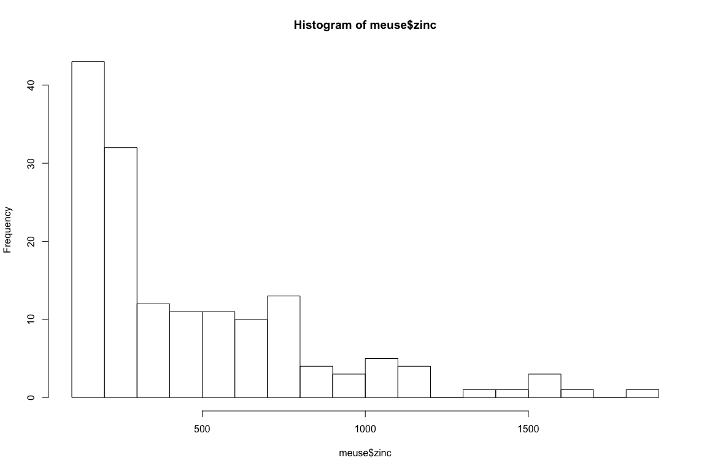

``` r
#shapiro.test(meuse$zinc)

#hist(log(meuse$zinc),breaks=20)
#shapiro.test(log(meuse$zinc))

bubble(meuse, 'zinc', col=brewer.pal(2, 'Reds'), main= 'zinc concentrations (ppm)')
```

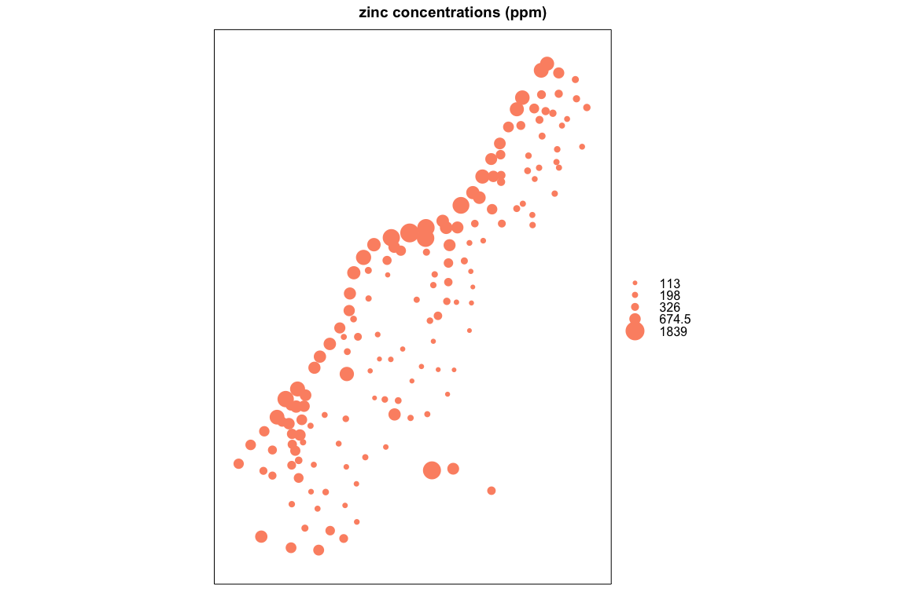

``` r
plot(log(zinc)~sqrt(dist), meuse)
abline(lm(log(zinc)~sqrt(dist), meuse))
```

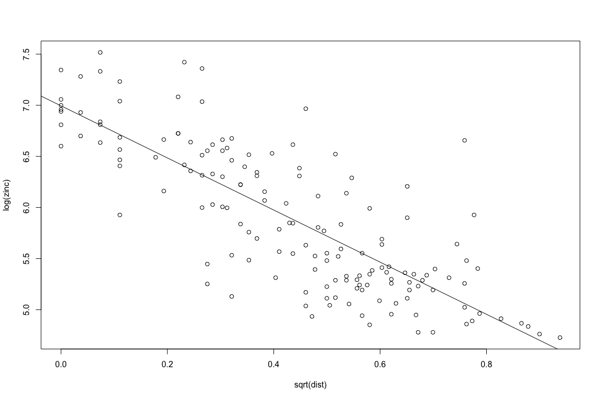 We can first use IDW (inverse distance weighted) method to interpolate the scattering measurements into a continuous surface.

``` r
data("meuse.grid")
class(meuse.grid)
```

    ## [1] "data.frame"

``` r
coordinates(meuse.grid)=~x+y
gridded(meuse.grid)=TRUE

proj4string(meuse.grid)=proj4string(meuse)
zinc.idw = idw(zinc~1, meuse, meuse.grid)
```

    ## [inverse distance weighted interpolation]

``` r
#image(meuse.grid['dist'], col=rev(brewer.pal(9, 'Reds')))

str(zinc.idw)
```

    ## Formal class 'SpatialPixelsDataFrame' [package "sp"] with 7 slots
    ##   ..@ data       :'data.frame':  3103 obs. of  2 variables:
    ##   .. ..$ var1.pred: num [1:3103] 634 713 654 604 857 ...
    ##   .. ..$ var1.var : num [1:3103] NA NA NA NA NA NA NA NA NA NA ...
    ##   ..@ coords.nrs : int [1:2] 1 2
    ##   ..@ grid       :Formal class 'GridTopology' [package "sp"] with 3 slots
    ##   .. .. ..@ cellcentre.offset: Named num [1:2] 178460 329620
    ##   .. .. .. ..- attr(*, "names")= chr [1:2] "x" "y"
    ##   .. .. ..@ cellsize         : Named num [1:2] 40 40
    ##   .. .. .. ..- attr(*, "names")= chr [1:2] "x" "y"
    ##   .. .. ..@ cells.dim        : Named int [1:2] 78 104
    ##   .. .. .. ..- attr(*, "names")= chr [1:2] "x" "y"
    ##   ..@ grid.index : int [1:3103] 69 146 147 148 223 224 225 226 300 301 ...
    ##   ..@ coords     : num [1:3103, 1:2] 181180 181140 181180 181220 181100 ...
    ##   .. ..- attr(*, "dimnames")=List of 2
    ##   .. .. ..$ : chr [1:3103] "1" "2" "3" "4" ...
    ##   .. .. ..$ : chr [1:2] "x" "y"
    ##   ..@ bbox       : num [1:2, 1:2] 178460 329620 181540 333740
    ##   .. ..- attr(*, "dimnames")=List of 2
    ##   .. .. ..$ : chr [1:2] "x" "y"
    ##   .. .. ..$ : chr [1:2] "min" "max"
    ##   ..@ proj4string:Formal class 'CRS' [package "sp"] with 1 slot
    ##   .. .. ..@ projargs: chr "+init=epsg:28992 +proj=sterea +lat_0=52.15616055555555 +lon_0=5.38763888888889 +k=0.9999079 +x_0=155000 +y_0=463000 +ellps=bess"| __truncated__

``` r
spplot(zinc.idw[,1], main='zinc, inverse distance weighted estimation')
```

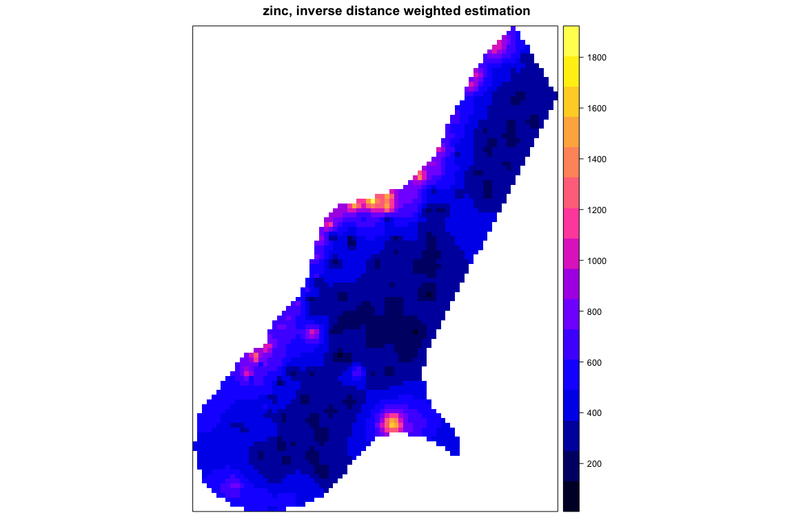

Kriging
=======

In addition to the point measurements of in `meuse`, we have another set of auxiliary dataset `meuse.grid`, containing a set of gridded auxiliary information about this area of study. We will use the distance to the river.

``` r
data(meuse.grid)
names(meuse)
```

    ##  [1] "cadmium" "copper"  "lead"    "zinc"    "elev"    "dist"    "om"     
    ##  [8] "ffreq"   "soil"    "lime"    "landuse" "dist.m"

``` r
coordinates(meuse.grid)=~x+y
gridded(meuse.grid)=TRUE 
proj4string(meuse.grid)=proj4string(meuse)
plot(meuse.grid['dist'], col=rev(brewer.pal(9, 'Reds')), main='distance to river (m)')
```

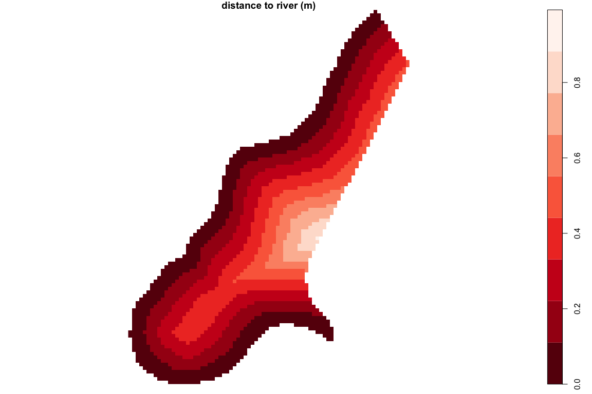

Variogram
---------

``` r
lzn.vgm = variogram(log(meuse$zinc)~1, meuse)
lzn.vgm
```

    ##     np       dist     gamma dir.hor dir.ver   id
    ## 1   57   79.29244 0.1234479       0       0 var1
    ## 2  299  163.97367 0.2162185       0       0 var1
    ## 3  419  267.36483 0.3027859       0       0 var1
    ## 4  457  372.73542 0.4121448       0       0 var1
    ## 5  547  478.47670 0.4634128       0       0 var1
    ## 6  533  585.34058 0.5646933       0       0 var1
    ## 7  574  693.14526 0.5689683       0       0 var1
    ## 8  564  796.18365 0.6186769       0       0 var1
    ## 9  589  903.14650 0.6471479       0       0 var1
    ## 10 543 1011.29177 0.6915705       0       0 var1
    ## 11 500 1117.86235 0.7033984       0       0 var1
    ## 12 477 1221.32810 0.6038770       0       0 var1
    ## 13 452 1329.16407 0.6517158       0       0 var1
    ## 14 457 1437.25620 0.5665318       0       0 var1
    ## 15 415 1543.20248 0.5748227       0       0 var1

``` r
plot(lzn.vgm)
```

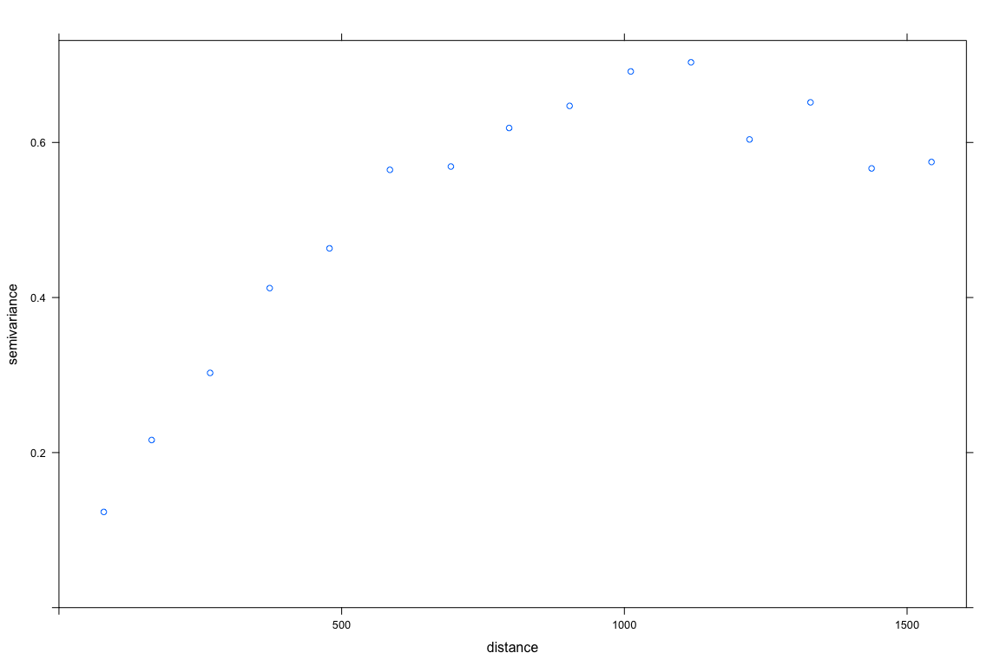

``` r
lzn.vgm.map = variogram(log(zinc)~1, meuse, map=TRUE, cutoff=1500, width=100)
plot(lzn.vgm.map)
```

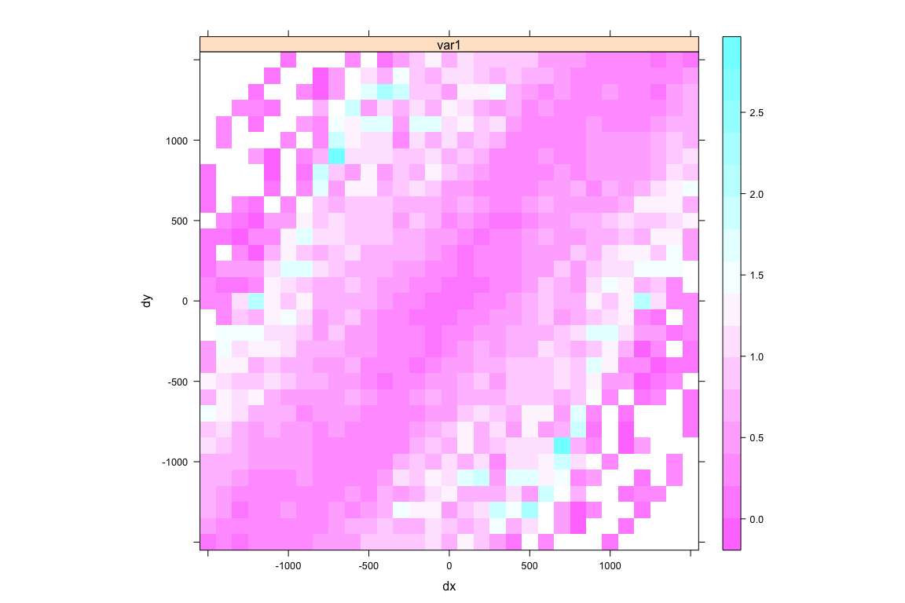

``` r
lzn.fit = fit.variogram(lzn.vgm, model = vgm(1, "Exp", 900, 1))
lzn.fit
```

    ##   model     psill    range
    ## 1   Nug 0.0000000   0.0000
    ## 2   Exp 0.7186599 449.7668

``` r
plot(lzn.vgm, lzn.fit)
```

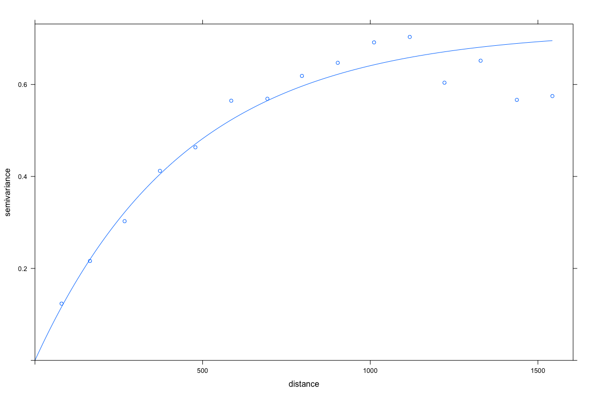

``` r
# accounting for other covariates/auxiliary information
# residual variogram of the linear regression
lznr.vgm = variogram(log(zinc)~sqrt(dist), meuse)
lznr.fit = fit.variogram(lznr.vgm, model = vgm(1, "Exp", 300, 1))
lznr.fit
```

    ##   model      psill    range
    ## 1   Nug 0.05712231   0.0000
    ## 2   Exp 0.17641559 340.3201

``` r
plot(lznr.vgm, lznr.fit)
```

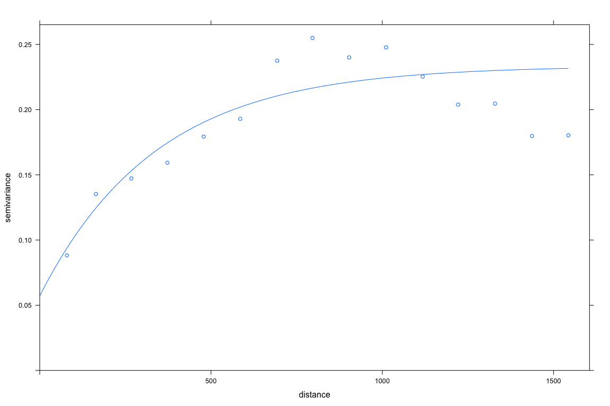

### Directional variogram

``` r
lzn.dir = variogram(log(zinc)~1, meuse, alpha = c(0, 45, 90, 135))
lzndir.fit = vgm(.59, "Sph", 1200, .05, anis = c(45, .4))
plot(lzn.dir, lzndir.fit, as.table = TRUE)
```

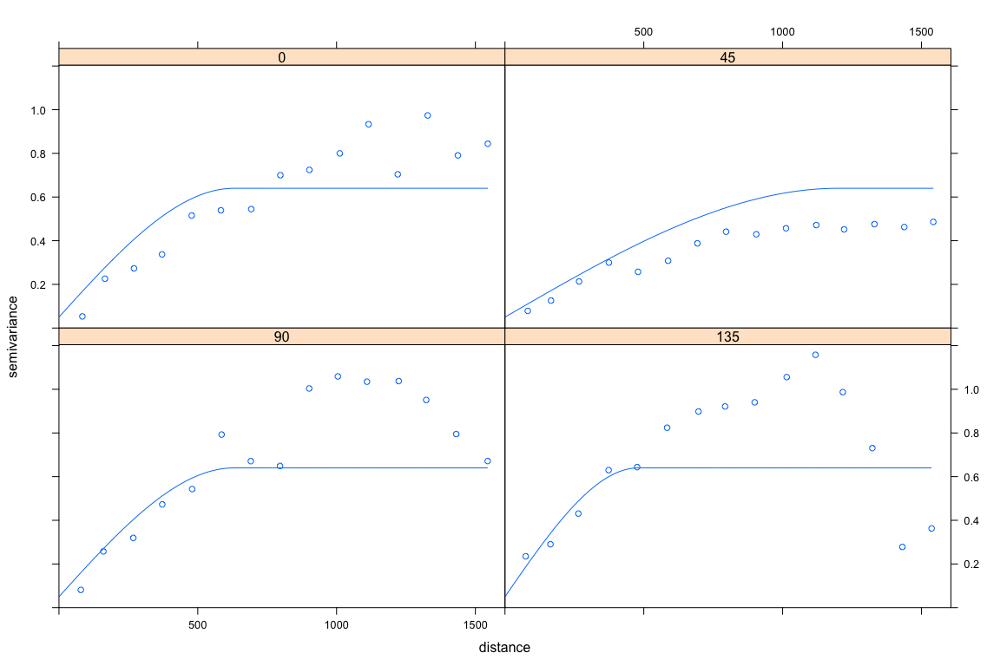

``` r
lznr.dir = variogram(log(zinc)~sqrt(dist), meuse, alpha = c(0, 45, 90, 135))
plot(lznr.dir, lznr.fit, as.table = TRUE)
```

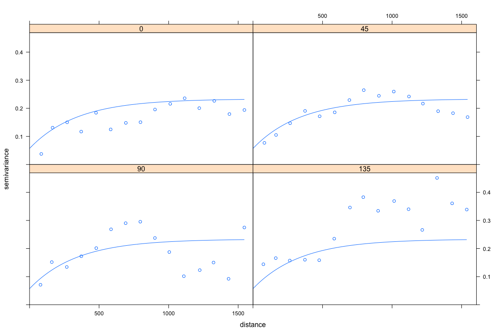

Kriging prediction
------------------

``` r
lzn.kriged = krige(log(zinc)~1, meuse, meuse.grid, model = lzn.fit)
```

    ## [using ordinary kriging]

``` r
names(lzn.kriged)
```

    ## [1] "var1.pred" "var1.var"

``` r
plot(lzn.kriged[,1], main='zinc, simple kriging estimation')
```

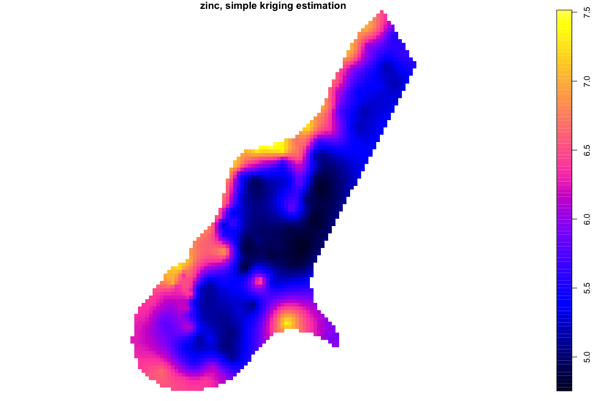

``` r
#kriging also output the variance of the estimation
plot(lzn.kriged[,2], main='zinc, variance of simple kriging estimation')
```

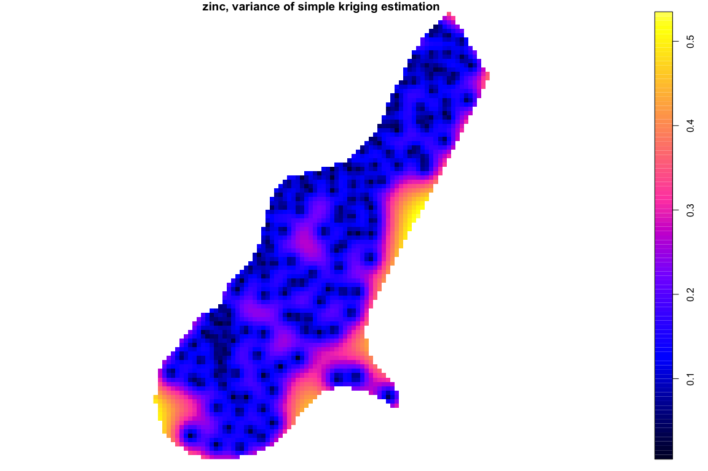

``` r
# accounting for other covariates/auxiliary information

lznr.kriged = krige(log(zinc)~sqrt(dist), meuse, meuse.grid, model = lzn.fit)
```

    ## [using universal kriging]

``` r
plot(lznr.kriged[,1], main='zinc, universal kriging estimation')
```

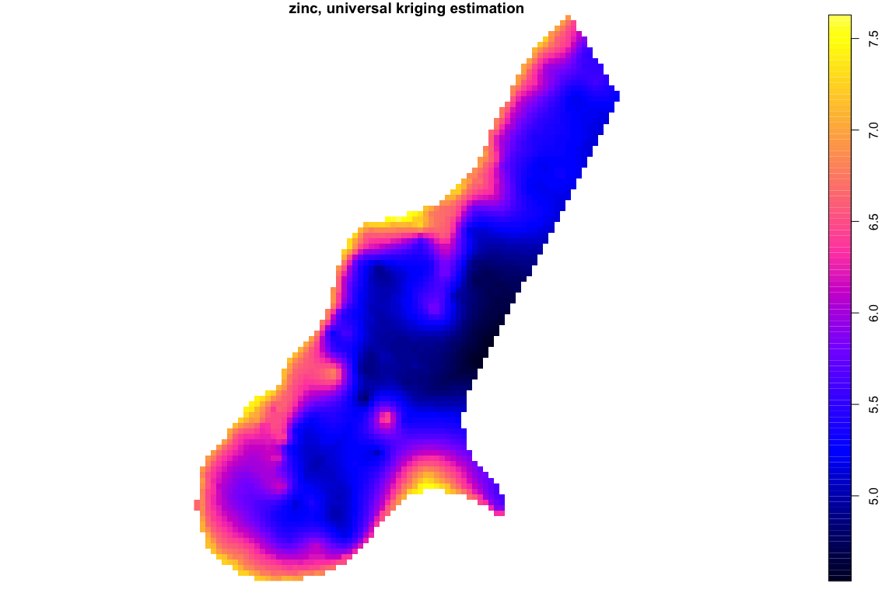

``` r
#kriging also output the variance of the estimation
plot(lznr.kriged[,2], main='zinc, variance of universal kriging estimation')
```

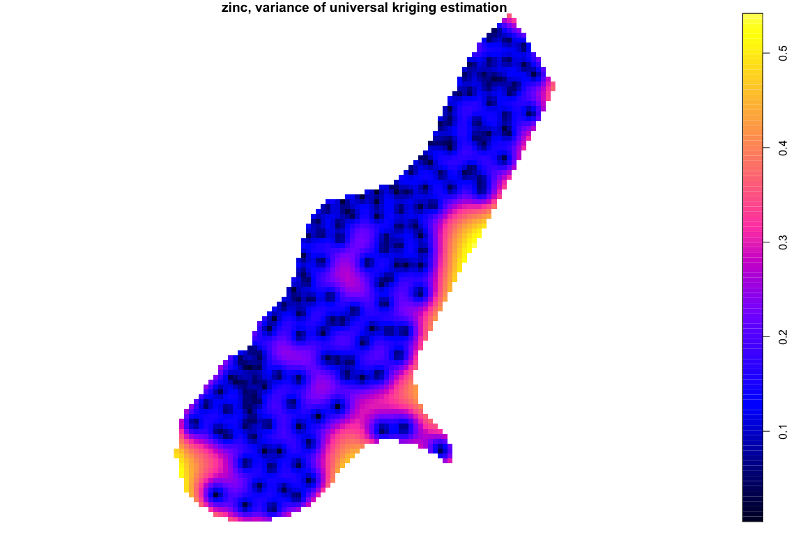

### Cross-validation

``` r
choose100 <- sample(1:155, 100) 
training <- meuse[choose100, ] 
validation <- meuse[-choose100, ] 

#Now, we can use the part model to estimate the variogram.
lzn.vgm.training = variogram(log(zinc)~1, training)
lzn.fit.training = fit.variogram(lzn.vgm.training, model = vgm(1, "Sph", 900, 1))
plot(lzn.vgm.training,lzn.fit.training)
```

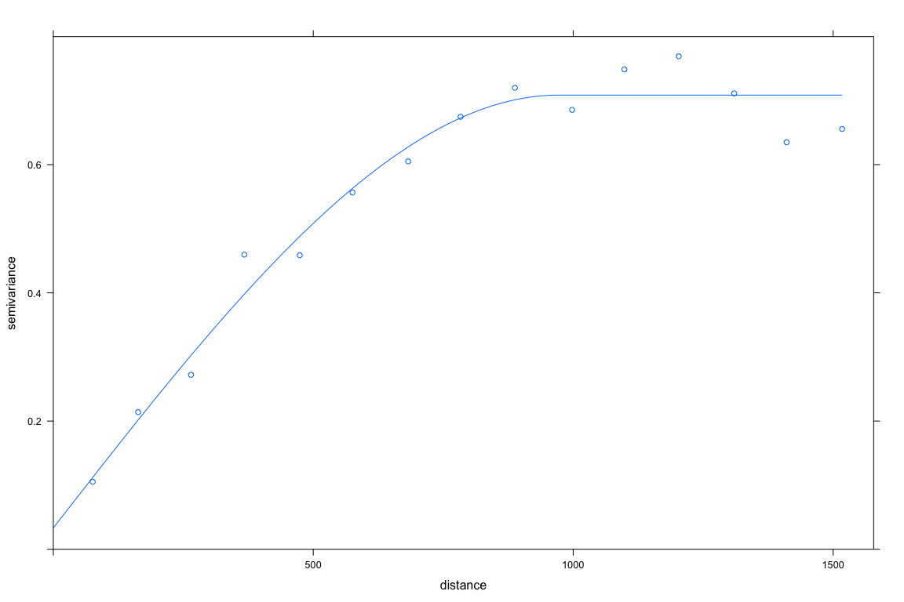

``` r
lzn.kriged.training = krige(log(zinc)~1, training, validation, model = lzn.fit.training)
```

    ## [using ordinary kriging]

``` r
difference <- log(validation$zinc) - lzn.kriged.training$var1.pred 
summary(difference)
```

    ##     Min.  1st Qu.   Median     Mean  3rd Qu.     Max. 
    ## -0.75220 -0.12400  0.09613  0.13410  0.35160  1.47200

``` r
rmse <- sqrt(sum(difference^2))
rmse
```

    ## [1] 3.152168

``` r
plot(log(validation$zinc), lzn.kriged.training$var1.pred, xlab= 'observed values', ylab='predicted values')
abline(lm(log(validation$zinc)~lzn.kriged.training$var1.pred))
```


``` r
# or use qqplot
qqplot(log(validation$zinc), lzn.kriged.training$var1.pred)
```

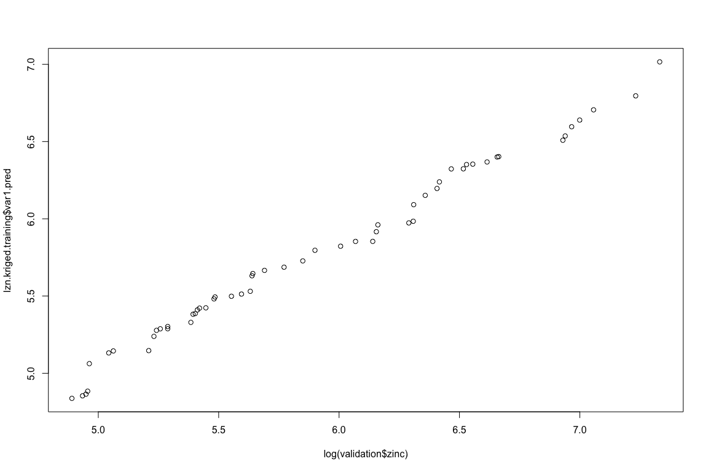

``` r
#A more automated way is to use the function krige.cv: 
cv<-krige.cv(log(zinc)~1,meuse, model=lzn.fit,nfold=nrow(meuse)) 
names(cv)
```

    ## [1] "var1.pred" "var1.var"  "observed"  "residual"  "zscore"    "fold"

``` r
rmse2 <- sqrt(sum(cv$residual^2))
rmse2
```

    ## [1] 4.898475

Simulation: Explore the space of uncertainty
--------------------------------------------

### Unconditional simulation

Generate a set of unconditional simulation based on the specified variogram

``` r
# Generate a set of unconditional simulation based on the specified variogram
xy <- expand.grid(1:100, 1:100)
names(xy) <- c('x','y')
g.dummy <- gstat(formula=z~1, locations=~x+y, dummy=T, beta=1, model=vgm(psill=0.025, range=10, model='Gau', nugget=0.0001), nmax=21) 
yy <- predict(g.dummy, newdata=xy, nsim=4)
```

    ## [using unconditional Gaussian simulation]

``` r
coordinates(yy)=~x+y
gridded(yy) =TRUE
spplot(yy)
```

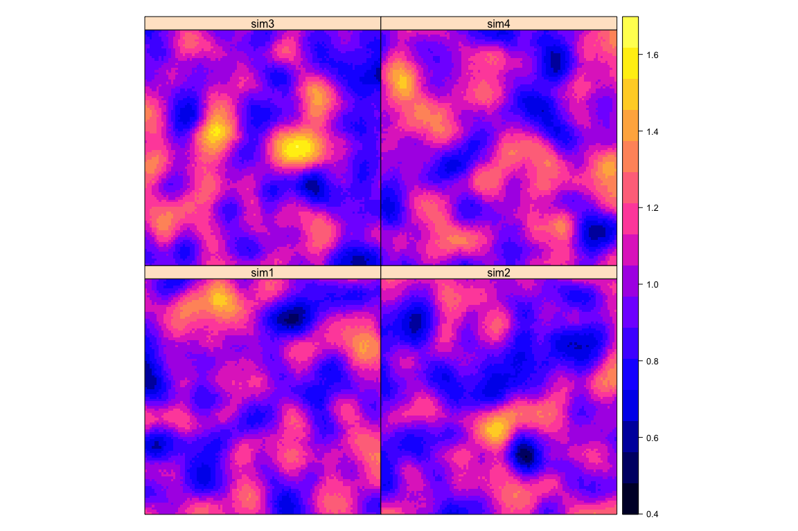

### Conditional simulation

Generate a set of simulation based on the specified variogram and conditional to a set of observations

``` r
lzn.condsim = krige(log(zinc)~1, meuse, newdata=meuse.grid, model = lzn.fit, nmax = 30, nsim = 4)
```

    ## drawing 4 GLS realisations of beta...
    ## [using conditional Gaussian simulation]

``` r
spplot(lzn.condsim, main='four realizations of conditional simulation')
```

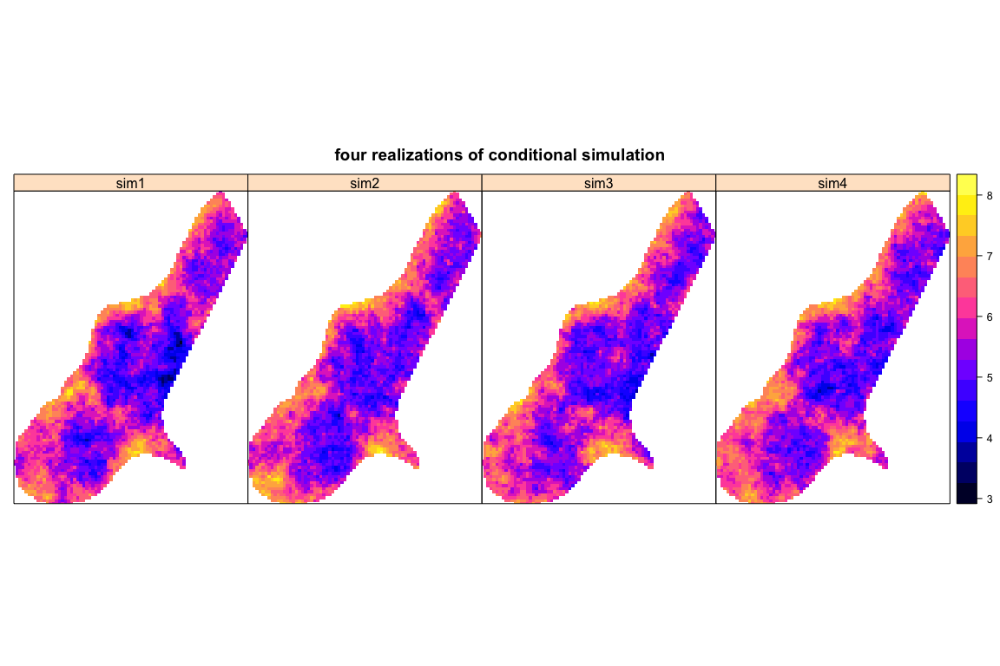

``` r
#accounting for covariates
lzn.condsim2 = krige(log(zinc)~sqrt(dist), meuse, newdata=meuse.grid, model = lznr.fit, nmax = 30, nsim = 4)
```

    ## drawing 4 GLS realisations of beta...
    ## [using conditional Gaussian simulation]

``` r
spplot(lzn.condsim2, main='four realizations of conditional simulation')
```

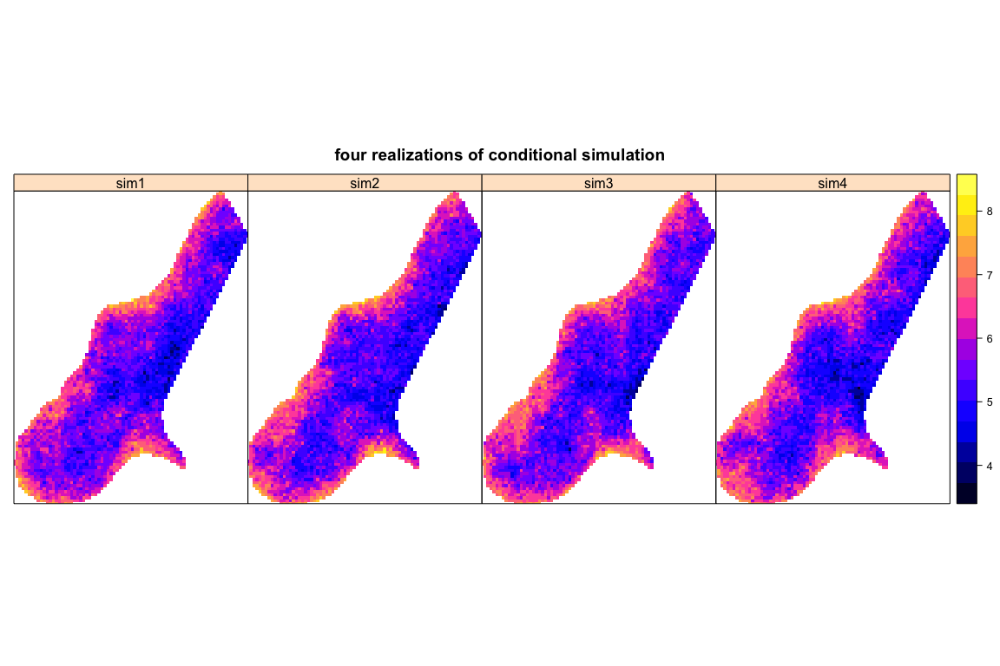
